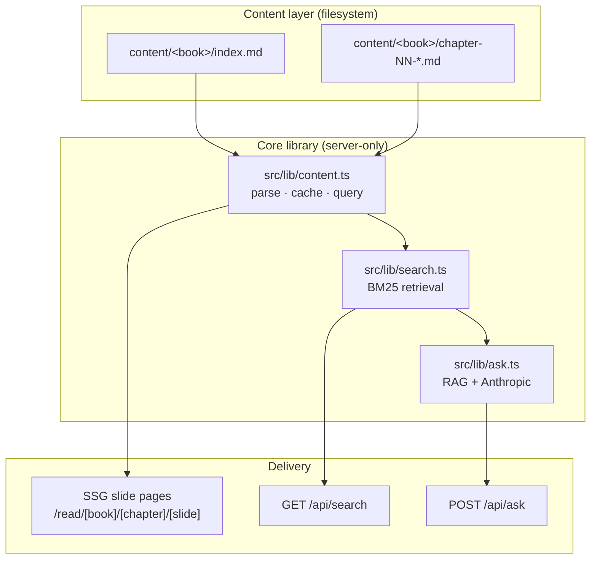
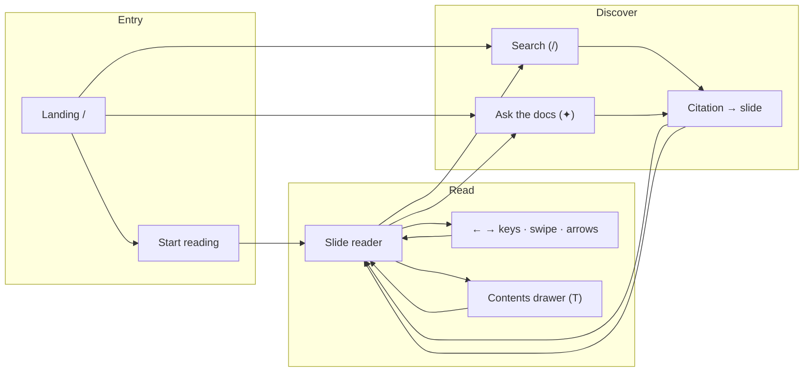
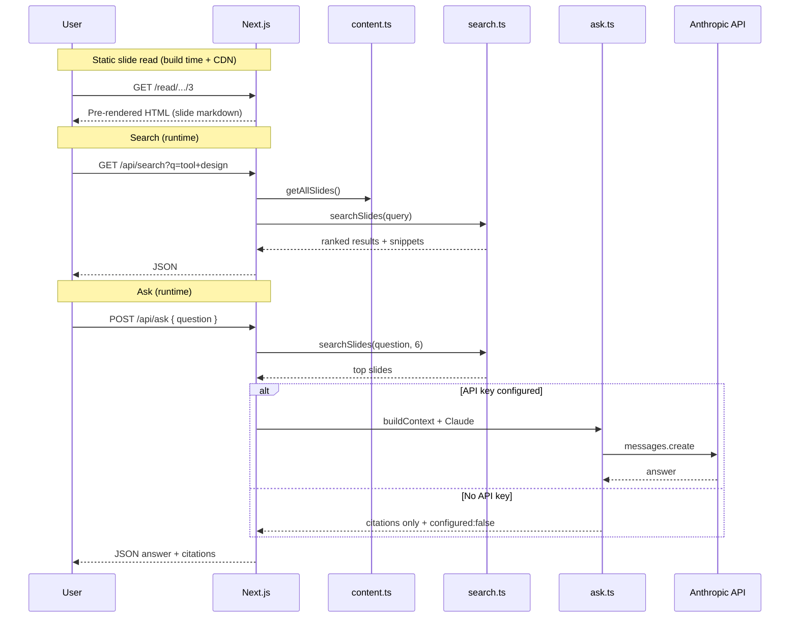
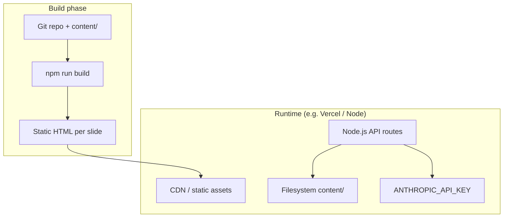
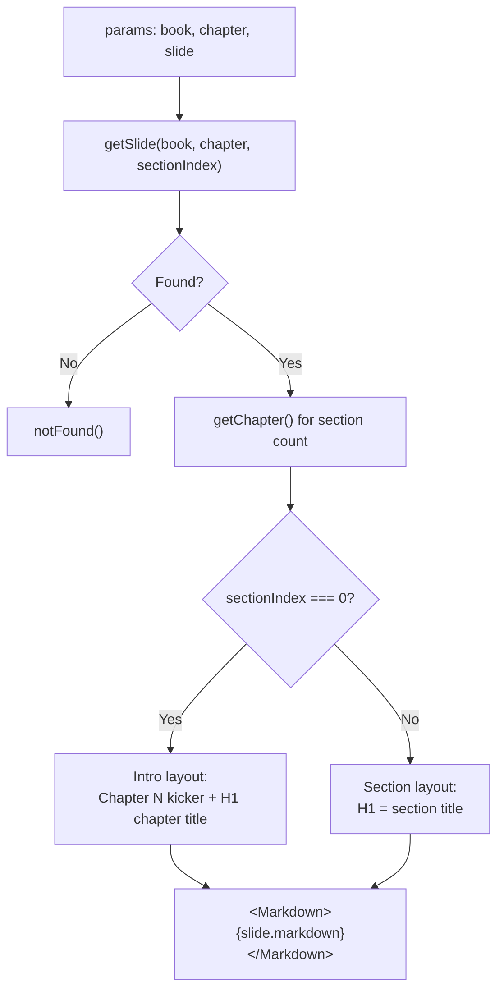
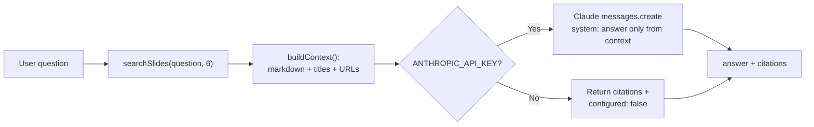
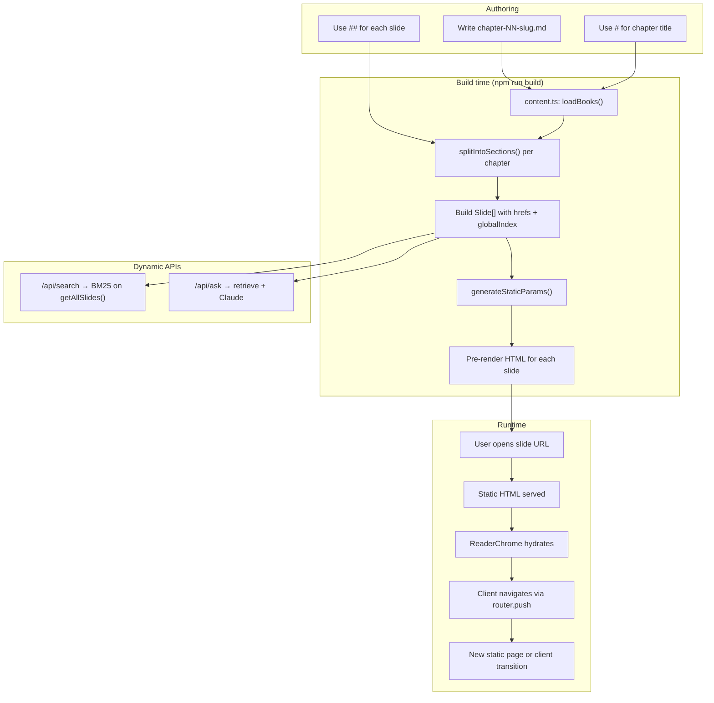

# Agent YAP — Project Overview

A multi-perspective analysis of **Agent YAP**: a public educational site that turns a markdown knowledge base into a slide-by-slide reader, with full-text search and a retrieval-augmented "Ask the docs" assistant.

> **Quick links:** [README.md](README.md) (setup & commands) · [docs/api-contract.md](docs/api-contract.md) (search + ask API) · [AGENTS.md](AGENTS.md) (ownership lanes)

---

## Table of contents

1. [Executive summary](#executive-summary)
2. [Software architect perspective](#software-architect-perspective)
3. [Software developer perspective](#software-developer-perspective)
4. [Product manager perspective](#product-manager-perspective)
5. [System architecture](#system-architecture)
6. [Content inventory & roadmap](#content-inventory--roadmap)
7. [Actionable insights & open questions](#actionable-insights--open-questions)
8. [Deep dive: markdown → slides → Next.js pipeline](#deep-dive-markdown--slides--nextjs-pipeline)

---

## Executive summary

| Dimension | Summary |
|-----------|---------|
| **Purpose** | Teach AI agent engineering (architecture, RAG, memory, harnesses) through a practitioner-focused, slide-based reader |
| **Delivery model** | Filesystem markdown → server-side parse → statically generated HTML pages + dynamic API routes |
| **Live today** | One book (`architecture-and-system-design`, 18 chapters, ~199 slides) |
| **Written but not live** | RAG, context engineering, agentic memory, multi-agent, coding harnesses (~50+ chapters across modules) |
| **Differentiators** | Slide pacing for dense technical content; BM25 search; grounded RAG with citations; no auth/CMS overhead |
| **Core bet** | *The model is the easy part* — the site embodies this by focusing on system design around the LLM |

---

## Software architect perspective

### Architectural style

Agent YAP follows a **static-site-first, content-as-code** architecture:

- **No database.** The filesystem under `content/` is the CMS.
- **Single source of truth.** `src/lib/content.ts` parses markdown once; reader pages, search, and RAG all import from it.
- **Hybrid rendering.** Reader pages are SSG (pre-rendered at build time); `/api/search` and `/api/ask` are dynamic Node.js route handlers.
- **Clear module boundaries.** Frontend (reader UI) and backend (search/RAG) lanes are documented in `AGENTS.md` to reduce merge conflicts.



### Key patterns

| Pattern | Where | Rationale |
|---------|-------|-----------|
| **Content-as-data** | `content.ts` | Avoid CMS complexity; version content with git; enable agent-assisted authoring |
| **Flat slide manifest** | `Book.slides[]` with `globalIndex` | Cross-chapter prev/next navigation without client-side re-parsing |
| **Nav manifest** | `getNavManifest()` | Ship lightweight TOC/progress data to client without full markdown payloads |
| **Lexical RAG** | BM25 over slides | Simple, fast, no embedding infra; good enough for structured technical prose |
| **Graceful degradation** | Ask without API key | Returns citations only; UI still useful |
| **Lane separation** | `AGENTS.md` | Parallel frontend/backend work without touching shared contracts |

### Scalability assessment

**What scales well today**

- **Read traffic:** Static HTML for every slide; CDN-friendly; no per-request parse cost in production.
- **Content growth:** Adding chapters is additive; `generateStaticParams` pre-renders all routes at build.
- **Search corpus:** In-memory BM25 over ~200 slides is trivial; would remain fine into low thousands of slides on a single Node instance.

**Scaling limits & mitigations**

| Limit | Threshold | Mitigation |
|-------|-----------|------------|
| Build time | Grows linearly with slide count | Incremental static regeneration or on-demand ISR for new chapters |
| In-memory content cache | `content.ts` caches parsed books for process lifetime | Acceptable for single-instance; add cache invalidation or external index if multi-instance |
| BM25 at scale | Thousands+ slides, high QPS | Pre-built inverted index (Meilisearch, Typesense) or vector search |
| Ask latency | Anthropic API round-trip | Streaming responses; cache frequent questions |
| Multi-book UX | Only `getPrimaryBook()` on landing | Book picker, per-book search scope |
| Content discovery rules | Strict `index.md` + `chapter-NN-*.md` naming | Migration script for dormant modules |

### Security posture

- **No authentication** — appropriate for public educational content.
- **Ask endpoint** — unauthenticated; rate limiting and API key cost controls are not yet implemented (production risk).
- **Prompt injection** — user questions go to Claude with retrieved context; system prompt constrains answers to context only.
- **Filesystem reads** — server-only; no user-supplied paths.

---

## Software developer perspective

### Repository map

```
agent YAP/
├── content/                    Markdown knowledge base (not all modules are "live")
├── docs/api-contract.md        Search + Ask API contract
├── src/
│   ├── lib/
│   │   ├── content.ts          ★ Single source of truth — books, chapters, slides
│   │   ├── search.ts           BM25 search over slides
│   │   ├── ask.ts              RAG glue → Anthropic Claude
│   │   └── chapter-color.ts    Per-chapter accent palette
│   ├── app/
│   │   ├── page.tsx            Landing (server → Home client component)
│   │   ├── read/
│   │   │   ├── page.tsx        Redirect to first slide of primary book
│   │   │   └── [book]/
│   │   │       ├── layout.tsx    ReaderChrome + NavManifest
│   │   │       ├── page.tsx      Redirect to first slide
│   │   │       └── [chapter]/[slide]/
│   │   │           ├── page.tsx      Slide content (SSG)
│   │   │           └── template.tsx  framer-motion transition
│   │   └── api/
│   │       ├── search/route.ts
│   │       └── ask/route.ts
│   └── components/
│       ├── Markdown.tsx        react-markdown + GFM + syntax highlight
│       ├── reader/ReaderChrome.tsx
│       ├── SearchPanel.tsx
│       ├── AskPanel.tsx
│       └── Home.tsx
```

### Code quality observations

**Strengths**

- **Typed domain model.** `Book`, `Chapter`, `Slide` interfaces are explicit and reused everywhere.
- **No duplicated parsing.** API routes import `getAllSlides()` — contract enforced in `docs/api-contract.md`.
- **Server/client split.** `Markdown` is a server component; navigation chrome is client-side with minimal manifest payload.
- **Conventions are documented.** `AGENTS.md`, `content.ts` header comments, and the context skill explain the rules.
- **Build validates the graph.** `generateStaticParams` + `npm run build` catches broken slugs and missing chapters.

**Maintainability risks**

| Risk | Detail | Suggested fix |
|------|--------|---------------|
| **Dormant content** | 6+ content folders use incompatible naming (`Chapter N - …md`, nested `explained/`) | One-time migration to `index.md` + `chapter-NN-slug.md` |
| **Primary book hardcoded** | Landing and `/read` always use `getPrimaryBook()` (first sorted book dir) | Explicit config or book metadata ordering |
| **Module cache** | `content.ts` caches forever in-process; no dev hot-reload of new files without restart | `cache = null` on file change in dev, or document restart requirement |
| **H2-only slide split** | `###` headings stay on the same slide; long sections can overflow one "page" | Authoring guidelines or sub-split logic for `###` |
| **No automated tests** | Search ranking, slide splitting, and API contracts untested | Unit tests for `splitIntoSections`, `searchSlides`, route handlers |
| **Lane coupling** | `content.ts` is "frontend-owned" but backend depends on it | Shared ownership or move to `src/lib/content/` neutral zone |

### Tech stack

| Layer | Choice | Notes |
|-------|--------|-------|
| Framework | Next.js 16 App Router | SSG via `generateStaticParams` |
| UI | React 19, Tailwind v4 | Custom design tokens in `globals.css` |
| Motion | framer-motion | Slide transitions + TOC drawer |
| Markdown | react-markdown, remark-gfm, rehype-highlight | Server-rendered prose |
| Search | Custom BM25 | Title terms weighted 3× |
| LLM | @anthropic-ai/sdk | claude-sonnet-4-6 default |

### Developer workflow

```bash
npm install
npm run dev      # http://localhost:3000
npm run build    # validates types + pre-renders all slides
npm run lint
```

**Adding a new live book:**

1. Create `content/<book-slug>/index.md` (H1 title + `>` description).
2. Add `content/<book-slug>/chapter-01-*.md` files.
3. Structure each chapter with `#` (chapter title) and `##` (slide sections).
4. Rebuild — routes appear automatically.

---

## Product manager perspective

### Value proposition

Agent YAP targets **practitioners designing LLM agents** — engineers, architects, and tech leads — who need durable mental models, not marketing summaries. The slide format reduces cognitive load for dense material; search and Ask reduce time-to-answer when facing a specific design decision.

### User flows



### Feature inventory

| Feature | Status | User value |
|---------|--------|------------|
| Slide reader | ✅ Shipped | Bite-size pacing; keyboard/swipe navigation; progress rail |
| Chapter TOC | ✅ Shipped | Jump within book; per-chapter accent colors |
| Landing chapter grid | ✅ Shipped | Discoverability; blurb previews |
| Full-text search | ✅ Shipped | Fast lexical lookup across all slides |
| Ask the docs (RAG) | ✅ Shipped (needs API key) | Synthesized answers with citations |
| MCQs / coding challenges | 🔜 Planned | Active learning; mentioned in project skills |
| Additional books | 📝 Content exists | RAG, memory, harnesses modules awaiting integration |
| User accounts / progress | ❌ Not planned | Keeps scope minimal |
| Offline / PWA | ❌ Not present | Opportunity for mobile readers |

### Business alignment

**Goals the product serves well**

- Establish thought leadership in agent system design.
- Make a large markdown corpus feel like a polished course, not a GitHub folder.
- Demonstrate RAG patterns the content itself teaches.

**Gaps vs. stated ambition**

| Gap | Impact |
|-----|--------|
| 80%+ of written content is invisible | Users see 1 of ~7 modules; SEO and depth under-delivered |
| No learning analytics | Cannot measure which chapters/slides resonate |
| Ask is cost-unbounded | No rate limits; production deployment needs guardrails |
| Interactive elements missing | Content rules mention MCQs/challenges; not yet in reader |
| Single-book landing | No module picker for the full curriculum |

### Usability notes

- **Strengths:** Clear visual hierarchy on slides; consistent chapter badges; search debounced at 180ms; keyboard shortcuts documented in UI hints.
- **Friction:** Very long `##` sections become tall scrollable "slides" (e.g. chapters with nested `###` content); no "estimated read time" per slide; Ask suggestions are static.

---

## System architecture

### End-to-end request paths



### Deployment topology (conceptual)



---

## Content inventory & roadmap

| Module folder | Topic | Chapters (approx.) | Live? | Blocker |
|---------------|-------|-------------------|-------|---------|
| `architecture-and-system-design/` | Full agent system design | 18 | **Yes** | — |
| `rag/` | Naive → agentic RAG | 4 | No | Needs `index.md` + `chapter-NN-*.md` rename |
| `context engineering/` | Context engineering | 4 | No | Same |
| `agentic memory/` | Agent memory | 5 | No | Same |
| `multi-agent/` | Multi-agent patterns | 5 | No | Same |
| `building coding agents and harnesses/explained/` | Harness internals | 17 | No | Needs book-level `index.md` |
| `glossary/` | Shared glossary | 1 | No | Not structured as a book |

**Current phase (from project docs):** All module chapter content is written; focus is shifting to **interactive elements** (MCQs, coding challenges) and integrating additional books.

---

## Actionable insights & open questions

### Recommended near-term actions

1. **Ship book #2** — Pick RAG or harnesses; run a migration script to rename chapters and add `index.md`.
2. **Add rate limiting** on `/api/ask` before public production deploy.
3. **Authoring guide** — Document optimal `##` section length; when to use `###` vs. new `##`.
4. **Book selector** — Landing page should list all live books, not only `getPrimaryBook()`.
5. **Tests for `splitIntoSections`** — Lock slide-boundary behavior before interactive components land in markdown.

### Strategic questions

| # | Question | Stakeholder |
|---|----------|-------------|
| 1 | Should interactive MCQs live *inside* markdown slides or as React components wired by convention? | PM + Dev |
| 2 | Is lexical BM25 sufficient as the corpus grows past ~500 slides, or should embeddings be introduced? | Architect |
| 3 | What is the module release order — follow the architecture book's chapter references or user demand? | PM |
| 4 | Should Ask stream tokens to the UI for perceived latency? | Dev + PM |
| 5 | Is there a need for printable/PDF export of chapters? | PM |
| 6 | How will `sources/` folders be exposed — stay internal, or link as further reading? | PM + Content |
| 7 | Multi-book search: global or scoped per book? | Architect |
| 8 | Do we need i18n, or is English-only acceptable for the target audience? | PM |

---

## Deep dive: markdown → slides → Next.js pipeline

This section explains **exactly** how markdown files become slides, how they are split, and how the Next.js frontend serves them. It is the operational heart of the project.

### 1. Where content lives

All publishable content sits under `content/<book-slug>/`. A folder becomes a **book** only when **both** conditions are met:

1. **`index.md` exists** at the book root.
   - First `# Heading` → book title (shown on landing).
   - First `>` blockquote line → book description.
2. **At least one file matches** `chapter-\d+*.md` (e.g. `chapter-01-anatomy.md`).

Everything else on disk is ignored by the parser: `sources/` folders, `Chapter N - Title.md` files, nested `explained/` directories, overview files without the right names.

### 2. Chapter file structure (authoring contract)

Each chapter file follows this shape:

```markdown
# Chapter 1 — Anatomy of an AI Agent

Introductory prose before the first ## becomes the chapter intro slide.
This can be multiple paragraphs.

## First major section

Body of slide 1. Becomes its own slide.
The ## line text becomes the slide title.

## Second major section

Body of slide 2.

### Subsections stay on the same slide

H3 and below are NOT split — they render inside the parent ## slide.
```

**Important implications:**

- `#` (H1) = chapter title; the line itself is **stripped** from slide bodies.
- `##` (H2) = **slide boundary**. Each H2 starts a new slide.
- `###` and deeper = **no boundary**; content stays on the current slide.
- If a chapter opens directly with `##` and has no intro prose, the empty intro slide is **dropped**.

### 3. The parsing algorithm (`splitIntoSections`)

Implemented in `src/lib/content.ts`. Pseudocode:

```
1. Split chapter markdown into lines.
2. Walk line by line:
   a. On first `# ` line → mark H1 seen, skip line (title extracted separately).
   b. On `## ` line → flush current buffer as a section; start new section with H2 title.
   c. Otherwise → append line to buffer.
3. After loop → flush final section.
4. Drop empty intro section if chapter starts at first ##.
```

Each section becomes one `Slide` object:

| Field | Meaning |
|-------|---------|
| `sectionIndex` | `0` = intro; `1..n` = H2 sections in order |
| `title` | Intro uses cleaned chapter title; others use H2 text |
| `markdown` | Section body **without** the heading line |
| `text` | Plain text via `toPlainText()` for search/snippets |
| `href` | `/read/{bookSlug}/{chapterSlug}/{sectionIndex}` |
| `globalIndex` | Position in book-wide flat list (for prev/next) |

**Chapter slug** is derived from the filename: `chapter-01-anatomy.md` → slug `01-anatomy`.

**Chapter number** comes from the numeric part after `chapter-` in the filename.

### 4. Book assembly and ordering

```
for each directory in content/ (sorted alphabetically):
  if index.md missing → skip
  read index.md → title, description
  for each chapter-*.md (sorted alphabetically):
    parse → sections → slides
    assign globalIndex sequentially across all chapters
  sort chapters by chapter number
  append to books[]
cache result in memory
```

`getPrimaryBook()` returns `books[0]` — today that is `architecture-and-system-design` (alphabetically first valid book).

### 5. URL routing model

| URL | Behavior |
|-----|----------|
| `/` | Landing page; lists primary book chapters |
| `/read` | Redirect to first slide of primary book |
| `/read/[book]` | Redirect to first slide of that book |
| `/read/[book]/[chapter]/[slide]` | **The slide page** — `slide` is `sectionIndex` (integer string) |

Example: `/read/architecture-and-system-design/01-anatomy/2` → chapter `01-anatomy`, section index `2` (third slide: intro is 0).

### 6. Static generation (Next.js SSG)

At **build time**, `generateStaticParams()` in the slide `page.tsx` enumerates every slide:

```typescript
for (const book of getBooks())
  for (const chapter of book.chapters)
    for (const slide of chapter.slides)
      emit { book, chapter: chapter.slug, slide: String(slide.sectionIndex) }
```

Next.js pre-renders **one HTML page per slide** (~199 pages for the current book). This means:

- **Zero filesystem reads** per slide view in production (content baked into HTML).
- **Fast TTFB** via static hosting/CDN.
- **Rebuild required** when markdown changes (no runtime CMS).

### 7. Runtime page render (single slide)

When a slide page renders (build or request):



The `Markdown` component is a **server component** using `react-markdown` + GFM + syntax highlighting. No client JS is shipped for prose rendering.

### 8. Reader shell (layout + navigation)

The book layout wraps every slide:

```
/read/[book]/layout.tsx
  → getNavManifest(book)   // lightweight slide list, no markdown bodies
  → <ReaderChrome manifest={...}>
       {children}          // slide page content
```

`ReaderChrome` (client component) provides:

- Progress bar (`globalIndex / total`)
- Prev/next via `manifest.slides[index ± 1]` — **crosses chapter boundaries**
- Keyboard: `←` `→` `Space`, `/` search, `T` TOC
- Touch swipe detection
- Search and Ask modals

**Directional animations:** `template.tsx` remounts on navigation (Next.js template behavior). `setNavDirection(±1)` before `router.push()` tells framer-motion to slide from left or right.

### 9. Search indexing (same slide objects)

Search does **not** re-parse markdown. It calls `getAllSlides()` and runs BM25 over:

- `slide.title` (term frequency × **3** weight)
- `slide.text` (plain body)

Snippets are ~160 characters centered on the best-matching query term.

### 10. Ask / RAG pipeline (retrieval → generation)



Retrieved slide `markdown` (not just plain text) is sent to Claude so code blocks and structure are preserved in context.

### 11. Full pipeline diagram



### 12. Mental model for authors and developers

| Question | Answer |
|----------|--------|
| What is a "slide"? | One screen in the reader: intro (pre-first-H2) or one `##` section |
| How do I add a slide? | Add a new `## Section title` block to a chapter file |
| How do I add a chapter? | Add `chapter-NN-new-topic.md`; rebuild |
| How do I add a book? | New folder with `index.md` + chapter files; rebuild |
| Why isn't my content showing? | Check filename pattern and `index.md` presence |
| What triggers a rebuild? | Any change under `content/` or `src/` |
| Where is truth? | `src/lib/content.ts` — never duplicate parsing elsewhere |

### 13. Example: one chapter → slides

For `chapter-01-anatomy.md` with H2 sections:

- "The spectrum: prompt → chatbot → agent"
- "The six parts"
- "How the parts interact in one turn"
- "A crucial reframing: the model is the easy part"
- "Two stances toward the model"
- "Review" (if present)

You get **7 slides**: intro (`/0`) + 6 section slides (`/1` … `/6`). The "six parts" slide contains all `### 1. The model` through `### 6. The surrounding system` content on **one** slide because only `##` creates boundaries.

---

*Document generated from repository analysis. For setup instructions, see [README.md](README.md).*
