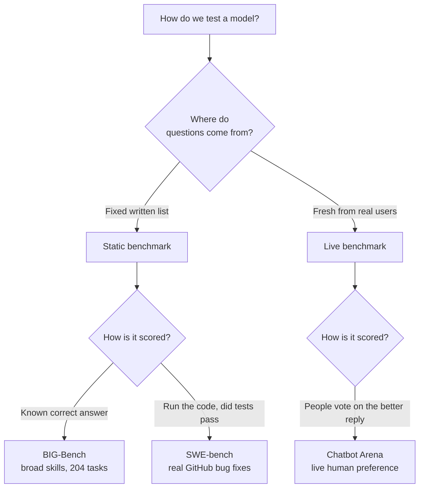

# Start Here: Benchmarks, Explained Simply

In the earlier folders you learned how a language model is built and how it is taught to reason. But there is a question hanging over all of that work: how do we actually know whether a model is any good? If one model scores 80 and another scores 82, does that mean anything? If a model aces a test, has it really learned the skill, or just seen the answers before? This folder is about the surprisingly hard problem of **measuring** language models honestly.

A [benchmark](../foundational-modelling/chapter-07-glossary.md#benchmark) is just a shared test that everyone runs their model on, so that scores can be compared fairly. That sounds simple, but good benchmarks are genuinely difficult to build, and the three papers here each solve a different piece of the puzzle. Together they cover the three things you most want to know about a model: how **broad** its abilities are, how **useful** it is on real work, and which model people actually **prefer** to talk to.

## How to use these explanations

Read the chapters in order; they are arranged from the most traditional style of testing to the most modern. Bold linked terms like [ground truth](chapter-04-glossary.md#ground-truth) jump to the [glossary](chapter-04-glossary.md), where every key idea is explained from scratch. Foundational terms that belong to the earlier folders (such as what a [benchmark](../foundational-modelling/chapter-07-glossary.md#benchmark) is at heart, or what an [Elo rating](../foundational-modelling/chapter-07-glossary.md#elo-rating) is) are linked across to those folders rather than repeated here.

You do not need anything from the earlier folders memorized. The one idea worth carrying in is that a language model is a next-word predictor that has been trained and tuned; everything here is about how we grade the result.

## The big picture

There is a clever way to organize almost every test we give a language model, and it comes from the Chatbot Arena paper itself. You can sort benchmarks along two questions. First, where do the questions come from: a **fixed list** written down in advance (static), or a **fresh stream** of new questions from real users (live)? Second, how is an answer scored: against a known **correct answer** (ground truth), or by asking **which answer people like better** (human preference)?

Each of the three papers stakes out a different corner of this map, and each one fixes a weakness in the styles that came before it.

## Which paper is covered where

| Paper | Year | What it measures | Chapter |
|-------|------|------------------|---------|
| BIG-Bench (Beyond the Imitation Game) | 2022 | Breadth: a huge, diverse suite of 204 tasks | [Chapter 1](chapter-01-big-bench.md) |
| SWE-bench | 2023 | Real-world usefulness: fixing actual software bugs | [Chapter 2](chapter-02-swe-bench.md) |
| Chatbot Arena | 2024 | Human preference: which model people actually like | [Chapter 3](chapter-03-chatbot-arena.md) |

## Chapter map

1. [BIG-Bench: testing the full breadth of what a model can do](chapter-01-big-bench.md)
2. [SWE-bench: can a model fix a real bug in real code?](chapter-02-swe-bench.md)
3. [Chatbot Arena: letting real people pick the winner](chapter-03-chatbot-arena.md)
4. [Glossary: every key term, explained from zero](chapter-04-glossary.md)

## One idea to hold in your head

Every benchmark is a bet about what "good" means, and every benchmark can be gamed or can go stale. A fixed test can leak into training data so a model looks smart without being smart. A narrow test can reward a skill nobody actually needs. The single thread running through this folder is the constant push to make tests that are **harder to fake and closer to reality**: broader tasks (BIG-Bench), real work with real pass-or-fail checks (SWE-bench), and live human judgment that cannot be memorized in advance (Chatbot Arena). Once you see evaluation as an arms race between tests and the models trying to ace them, every paper here becomes a different move in that game.

Ready? Start with [Chapter 1: BIG-Bench](chapter-01-big-bench.md).
