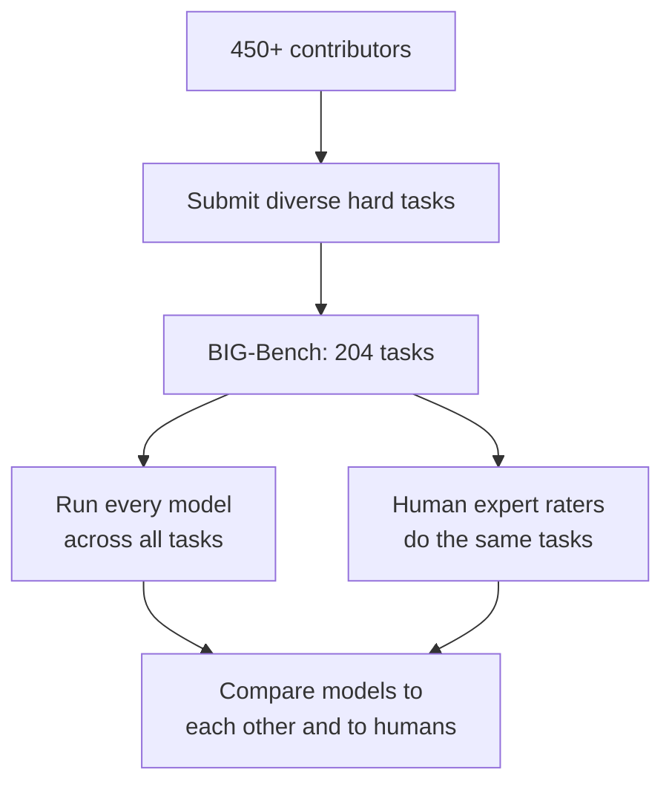

# Chapter 1: BIG-Bench, Testing the Full Breadth of What a Model Can Do

**Paper:** *Beyond the Imitation Game: Quantifying and Extrapolating the Capabilities of Language Models* (2022), known as BIG-Bench

This paper is the result of an unusual experiment in scale, not of the model but of the test. More than 450 researchers across 132 institutions came together to build a single giant benchmark of 204 tasks, deliberately chosen to be hard for the language models of the day. The goal was simple to state and hard to do: build a test broad and difficult enough to actually map the edges of what these models can and cannot do.

## The problem it solves

By 2022, language models were improving so fast that the tests used to measure them kept becoming useless. A benchmark would come out, models would reach human level on it within a year or two, and then the score stopped being informative because everyone was near the top. This is called [saturation](chapter-04-glossary.md#saturation): when a test is too easy, every model gets a high score and you can no longer tell them apart.

There was a second, subtler problem. Most benchmarks measured a narrow slice of ability, often one task like translation or sentiment. But a large model is a generalist, and a handful of narrow tests cannot tell you where its broad knowledge holds up and where it quietly falls apart. To prepare for models that were getting more capable in unpredictable ways, researchers wanted a [task suite](chapter-04-glossary.md#task-and-task-suite) that was wide rather than deep: many different kinds of problem, including strange ones nobody had thought to test before.

## The core idea

BIG-Bench is, at heart, an enormous and varied collection of tasks plus a fair way to run every model through all of them. The tasks were crowdsourced from hundreds of contributors, so they draw on linguistics, child development, math, common-sense reasoning, biology, physics, social bias, software, and much more. Many were designed specifically to be **beyond** what current models could do, which is where the name comes from.

Three design choices are worth understanding because they show what makes a benchmark trustworthy.

First, a **human baseline**. A team of human expert raters worked through the tasks too, so that model scores could be compared against how well people do, not just against other models. A score of 60 means very different things depending on whether humans get 65 or 99.

Second, a smaller curated subset called [BIG-Bench Lite](chapter-04-glossary.md#big-bench-lite). Running every model on all 204 tasks is expensive, so the authors picked a representative slice that gives a quick read without the full cost. This is a common pattern: a big benchmark and a cheap proxy version of it.

Third, and cleverest, a [canary string](chapter-04-glossary.md#canary-string). The whole benchmark is published on the internet, which creates a trap: future models might be trained on the benchmark itself and then "pass" it by memorization rather than skill, a problem called [contamination](chapter-04-glossary.md#contamination). To fight this, every BIG-Bench document contains a unique identifier string. Model builders can search their training data for that string and remove the benchmark, and researchers can check whether a model has secretly seen it.

## What they found

The headline results are a tour of how scale changes model behavior.

Performance and [calibration](chapter-04-glossary.md#calibration) both improved as models got bigger, but stayed poor in absolute terms and well below the human raters. In other words, scale helped, but these models were still far from human-level breadth in 2022.

Different model families behaved surprisingly similarly at the same size, though [sparse models](../foundational-modelling/chapter-07-glossary.md#sparse-and-dense-models) (the mixture-of-experts kind) got a bit more out of each unit of compute.

The most interesting finding was about how skills appear with scale. Some tasks improved smoothly and predictably as models grew, and these usually leaned on knowledge or memorization. Other tasks showed [breakthrough](chapter-04-glossary.md#breakthrough-behavior) behavior: almost no improvement for a long time, then a sudden jump once the model crossed a critical size. These breakthrough tasks tended to require several steps chained together. This is the same [emergent ability](../foundational-modelling/chapter-07-glossary.md#emergent-ability) idea you may have met before, measured here across hundreds of tasks at once.

They also found that large models are [brittle](chapter-04-glossary.md#brittleness): small, meaningless changes in how a task is worded could swing the score a lot, a warning that a single number never tells the whole story. And social bias often grew with scale when the prompt was ambiguous, though careful prompting could reduce it.

## A short worked example

One BIG-Bench task is "checkmate-in-one": given a chess position, name the single move that delivers checkmate. It is a good illustration of why breadth matters. A model can be fluent and well-read yet fail this completely, because it requires following the rules of chess for several pieces at once rather than recalling a fact. Tasks like this are exactly the kind that show breakthrough behavior, staying near zero until a model is large enough to track the multiple steps involved. One narrow language test would never have revealed that gap; a suite of 204 varied tasks does.

## Why it mattered

BIG-Bench set the template for the modern broad evaluation. It showed that the right response to fast-improving models is not one clever test but a wide, collaborative, deliberately-hard suite, paired with a human baseline and defenses against contamination. Its findings about smooth versus breakthrough scaling shaped how the field thinks about [emergent abilities](../foundational-modelling/chapter-07-glossary.md#emergent-ability), and its canary-string trick is now standard practice. Later benchmarks, including the two in this folder, inherited its core lesson: a benchmark is only as good as it is hard to fake and broad enough to be honest.

## The one-sentence takeaway

**BIG-Bench answered fast-improving models with a fast-broadening test, proving that the most honest way to measure a generalist is a huge, diverse, deliberately-hard suite of tasks measured against a human baseline.**

Next: [Chapter 2, SWE-bench](chapter-02-swe-bench.md), where the test stops using made-up tasks and starts using real bugs from real software.
