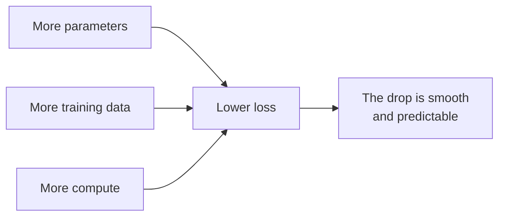
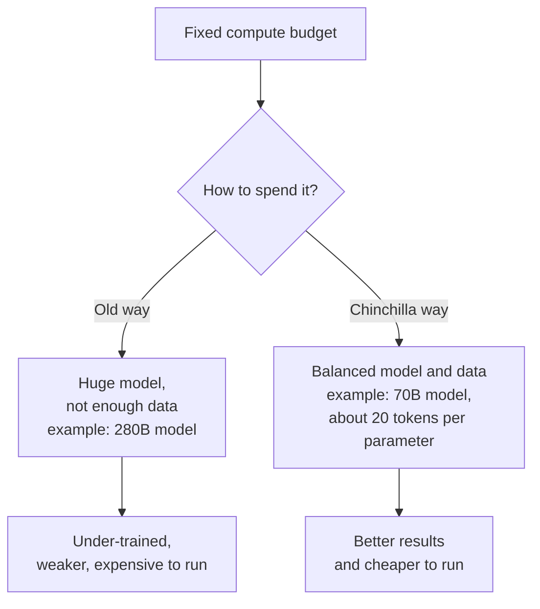

# Chapter 2: Scaling Laws and Chinchilla, How Big Should a Model Be?

**Papers:** *Scaling Laws for Neural Language Models* (2020) and *Training Compute-Optimal Large Language Models* (Chinchilla, 2022)

Once you have the Transformer engine from Chapter 1, an obvious question appears: how big should you build it, and how much text should you feed it? These two papers answer that question with numbers instead of guesswork. Together they are the reason teams felt confident spending tens of millions of dollars to train ever-larger models.

## Three knobs you can turn

When training a language model, you mostly control three things:

1. **Model size**, the number of [parameters](chapter-07-glossary.md#parameters-weights). Parameters are the adjustable dials inside the model. More dials means more capacity to store patterns.
2. **Data size**, the number of [tokens](chapter-07-glossary.md#token) of text you train on. A token is roughly a word or a piece of a word.
3. **Compute**, the total amount of calculation you do, measured in [FLOPs](chapter-07-glossary.md#compute-and-flops). Compute is basically time multiplied by hardware, which translates into money.

These three are linked. More compute lets you train a bigger model, or train on more data, or both. The whole game is deciding how to spend a fixed compute budget.

## Paper 1: Scaling Laws, the discovery that bigger is predictably better

Before this paper, people knew bigger models tended to be better, but it felt like alchemy. The Scaling Laws paper showed something striking: the improvement is **smooth and predictable**.

Specifically, as you increase model size, data, or compute, the model's error (measured as [loss](chapter-07-glossary.md#loss-function), where lower is better) drops along a clean curve called a power law. When you plot it on the right kind of graph, it is almost a straight line over many orders of magnitude.

Why this mattered so much: predictability removes risk. If a small experiment shows the curve, you can extrapolate and forecast how a model 100 times larger will perform **before** you spend the money to build it. That forecast is what gave teams the conviction to scale up to GPT-3 and beyond.

The original paper's takeaway leaned toward one conclusion: if you have more compute, spend most of it on a **bigger model**. As we will see, that advice was slightly off, and the next paper fixed it.

## Paper 2: Chinchilla, the correction

Two years later, a DeepMind team revisited the question with more careful experiments and found that the field had been building models that were **too big and trained on too little data**.

Here is the key finding in one line: for a given compute budget, you should grow the model and the dataset **in equal measure**. A useful rule of thumb that came out of this work is roughly **20 tokens of training data for every parameter**.

To prove it, they trained a model called Chinchilla with 70 billion parameters on 1.4 trillion tokens. They compared it against Gopher, a model with 280 billion parameters (four times larger) trained on less data. Chinchilla, despite being four times smaller, **beat** the bigger model on almost everything.

### A simple analogy

Imagine compute is a fixed budget for opening a restaurant. Model size is the size of the kitchen. Data is the amount of cooking practice your chefs get.

The old approach built a giant kitchen but barely let the chefs practice. Chinchilla showed that a medium kitchen with well-practiced chefs produces better food for the same total budget. A bigger kitchen is wasted if no one has learned to cook in it.

### Why a smaller, well-trained model is a double win

A Chinchilla-style model is not only better, it is also **cheaper to run**. Every time you use a model (called [inference](chapter-07-glossary.md#inference)), the cost depends on its size. A 70 billion parameter model costs far less per use than a 280 billion one. So training in a balanced way gives you a model that is both stronger and cheaper to serve to millions of users. That is why this paper reshaped how essentially every modern model is trained.

## Putting the two papers together

These papers are not in conflict. The first one discovered that scaling works in a predictable way. The second one refined the recipe for *how* to scale, by balancing model size against data instead of just inflating the model.

| Question | Scaling Laws (2020) | Chinchilla (2022) |
|----------|---------------------|-------------------|
| Does scaling help predictably? | Yes, it follows a smooth power law | Agrees |
| Where to spend extra compute? | Mostly on a bigger model | Split evenly between model size and data |
| Practical rule | Bigger is better | About 20 tokens of data per parameter |
| Lasting lesson | Forecast performance before training | Do not starve your model of data |

## The one-sentence takeaway

Model quality improves in a smooth, predictable way as you add parameters, data, and compute, and the smartest way to spend a compute budget is to grow the model and its training data together, not to just make the model enormous.

Next: [Chapter 3, Alignment with RLHF and DPO](chapter-03-alignment-instructgpt-and-dpo.md), where a raw text predictor learns to become a helpful assistant.
