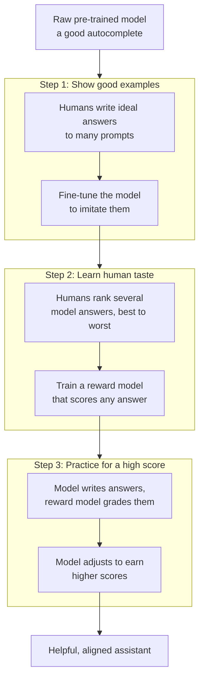
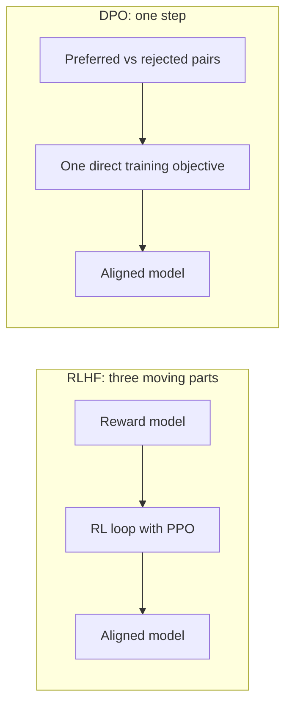

# Chapter 3: Alignment, Turning a Text Predictor Into a Helpful Assistant

**Papers:** *Training Language Models to Follow Instructions with Human Feedback* (InstructGPT / RLHF, 2022) and *Direct Preference Optimization* (DPO, 2023)

After Chapters 1 and 2, we have a big model trained on the internet. But here is a surprise: a freshly trained model is not a helpful assistant. It is a very good **autocomplete**. Its only skill is predicting the next word in internet text. Ask it "How do I bake bread?" and it might continue with more questions, because on the internet, questions are often followed by more questions. It does not know that *you* want an answer.

These two papers are about closing that gap. The goal is **alignment**: making the model do what humans actually want, helpfully and safely. This is the step that turned GPT-3 into ChatGPT.

## Why a raw model is not enough

The model has soaked up enormous knowledge, but it has no sense of what makes a response *good*. Good is subjective and human. It involves being helpful, honest, harmless, following instructions, and matching the tone people expect. You cannot write down those rules as a formula. But humans can recognize a good answer when they see one. The trick is to teach the model from human judgment.

## Paper 1: InstructGPT and the RLHF recipe

[RLHF](chapter-07-glossary.md#rlhf) stands for Reinforcement Learning from Human Feedback. It is a three-step pipeline. Let us walk through each step.

### Step 1: Supervised fine-tuning (show it what good looks like)

Humans write high-quality answers to a collection of prompts. The model is then trained to imitate these examples. This step is called [supervised fine-tuning](chapter-07-glossary.md#supervised-fine-tuning-sft), or SFT. It is like an apprentice copying a master. After this step the model is already much more helpful, but humans cannot write enough examples to cover everything.

### Step 2: Train a reward model (teach the machine our taste)

This is the clever part. Instead of writing more answers, humans now just **compare** them. The model produces several answers to a prompt, and a person ranks them from best to worst. Ranking is much faster and more reliable for humans than writing.

These rankings are used to train a separate model called a [reward model](chapter-07-glossary.md#reward-model). Its only job is to look at any answer and output a score that predicts how much a human would like it. In effect, we have bottled human judgment into a piece of software that can grade an unlimited number of answers automatically.

### Step 3: Reinforcement learning (practice to score well)

Now the main model practices. It writes an answer, the reward model grades it, and the model nudges itself to produce answers that earn higher scores. This is [reinforcement learning](chapter-07-glossary.md#reinforcement-learning), and the specific method used is called [PPO](chapter-07-glossary.md#ppo). Over many rounds, the model gets better and better at pleasing the reward model, which stands in for pleasing humans.

There is one danger here. If the model only chases a high score, it might find weird tricks that fool the reward model while producing nonsense, the way a student might game a test. To prevent this, the training adds a leash called a [KL penalty](chapter-07-glossary.md#kl-divergence), which discourages the model from drifting too far from its sensible Step 1 self. Reward on one side, leash on the other, keeps it both helpful and grounded.

### The headline result

The most famous finding: a small InstructGPT model with 1.3 billion parameters was **preferred by humans over the original GPT-3 with 175 billion parameters**, more than 100 times larger. Alignment, not raw size, was the missing ingredient. This is why every serious chat assistant since has used some form of this pipeline.

## Paper 2: DPO, the same goal with far less machinery

RLHF works, but it is complicated and fragile. You have to train and maintain a separate reward model, then run a delicate reinforcement learning loop that is hard to get right. The DPO paper asked: can we get the same result more simply?

The answer is yes, and the insight is captured by the paper's subtitle: **your language model is secretly a reward model**. The authors showed with math that you do not need a separate reward model and an RL loop at all. You can fold the whole thing into a single, direct training step on the human comparison data.

[DPO](chapter-07-glossary.md#dpo) works straight from [preference pairs](chapter-07-glossary.md#preference-data): a prompt, a preferred answer, and a rejected answer. It then trains the model with one simple objective: **make the preferred answer more likely and the rejected answer less likely**, while gently staying close to the original model (the same leash idea as before, baked right in).

### A simple analogy

RLHF is like hiring a judge (the reward model), then having a coach (PPO) run an athlete through endless practice rounds in front of that judge. DPO removes the judge and the coach. It just shows the athlete pairs of "this was good, that was bad" and lets them learn directly. Fewer moving parts, less that can break.

### Why DPO caught on

DPO is simpler to implement, cheaper to run, and more stable than full RLHF. For many teams it produces results just as good. It does not completely replace RLHF (the big labs still use reinforcement learning for the hardest cases, as you will see with DeepSeek-R1 in folder 02), but DPO made high-quality alignment accessible to far more people.

## Putting the two papers together

| Aspect | InstructGPT / RLHF | DPO |
|--------|--------------------|-----|
| Core idea | Learn human taste, then practice against it | Learn directly from preferred vs rejected pairs |
| Reward model | Separate, must be trained | None, the model itself plays that role |
| Reinforcement learning loop | Yes, using PPO | No |
| Complexity | High, can be unstable | Low, more stable |
| Both rely on | Human preference data | Human preference data |

Notice the bottom row. Both methods are powered by the same fuel: humans comparing answers. The difference is only in the machinery that turns those comparisons into a better model.

## The one-sentence takeaway

A pre-trained model is just a powerful autocomplete, and alignment is the process of teaching it human preferences, either through the three-step RLHF pipeline (demonstrations, a reward model, then reinforcement learning) or through DPO, which reaches the same place with a single, simpler training step.

Next: [Chapter 4, LoRA](chapter-04-efficient-fine-tuning-lora.md), where we learn to customize giant models without retraining all of them.
