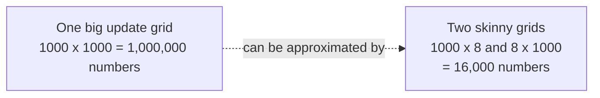
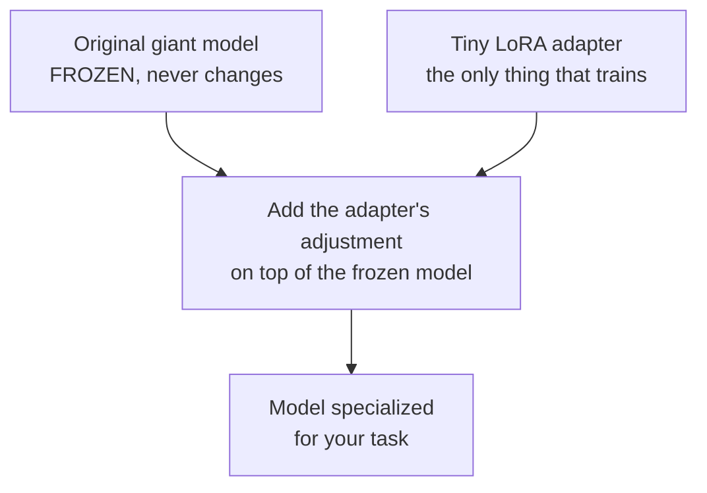
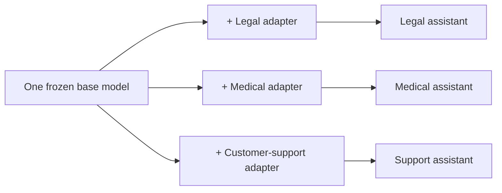

# Chapter 4: LoRA, Fine-Tuning Giant Models on a Budget

**Paper:** *LoRA: Low-Rank Adaptation of Large Language Models* (2021)

By now you can build a model (Chapter 1), scale it (Chapter 2), and align it (Chapter 3). But there is a practical problem. Suppose you have a giant model and you want to teach it a new specialty: your company's writing style, legal documents, medical Q&A. The obvious approach is [fine-tuning](chapter-07-glossary.md#fine-tuning), which means continuing to train the model on your new data. The trouble is that fine-tuning a model with billions of parameters is brutally expensive. LoRA is the trick that makes it cheap and practical.

## Why normal fine-tuning hurts

When you fine-tune a model the usual way, you adjust **all** of its [parameters](chapter-07-glossary.md#parameters-weights). For a model with billions of them, this causes three pains:

1. **Memory.** Training needs several times more memory than just running the model, because it has to track how to adjust every single parameter. This can require many expensive GPUs.
2. **Storage.** Every fine-tuned copy is a full-size model. If you want ten specialized versions, you store ten enormous files.
3. **Cost and time.** Updating billions of dials is slow and burns a lot of money.

For most people and companies, this is simply out of reach. LoRA changes that.

## The key insight: big changes can hide in small matrices

Here is the idea that makes LoRA work. When you fine-tune a model for a new task, the **change** you make to its weights turns out to be surprisingly simple. Even though the weights are a huge grid of numbers, the *adjustment* needed to specialize them can be captured by something much smaller. In technical terms, the update has a low [rank](chapter-07-glossary.md#matrix-rank-low-rank).

Let us unpack rank with a picture. A model's weights live in big grids of numbers called matrices. A large matrix might be 1000 by 1000, which is one million numbers. But some large matrices can be reconstructed by multiplying two skinny ones together. A 1000 by 1000 matrix can be approximated by a 1000 by 8 matrix times an 8 by 1000 matrix. Count the numbers: that is 8000 plus 8000, which is 16000 numbers instead of one million. Almost the same information, a tiny fraction of the storage.

LoRA bets that the adjustment a model needs in order to learn a new task fits comfortably into those two skinny grids.

## How LoRA works

Instead of editing the original weights, LoRA does this:

1. **Freeze** the original model completely. Not a single original parameter changes.
2. **Add** a small pair of skinny matrices (the low-rank adapter) alongside the layers you want to adapt.
3. **Train only those small matrices** on your new data. They learn the adjustment.

Because you are training only the skinny matrices, the number of trainable parameters can drop by a factor of thousands. Memory needs plummet, training is fast, and the resulting adapter file is small, often only a few megabytes instead of many gigabytes.

## Why this is such a big deal in practice

### One base model, many tiny adapters

Since the original model stays frozen and untouched, you can train a separate small adapter for each task and keep them all. Want the model to switch from legal writing to casual chat? Swap the adapter, not the whole model.

This is wonderfully efficient. Instead of storing ten full models, you store one base model plus ten tiny adapters.

### No slowdown when running

A natural worry: does adding an adapter make the model slower to use? No. After training, the adapter's adjustment can be merged back into the original weights, producing a model that runs at exactly the original speed. You get the customization for free at [inference](chapter-07-glossary.md#inference) time.

### A simple analogy

Think of the giant pre-trained model as a printed textbook that is expensive to reprint. Normal fine-tuning rewrites the entire book for each new course. LoRA instead clips a thin set of sticky notes onto the relevant pages. The book underneath never changes, the sticky notes are cheap to make, and you can keep different sets of notes for different courses and swap them in seconds.

## Why it spread everywhere

LoRA democratized fine-tuning. Suddenly a hobbyist with a single GPU, not just a big lab, could specialize a large model. It is now one of the most widely used techniques in the field, and it underpins the huge ecosystem of community-made model variants. Whenever you hear about someone "fine-tuning" an open model at home, they are almost always using LoRA or a close relative of it.

## The one-sentence takeaway

LoRA fine-tunes a giant model cheaply by freezing the original and training only a tiny pair of low-rank matrices that capture the small adjustment a new task requires, which slashes memory and storage, lets one base model wear many swappable adapters, and adds no slowdown when the model runs.

Next: [Chapter 5, Mixtral and Mixture of Experts](chapter-05-mixture-of-experts-mixtral.md), where models get a bigger brain without getting slower.
