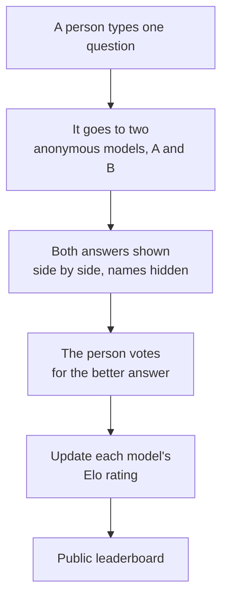
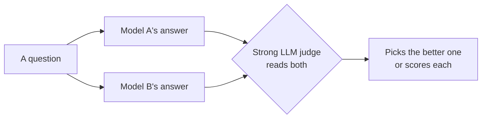
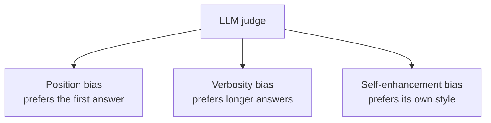

# Chapter 6: Judging Models, How Do We Measure Quality?

**Paper:** *Judging LLM-as-a-Judge with MT-Bench and Chatbot Arena* (2023)

We have built, scaled, aligned, and optimized our model. One question remains, and it is harder than it sounds: **how do we know if it is any good?** This final chapter of folder 01 is about measurement, which is the unglamorous but essential foundation of all progress. If you cannot measure quality, you cannot improve it.

## Why measuring chat models is genuinely hard

For a long time, models were tested with [benchmarks](chapter-07-glossary.md#benchmark) made of questions that have one clearly correct answer, often multiple choice. That works for "What is the capital of France?" But modern assistants are judged on open-ended tasks: "Write me a polite email declining this meeting," or "Explain recursion to a ten-year-old." These have no single right answer. A good response must be helpful, clear, well-toned, and genuinely useful, all qualities that resist a simple answer key.

So how do you score something that has thousands of valid answers, each better or worse in fuzzy human ways? This paper offers two complementary tools and one provocative idea.

## Tool 1: MT-Bench, a hard conversation quiz

MT-Bench is a curated set of challenging, open-ended questions spanning writing, reasoning, math, coding, and more. Crucially, it is **multi-turn**: it asks a question, then a follow-up, to test whether the model can hold a coherent conversation rather than just answer one-off prompts. It is a fixed, repeatable test you can run any model against.

## Tool 2: Chatbot Arena, let the crowd vote

Chatbot Arena takes a completely different approach: a live, public website where real people compare models head to head.

Because the model names are hidden, the votes are unbiased by reputation. The votes feed an [Elo rating](chapter-07-glossary.md#elo-rating), the same system used to rank chess players, where beating a strong opponent raises your score more than beating a weak one. With enough votes, this produces a remarkably trustworthy ranking grounded directly in human preference. The catch is that it is slow and expensive: it needs a constant stream of thousands of human voters.

## The big idea: let an LLM be the judge

Human voting is the gold standard, but it does not scale. You cannot summon thousands of humans every time you tweak a model. So the paper asks a bold question: **can a strong model, like GPT-4, judge other models' answers in place of a human?**

The appeal is obvious: an LLM judge is fast, cheap, and available around the clock. You can run thousands of automatic comparisons in minutes. But does it actually agree with human taste?

### The key finding

Yes, to a striking degree. The paper found that a strong LLM judge agreed with human preferences about **80 percent** of the time. That is roughly the same rate at which two humans agree with **each other**. In other words, the model judge is about as reliable as a typical human judge. This result is why "LLM-as-a-judge" is now a standard, everyday tool for evaluating AI systems quickly.

## Be careful: judges have biases

The paper is honest about the ways an LLM judge can be fooled, and knowing these is important if you ever rely on one:

- **Position bias:** the judge may favor whichever answer it sees first, regardless of quality. The fix is to swap the order and average.
- **Verbosity bias:** the judge tends to prefer longer answers, even when a shorter one is better. Length can masquerade as quality.
- **Self-enhancement bias:** a judge may favor answers written in its own style, subtly rating its own family of models more highly.

These biases do not make LLM judges useless. They make them tools to use **carefully**, with tricks like swapping answer order and watching out for padding.

## How the three pieces fit together

| Tool | What it is | Strength | Weakness |
|------|-----------|----------|----------|
| MT-Bench | Fixed hard question set | Repeatable, targeted | Limited set of questions |
| Chatbot Arena | Live human voting with Elo | Gold-standard human preference | Slow, expensive, needs crowds |
| LLM-as-a-judge | A strong model grades answers | Fast, cheap, scalable | Carries biases, needs care |

Together they form a practical toolkit: use the fast LLM judge for everyday iteration, use MT-Bench for a consistent yardstick, and use the human Arena as the ultimate source of truth.

## The one-sentence takeaway

Judging open-ended chat quality is hard because there is no single right answer, and this paper showed that a strong model can stand in for a human judge about 80 percent of the time, fast and cheap, as long as you stay alert to its position, verbosity, and self-preference biases.

That completes folder 01. You now understand how modern models are built, scaled, aligned, made efficient, and measured. For any unfamiliar term, the [glossary](chapter-07-glossary.md) is your friend. When you are ready, move on to [folder 02, Planning and Reasoning](../planning-and-reasoning/chapter-00-start-here.md), where models learn to think step by step.
