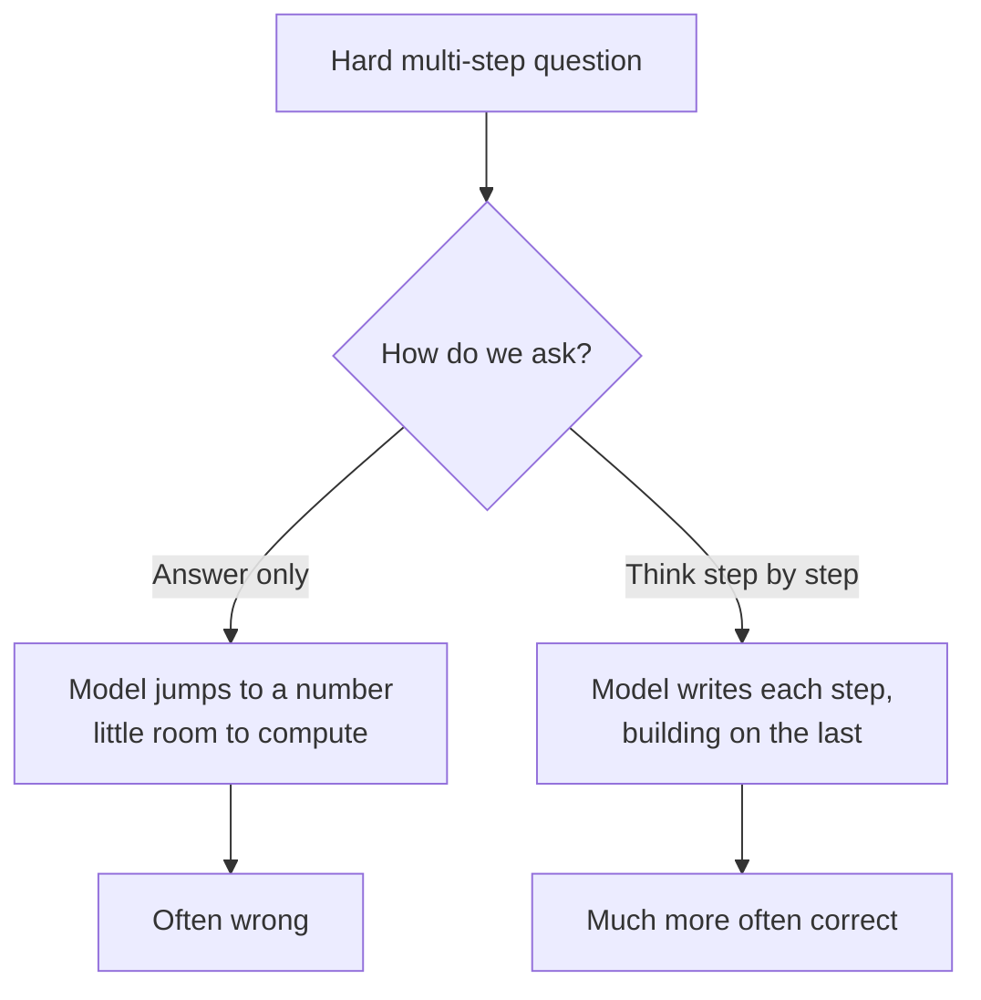
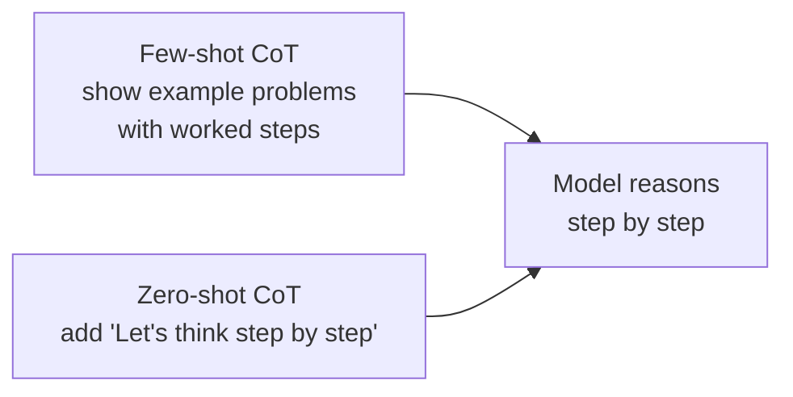
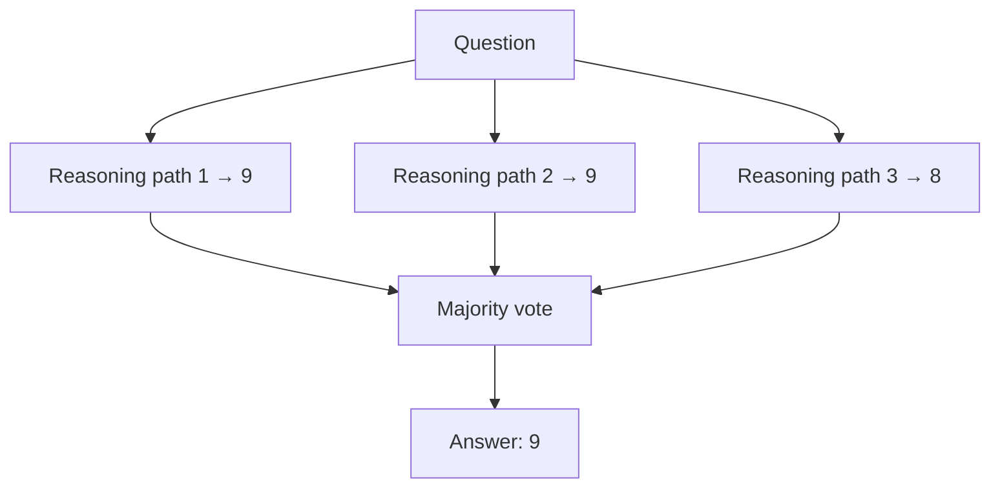

# Chapter 1: Chain of Thought, Teaching Models to Think Out Loud

**Paper:** *Chain-of-Thought Prompting Elicits Reasoning in Large Language Models* (2022)

This paper introduced one of the simplest and most powerful tricks in all of AI, and the wonderful part is that it requires no new training at all. You just change how you ask. The idea is to get the model to **show its work** before giving an answer, exactly like a math teacher asking you to write out the steps. That single change unlocks a dramatic jump in reasoning ability.

## The problem: answering too fast

Imagine asking a person this question and demanding an instant, one-word answer:

> A cafe had 23 apples. They used 20 to make pies and then bought 6 more. How many apples do they have now?

If forced to blurt out a number immediately, even a smart person might slip. But given a moment to think, "23 minus 20 is 3, plus 6 is 9," they get it right easily. Language models have the same issue, and for a deep reason. A model produces its answer one [token](chapter-06-glossary.md#token) at a time, with a fixed, small amount of computation per token. If you ask it to jump straight to the final number, it has almost no room to work out the intermediate steps. It is being forced to answer too fast.

## The fix: ask it to reason step by step

Chain-of-thought prompting tells the model to lay out its [reasoning](chapter-06-glossary.md#reasoning-in-language-models) before the final answer. Instead of just the number, it produces a [reasoning trace](chapter-06-glossary.md#reasoning-trace):

> Start with 23 apples. They used 20 for pies, leaving 23 minus 20 equals 3. Then they bought 6 more, so 3 plus 6 equals 9. The answer is 9.

Why does this help so much? Because each step the model writes becomes part of what it reads for the next step. By writing "23 minus 20 equals 3," the model puts that intermediate result into its own working memory, and can build on it. The written steps are like scratch paper. The model is literally giving itself more room to compute by thinking out loud.

## How you actually trigger it

There are two common ways to get a chain of thought, both relying on [in-context learning](chapter-06-glossary.md#in-context-learning-zero-shot-and-few-shot), the model's ability to learn from the prompt itself.

The first, from this paper, is **few-shot**: you include a couple of example problems in your prompt where the worked-out steps are shown, not just the answers. The model sees that pattern and imitates it, producing steps for your new question too.

The second, from closely related work, is even simpler and is **zero-shot**: you just add a phrase like "Let's think step by step" to your question. That small nudge is often enough to make a large model start reasoning before answering.

## The catch: it only works when models are big

Here is a fascinating wrinkle. Chain of thought is an [emergent ability](chapter-06-glossary.md#emergent-ability): it barely helps small models, and can even make them worse, but it produces a large improvement once a model is big enough. Small models do not yet have the underlying capability to chain steps reliably, so prompting them to do so just gives them more chances to make mistakes. Past a certain scale, the ability switches on and the prompting unlocks it. This was an early, vivid example of scale producing genuinely new behavior, not just smoother performance.

## A reliability booster: self-consistency

A natural follow-up idea, worth knowing because it is widely used, is [self-consistency](chapter-06-glossary.md#self-consistency). Instead of generating one chain of thought, you generate several different ones (the model can reason its way to an answer by more than one path), and then take the answer that comes up most often, a majority vote.

The intuition: a correct answer can be reached by many different valid lines of reasoning, while mistakes tend to be scattered and inconsistent. So the most common answer across several attempts is usually the right one. This trades extra computation for extra reliability, which is a theme that returns again and again in this folder.

## Why this paper mattered

Chain of thought reframed what a prompt is for. A prompt is not just a question; it can shape *how* the model thinks. It showed that a huge amount of latent reasoning ability was already sitting inside large models, waiting to be unlocked by simply giving them room to work. Almost every later advance in reasoning, including the ReAct agents and the DeepSeek-R1 reasoning model in this folder, builds directly on this foundation of getting the model to produce intermediate steps.

## The one-sentence takeaway

Asking a large model to think step by step, rather than answer instantly, lets it use its own written steps as scratch paper and dramatically improves its reasoning, a free upgrade that needs no retraining but only switches on once models are big enough.

Next: [Chapter 2, ReAct](chapter-02-react.md), where the model stops just thinking and starts acting in the world.
