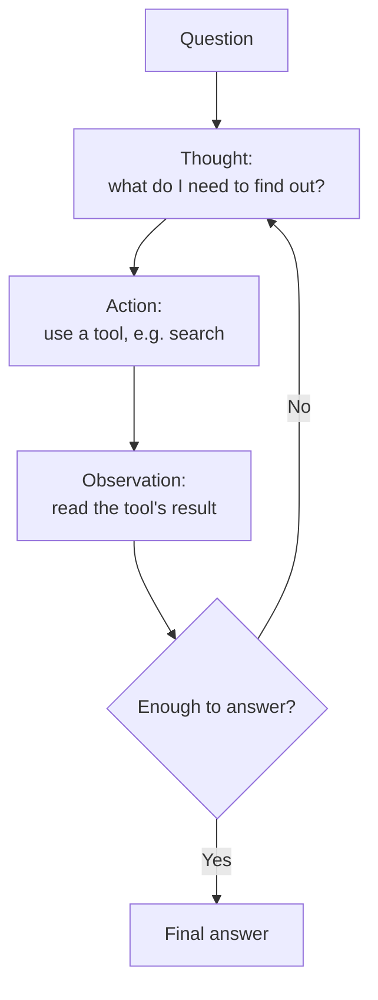
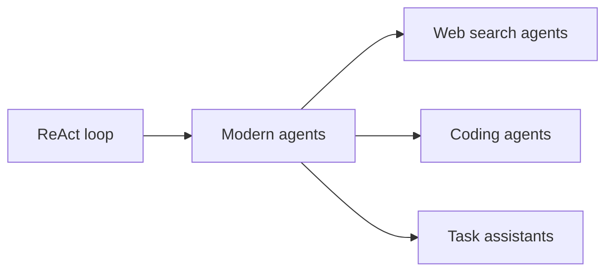

# Chapter 2: ReAct, Reasoning and Acting Together

**Paper:** *ReAct: Synergizing Reasoning and Acting in Language Models* (2022)

Chapter 1 gave the model an inner monologue. But thinking alone has a limit: a model can only reason about what it already knows. Ask it "What is the weather in Tokyo right now?" and no amount of step-by-step thinking will help, because the answer is not inside it. ReAct closes this gap by letting the model **act**: look things up, use tools, and bring real information back into its reasoning. This paper is the blueprint for nearly every AI [agent](chapter-06-glossary.md#agent) built since.

## Two failure modes ReAct fixes

Consider the two extremes before ReAct.

**Pure reasoning (chain of thought alone).** The model thinks beautifully but is cut off from the world. If it does not know a fact, it may confidently invent one. This making-things-up is called [hallucination](chapter-06-glossary.md#hallucination), and it happens because the model has no way to check itself against reality.

**Pure acting (tools without reasoning).** Imagine a system that can click buttons and run searches but cannot think about why. It tends to flail, taking actions without a coherent plan, easily knocked off track.

ReAct's insight is that reasoning and acting fix each other's weaknesses. Reasoning decides what action to take next and what to make of the result; acting feeds real information back to keep the reasoning honest.

## The core loop: Thought, Action, Observation

ReAct runs the model in a loop of three repeating moves:

- **Thought:** the model reasons about what it knows and what it needs next.
- **Action:** the model uses a tool, for example searching the web or a database. This is its [tool use](chapter-06-glossary.md#tool-use).
- **Observation:** the result of the action comes back and the model reads it.

Then it loops again, thinking about the new observation, taking another action, and so on, until it has enough to answer.

The crucial design choice is the [observation and action](chapter-06-glossary.md#observation-and-action) cycle. The model is no longer reasoning in a sealed box; each loop pulls fresh, real information in, which the next thought can use.

## A worked example

Suppose you ask: "Which is taller, the Eiffel Tower or the Statue of Liberty, and by how much?" A ReAct trace might look like this:

> **Thought:** I need the heights of both. I will look up the Eiffel Tower first.
> **Action:** search "height of Eiffel Tower"
> **Observation:** About 330 meters.
> **Thought:** Now the Statue of Liberty.
> **Action:** search "height of Statue of Liberty"
> **Observation:** About 93 meters including the base.
> **Thought:** 330 minus 93 is 237. The Eiffel Tower is taller.
> **Answer:** The Eiffel Tower is taller, by roughly 237 meters.

Notice the interplay. Each thought decides the next action; each observation grounds the next thought in a real fact rather than a guess. This grounding, anchoring reasoning to information retrieved from the world, is exactly what prevents the hallucination problem from Chapter 1. (See [grounding](chapter-06-glossary.md#grounding).)

## Why this is the foundation of agents

An [agent](chapter-06-glossary.md#agent) is an AI system that does not just answer once but takes a series of actions to accomplish a goal. The ReAct loop is the beating heart of that idea. Every modern tool-using assistant, the ones that can search the web, run code, query a calendar, or browse files, is running some refined version of Thought, Action, Observation.

The reason it caught on is that it is both powerful and transparent. Because the model writes out its thoughts and actions, you can read the trace and see exactly *why* it did what it did, which makes these systems far easier to debug and trust than a black box that simply emits an answer.

## The one-sentence takeaway

ReAct interleaves thinking and doing in a loop of Thought, Action, and Observation, so the model can reach out to tools for real information and weave it back into its reasoning, which both stops hallucination and forms the basic pattern behind every modern AI agent.

Next: [Chapter 3, Let's Verify Step by Step](chapter-03-verify-step-by-step.md), where we learn to reward good reasoning rather than just lucky answers.
