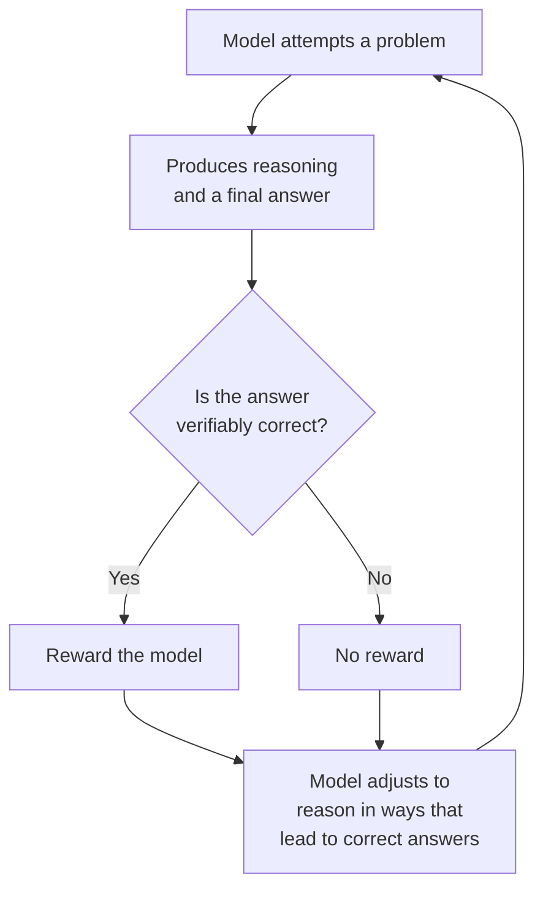
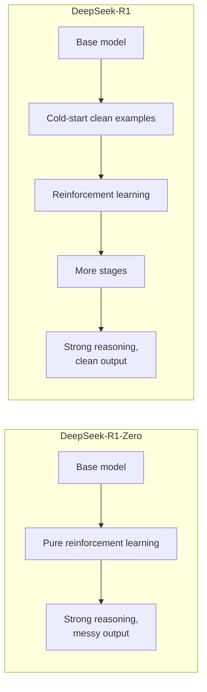

# Chapter 4: DeepSeek-R1, Learning to Reason Through Reinforcement Learning

**Paper:** *DeepSeek-R1: Incentivizing Reasoning Capability in LLMs via Reinforcement Learning* (2025)

So far, models learned to reason mostly by **imitation**: we showed them step-by-step examples (Chapter 1) or human-labeled good and bad steps (Chapter 3). DeepSeek-R1 asks a bolder question. What if we do not show the model how to reason at all, and instead just reward it for getting answers right, letting it **discover** how to reason on its own? The result was an open-source model that rivals the best closed reasoning models, and a genuinely surprising finding about how reasoning can emerge.

## The setup: reward correct answers, nothing else

The team started from a base model and applied [reinforcement learning](chapter-06-glossary.md#reinforcement-learning), the trial-and-error training you met in folder 01. But here is the twist that makes it work for reasoning. For problems like math and coding, you can check an answer **automatically and for certain**: a math answer is either correct or not, code either passes the tests or not. These are [verifiable rewards](chapter-06-glossary.md#verifiable-rewards), and they are powerful because they are cheap and impossible to fake.

This sidesteps the whole machinery of folder 01's alignment. There is no separate learned [reward model](chapter-06-glossary.md#reward-and-reward-signal) that might be fooled. The reward comes straight from checking whether the answer is right.

## DeepSeek-R1-Zero: reasoning appears on its own

The first model, called R1-Zero, was trained with **pure** reinforcement learning, with no [supervised fine-tuning](chapter-06-glossary.md#supervised-fine-tuning-sft) warm-up at all, no human-written reasoning examples first. It was simply rewarded for correct answers, over and over.

What happened next is the heart of the paper. With nothing but this reward, the model **taught itself to reason**. It began, entirely on its own, to write longer [chains of thought](chapter-06-glossary.md#chain-of-thought), to double-check its own work, to try an approach and then reconsider it. Nobody programmed these behaviors in. They [emerged](chapter-06-glossary.md#emergent-ability) because they led to more correct answers, and correct answers were rewarded.

The researchers describe an "aha moment," where the model learned to pause and re-evaluate its approach mid-solution, spending more thinking time on harder problems. This is a striking demonstration that the *strategy* of careful reasoning can be discovered through reward alone, much as a game-playing AI discovers clever tactics by being rewarded only for winning.

## The catch, and the fix: DeepSeek-R1

R1-Zero reasoned well but had rough edges. Because it was never trained on clean human examples, its output was often hard to read and sometimes mixed languages mid-answer. It was a brilliant thinker with messy handwriting.

To fix this, the team built the full DeepSeek-R1 with a multi-stage recipe. The key addition is a small amount of [cold-start data](chapter-06-glossary.md#cold-start-data): a curated set of clean, well-formatted reasoning examples used to gently warm up the model **before** the reinforcement learning begins. This gives the model good habits of presentation first, and then RL sharpens its reasoning.

The payoff: DeepSeek-R1 reached performance **comparable to OpenAI's o1**, one of the best reasoning models in the world at the time, but as an open model the whole community could study and use.

## Sharing the ability: distillation

There is one more valuable contribution. The team used [distillation](chapter-06-glossary.md#distillation) to transfer R1's reasoning skill into a family of smaller models (ranging from tiny to large). Distillation means training a smaller "student" model to imitate the outputs of a larger "teacher" model. The result was a set of compact models that reason surprisingly well, making strong reasoning accessible on far more modest hardware.

## Why this paper mattered

DeepSeek-R1 was a landmark for two reasons. First, it showed that high-level reasoning can be **grown** through reinforcement learning with simple verifiable rewards, rather than painstakingly taught example by example. That is a more scalable path, because checking answers is far cheaper than hand-writing reasoning. Second, by being open, it pulled back the curtain on how frontier reasoning models are built, accelerating the entire field. It is the clearest demonstration yet of this folder's central theme: let the model spend more effort thinking, and reward it for thinking well, and powerful reasoning follows.

## The one-sentence takeaway

DeepSeek-R1 showed that a model can teach itself to reason, growing longer chains of thought and self-checking habits on its own, when it is trained with reinforcement learning and rewarded simply for reaching verifiably correct answers, with a light touch of clean example data added only to tidy up how it presents its thinking.

Next: [Chapter 5, Recursive Language Models](chapter-05-recursive-language-models.md), where a model learns to handle inputs far larger than its own memory.
