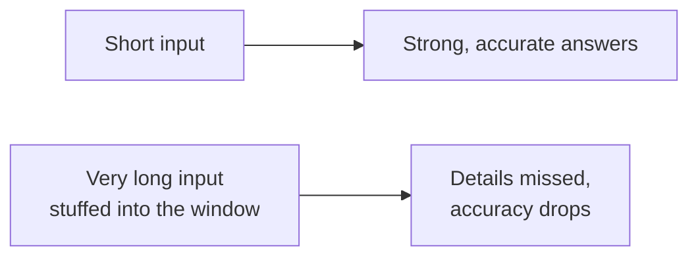
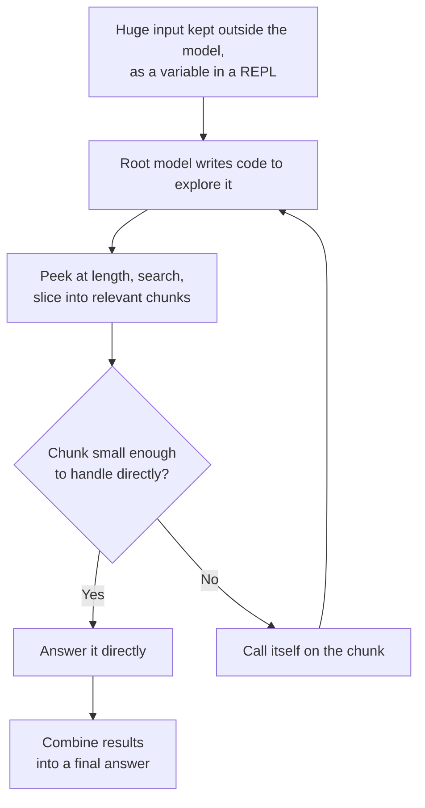
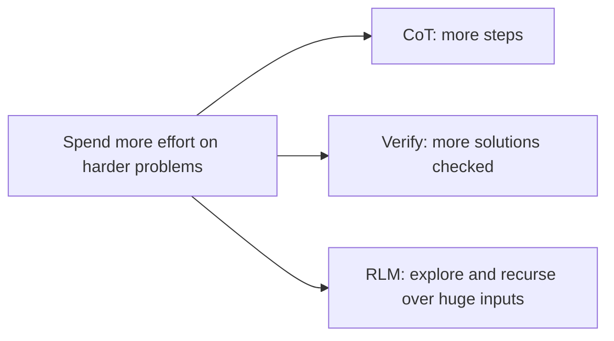

# Chapter 5: Recursive Language Models, Thinking Beyond the Memory Limit

**Paper:** *Recursive Language Models* (2025)

Every chapter so far made the model think *better*. This final chapter tackles a different wall: thinking about something *bigger than the model can hold*. Models have a fixed [context window](chapter-06-glossary.md#context-window-and-long-context), a maximum amount of text they can read at once. Feed them a whole book, a giant codebase, or a thousand-page report, and they either cannot fit it or, just as bad, get confused and lose accuracy as the input grows. Recursive Language Models, or RLMs, are a clever way around this, and they come from MIT researchers in 2025.

## The problem: long inputs break models

The context window is the model's working memory. Two things go wrong when inputs get large:

First, the hard limit: if the text simply does not fit in the window, the model cannot see all of it. Second, and more subtly, even when text *does* fit, models tend to **degrade** as the input grows longer. Buried details get overlooked, and the model effectively forgets parts of what it read, as if some early information had to be pushed aside to make room. So just building ever-bigger context windows is not a full solution; quality slips as length climbs.

## The idea: treat the long prompt as an environment, not a thing to read

Here is the shift in thinking. Instead of forcing the entire giant input *into* the model's memory all at once, RLMs keep the input *outside* the model, as data the model can explore. The long prompt is placed into a [REPL](chapter-06-glossary.md#repl), a small live programming environment, as a variable the model can examine with code.

Now the model does not try to read everything. It writes code to **peek** at the input: check how long it is, search it for relevant parts, slice it into chunks. It pulls in only the pieces it actually needs, when it needs them, rather than drowning in the whole thing.

## The recursive part

The name comes from the key move: when a chunk is still too big or complex to handle in one go, the model **calls itself** on that chunk. [Recursion](chapter-06-glossary.md#recursion) means a process that invokes a fresh copy of itself to handle a smaller piece of the same kind of problem. A "root" model orchestrates the work; it spawns sub-calls, each a fresh model instance, to digest individual pieces, then gathers their results back together.

A simple analogy. Imagine a lead researcher handed a thousand-page report and one question. They do not read every page themselves. They skim the table of contents, identify the ten relevant chapters, and hand each chapter to an assistant with the instruction "summarize what this says about the question." Each assistant, if their chapter is still huge, can recruit their own helper for sub-sections. Finally the lead researcher combines the assistants' notes into one answer. The lead never had to hold the whole report in their head at once. That is exactly how an RLM works, with the model playing every role.

## Why this works so well

The payoff reported in the paper is striking. RLMs can handle inputs up to **a hundred times larger** than the model's normal context window. And even on inputs that *would* fit, they often beat a plain model, because they avoid the accuracy-drop-with-length problem by only ever looking closely at small, relevant pieces. Remarkably, they do this at a cost per query that is comparable to, or even cheaper than, the alternatives, because the model spends effort only on the parts that matter instead of processing everything.

This is another face of the theme running through this whole folder: [inference-time compute](chapter-06-glossary.md#inference-time-compute-test-time-scaling), spending more thinking effort at the moment of answering. Chapter 1 spent it on writing steps; Chapter 3 spent it on generating and checking many solutions; here it is spent on programmatically exploring and recursively breaking down a massive input. The model decides, on its own, how to divide and conquer.

## Why this paper mattered

Recursive Language Models reframe the long-context problem. The goal is not to build a model with an infinitely large memory, which is expensive and still degrades. The goal is to give the model the *tools and strategy* to navigate inputs far larger than its memory, the way a person uses an index, notes, and helpers to work through a library they could never memorize. It is a fitting capstone to this folder, because it shows reasoning, tool use, and the divide-and-conquer instinct all working together.

## The one-sentence takeaway

Recursive Language Models handle inputs far larger than a model's memory by keeping the giant input outside the model as explorable data, writing code to examine only the relevant pieces, and recursively calling fresh copies of the model on chunks that are still too big, so a model can effectively reason over a library it could never hold all at once.

That completes folder 02. You have followed reasoning from a simple "think step by step" prompt all the way to models that learn to reason on their own and navigate inputs beyond their memory. For any unfamiliar term, the [glossary](chapter-06-glossary.md) has you covered.
