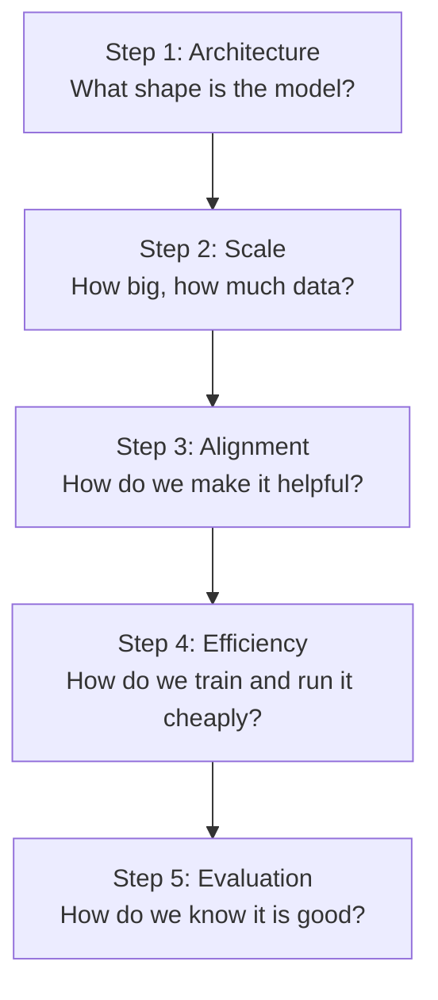

# Start Here: Foundational Modelling, Explained Simply

Welcome. This folder of papers is the bedrock of modern AI. Every chatbot, coding assistant, and AI tool you have used stands on the ideas in these eight papers.

The papers themselves are written for researchers, so they can feel intimidating if you are new. These explanation chapters fix that. They walk you through the same ideas in plain language, with pictures and small examples, so that by the end you understand *why* each paper mattered, not just *what* it said.

## How to use these explanations

Read the chapters in order. Each one builds on the last. When you hit a word in **bold with a link**, like [self-attention](./glossary.md#self-attention), you can click it to jump to the [glossary](./glossary.md), where that idea is explained from scratch. The same words show up again and again across papers, so explaining them once in a shared glossary keeps things clean.

You do not need any math beyond basic arithmetic to follow these chapters. You do need patience and curiosity.

## The big picture

Think of building a modern language model as a four-step journey. Each paper in this folder improves one step.

Here is how the eight papers map onto that journey.

| Step | Question it answers | Papers |
|------|--------------------|--------|
| Architecture | What internal design lets a model understand language? | Attention Is All You Need |
| Scale | How big should the model and dataset be? | Scaling Laws, Chinchilla |
| Alignment | How do we turn a raw text predictor into a helpful assistant? | InstructGPT (RLHF), DPO |
| Efficiency | How do we customize and serve models without huge cost? | LoRA, Mixtral (Mixture of Experts) |
| Evaluation | How do we measure whether a model is actually good? | LLM-as-a-Judge / Chatbot Arena |

## Chapter map

1. [The Transformer: the engine inside every modern model](./01-the-transformer.md)
2. [Scaling Laws and Chinchilla: how big should a model be?](./02-scaling-laws-and-compute.md)
3. [Alignment: turning a text predictor into a helpful assistant (RLHF and DPO)](./03-alignment-instructgpt-and-dpo.md)
4. [LoRA: fine-tuning giant models on a budget](./04-efficient-fine-tuning-lora.md)
5. [Mixtral and Mixture of Experts: more brain, same speed](./05-mixture-of-experts-mixtral.md)
6. [Judging models: how do we measure quality?](./06-evaluating-models.md)
7. [Glossary: every key term, explained from zero](./glossary.md)

## One idea to hold in your head

Almost everything in this folder is a variation on a single trick: **predict the next word**. A language model is trained by hiding the next word in billions of sentences and asking the model to guess it. That is it. Everything else, the architecture, the scaling, the alignment, is about making that one trick work better and behave the way we want. Keep that anchor in mind and the rest will click into place.

Ready? Start with [Chapter 1: The Transformer](./01-the-transformer.md).
