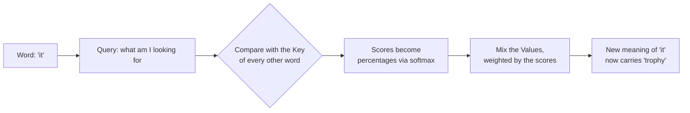
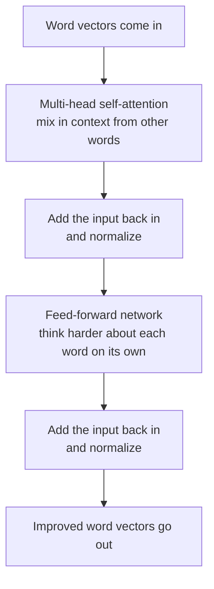

# Chapter 1: The Transformer, the Engine Inside Every Modern Model

**Paper:** *Attention Is All You Need* (2017)

If you read only one paper in this whole collection, make it this one. The Transformer is the design that made GPT, Claude, Gemini, Llama, and every other modern model possible. The title is a small joke that turned out to be true: the authors threw away the complicated machinery everyone was using and kept just one idea, called **attention**, and it worked better than anything before it.

## The problem they were trying to solve

Language is about relationships between words that can be far apart. Take this sentence:

> The trophy did not fit in the suitcase because **it** was too big.

What does "it" refer to? The trophy. Now change one word:

> The trophy did not fit in the suitcase because **it** was too small.

Now "it" refers to the suitcase. To understand the sentence, the model has to look back across several words and figure out which earlier word each word is connected to.

Before 2017, the popular tool for this was the [recurrent neural network](./glossary.md#neural-network), which read a sentence one word at a time, left to right, carrying a running memory. This had two big problems:

1. It was **slow**, because word number 100 could not be processed until words 1 through 99 were done. No skipping ahead, no doing things in parallel.
2. It had a **bad memory**. By the time it reached the end of a long paragraph, it had mostly forgotten the beginning.

The Transformer solves both at once.

## The one big idea: attention

Here is the core move. Instead of reading word by word, the Transformer looks at **all the words at the same time** and lets each word decide which other words it should pay attention to.

A simple analogy. Imagine every word in the sentence is a person in a room, and they are all trying to understand their own role. The word "it" raises its hand and asks the room, "Which of you is relevant to me?" Every other word answers with a relevance score. "Trophy" might shout loudly, "suitcase" a bit softer, "the" almost silently. The word "it" then builds its understanding mostly from the words that answered loudest.

That asking-and-weighing process is [self-attention](./glossary.md#self-attention). Doing it lets every word pull in context from every other word in a single step, no matter how far apart they are.

### How attention actually works, gently

Every word is first turned into a list of numbers called an [embedding](./glossary.md#embedding). A list of numbers is called a [vector](./glossary.md#vector), and you can think of it as the word's location on a giant map of meaning, where similar words sit close together.

For attention, each word creates three different versions of itself:

- A **Query**: "Here is what I am looking for."
- A **Key**: "Here is what I contain."
- A **Value**: "Here is what I will hand over if you pick me."

To decide how much word A should attend to word B, the model compares A's Query with B's Key. A strong match means a high score. All the scores get squashed into percentages that add up to 100 using a function called [softmax](./glossary.md#softmax). Then each word builds its new, context-aware representation by mixing together the Values of the other words, weighted by those percentages.



The beautiful part: the model is not told the rules of grammar. It **learns** what to attend to on its own, by practicing next-word prediction on huge amounts of text.

### Many heads are better than one

A single attention pass captures one kind of relationship. But words relate in many ways at once: grammar, subject matter, tone, who-did-what-to-whom. So the Transformer runs several attention passes in parallel, each free to focus on a different pattern. These parallel passes are called [attention heads](./glossary.md#multi-head-attention). One head might track which noun a pronoun refers to, another might track verb tense, another might link adjectives to the things they describe. Their results are combined. The original paper used eight heads.

## The rest of the machine

Attention is the star, but a Transformer block has a few more parts. Here is the full flow for one block.



Two new pieces appear here:

- The [feed-forward network](./glossary.md#feed-forward-network) is a small processing step applied to each word separately. If attention is "gather information from neighbors," the feed-forward step is "now think about what you gathered."
- The "add the input back in" arrows are called residual connections. They let the original information flow straight through, so deep stacks of blocks do not lose the thread. This is a practical trick that makes very deep models trainable.

A real Transformer stacks many of these blocks on top of each other. Each [layer](./glossary.md#layers-and-depth) refines the meaning a little more. Early layers catch simple patterns like grammar; later layers catch abstract ones like intent.

### One more thing: word order

Because attention looks at all words at once, it has no built-in sense of order. "Dog bites man" and "man bites dog" would look identical. The fix is [positional encoding](./glossary.md#positional-encoding), a small signal added to each word's embedding that tells the model where the word sits in the sequence. Now order is preserved.

## Encoder and decoder

The original Transformer had two halves, an [encoder and a decoder](./glossary.md#encoder-and-decoder). The encoder reads and understands the input (useful for translation). The decoder generates the output one word at a time. Most chat models today, like GPT, use only the decoder half, because their main job is to generate text. It is worth knowing both exist, because the words "encoder" and "decoder" show up constantly.

## Why this paper changed everything

Three reasons, in plain terms:

1. **Speed through parallelism.** Because all words are processed together, training can use modern hardware (GPUs) at full tilt. This is what made it practical to train on the entire internet.
2. **Long-range memory.** Any word can attend directly to any other word, so distance no longer destroys understanding.
3. **It scales.** Make it bigger, feed it more text, and it keeps getting better in a predictable way. That predictability is the subject of the next chapter.

In short, the Transformer is the engine. Everything else in this folder is about fueling it, tuning it, and steering it.

## The one-sentence takeaway

The Transformer lets every word in a sentence directly look at every other word and decide what to pay attention to, and stacking that simple idea many times, at scale, is enough to learn language.

Next: [Chapter 2, Scaling Laws and Chinchilla](./02-scaling-laws-and-compute.md), where we ask how big these models should actually be.

## Review

**Quick Check**

1. Before 2017 the popular tool for language was the recurrent neural network. Which two problems does the chapter say it had?
   - A) It needed labelled data, and it could not be stacked into deep models
   - B) It was slow, because word 100 could not be processed until words 1 through 99 were done, and it had a bad memory over long paragraphs
   - C) It could not handle unknown words, and it had no sense of word order
   - D) It was expensive to run, and it could only translate between two languages
   <details><summary>Answer</summary>B) Slow and forgetful - reading strictly left to right blocks any parallelism, and by the end of a long paragraph it had mostly forgotten the beginning.</details>

2. In "The trophy did not fit in the suitcase because it was too big / too small", what flips what "it" refers to?
   - A) The position of the word "it" in the sentence
   - B) The word "because", which reverses the direction of the clause
   - C) A single adjective at the end - "too big" points at the trophy, "too small" points at the suitcase
   - D) The order in which "trophy" and "suitcase" appear
   <details><summary>Answer</summary>C) One adjective at the far end of the sentence - which is exactly why the model has to look back across several words to resolve the pronoun.</details>

3. Each word creates three versions of itself for attention. Which one means "here is what I will hand over if you pick me"?
   - A) The Query
   - B) The Key
   - C) The embedding
   - D) The Value
   <details><summary>Answer</summary>D) The Value - Query is what a word is looking for, Key is what it contains, and Value is what actually gets mixed into the result.</details>

4. How does the model decide how much word A should attend to word B?
   - A) It compares A's Query with B's Key, and a strong match means a high score
   - B) It compares A's Value with B's Value
   - C) It measures how many words apart A and B sit
   - D) It looks the pair up in a grammar rule table supplied during training
   <details><summary>Answer</summary>A) Query against Key - and notice nobody hands the model grammar rules; it learns what to attend to by practising next-word prediction.</details>

5. Suppose you build a Transformer and forget to add positional encoding, then feed it "Dog bites man" and "Man bites dog". According to the chapter, what happens?
   - A) The second sentence is rejected as ungrammatical
   - B) The model processes the first correctly and the second slowly
   - C) The two sentences look identical to the model, because attention looks at all words at once and has no built-in sense of order
   - D) Attention scores become negative and training fails immediately
   <details><summary>Answer</summary>C) They look identical - losing sequential reading also lost the free sense of order, so a position signal has to be added back into each word's embedding.</details>

**More Questions**

6. What does softmax do to the raw attention scores?
   - A) It removes any negative scores
   - B) It squashes them into percentages that add up to 100
   - C) It sorts them from highest to lowest
   - D) It averages them into a single number per sentence
   <details><summary>Answer</summary>B) It turns them into percentages summing to 100, so each word's new representation is a weighted mixture of the other words' Values.</details>

7. How many attention heads did the original paper use?
   - A) One
   - B) Three
   - C) Six
   - D) Eight
   <details><summary>Answer</summary>D) Eight - each head runs in parallel and is free to focus on a different kind of relationship.</details>

8. Inside a Transformer block, what is the feed-forward network for?
   - A) It is a small processing step applied to each word on its own - if attention is "gather information from neighbours", this is "now think about what you gathered"
   - B) It mixes information between words a second time, more cheaply than attention
   - C) It converts word vectors back into text
   - D) It adds the positional signal to each embedding
   <details><summary>Answer</summary>A) Per-word thinking - attention gathers context across words, then the feed-forward step processes each word separately.</details>

9. The block diagram has two "add the input back in and normalize" arrows. What are those residual connections for?
   - A) They normalize the attention scores so they sum to 100
   - B) They discard words that received low attention
   - C) They let the original information flow straight through, so deep stacks of blocks do not lose the thread - which is what makes very deep models trainable
   - D) They average the outputs of the eight attention heads
   <details><summary>Answer</summary>C) A straight path for the original signal - a practical trick, but the thing that keeps deep stacks from losing the thread.</details>

10. You are building a chat model whose main job is to generate text. Based on the chapter, which half of the original Transformer would you use?
   - A) The encoder, because it is the half that understands language
   - B) The decoder, because it generates the output one word at a time - which is why most chat models today are decoder-only
   - C) Both halves, because generation requires reading and writing
   - D) Neither, because chat models replaced this architecture entirely
   <details><summary>Answer</summary>B) The decoder - the encoder half is most useful when you need to read and understand an input, as in translation.</details>

**Think About It**

1. The paper's title is a small joke: *Attention Is All You Need*. The authors did not add a clever new mechanism on top of what everyone was using - they deleted almost everything. Why was subtraction the breakthrough?
<details><summary>Show answer</summary>
By 2017 the field had spent years making recurrent networks better: gates to help them remember, attention bolted on as a helper to patch their weak memory. Attention was already there - it just wasn't the point. The bet in this paper was that the recurrence, the part everyone considered the actual engine, was the thing holding it all back, and the helper was strong enough to stand alone. Removing recurrence bought two things at once: every word could be processed in the same step, so training could finally saturate a GPU, and any word could reach any other word directly instead of relaying information through every word in between. That's the joke landing - the helper was all you needed, and the engine was the anchor.
</details>

2. Attention lets every word look directly at every other word, which sounds strictly better than reading left to right. Yet it immediately created a problem the old recurrent network never had. What was it, and why would anyone accept that trade?
<details><summary>Show answer</summary>
A network that reads one word at a time gets word order for free - order *is* the reading. Look at all the words simultaneously and that free gift vanishes: "Dog bites man" and "Man bites dog" become the same bag of words. So the Transformer had to be given order back explicitly, as a small positional signal added to each word's embedding. The trade is worth it because order is cheap to reintroduce - it's a number added to a vector - while the things recurrence cost you, parallel training and long-range memory, could not be bought back at any price. That's a pattern worth noticing: it's often better to break something you can repair cheaply than to keep something whose cost is structural.
</details>

3. If one attention pass can already let every word gather context from every other word, why bother running eight of them in parallel? Isn't that just doing the same thing eight times?
<details><summary>Show answer</summary>
It would be, if attention produced one objectively correct set of relevance scores. But a single pass has to commit to one answer to "which words matter to me" - and words relate in many ways at once. Grammar wants the pronoun linked to its noun. Tense wants the verbs linked to each other. Meaning wants adjectives linked to what they describe. One set of percentages cannot express all of those simultaneously, because attending strongly to the noun means attending less to everything else. Running several heads in parallel lets each one specialise in a different pattern, then combines their results, so the block can carry many kinds of relationship at once instead of picking a winner.
</details>

4. Nobody tells the Transformer that "it" is a pronoun, or that pronouns refer back to nouns. It has no grammar rules anywhere in it. So how does it end up attending from "it" to "trophy"?
<details><summary>Show answer</summary>
The only thing the model is ever asked to do is predict the next word, over and over, across an enormous amount of text. Getting that prediction right in the trophy sentence *requires* having resolved what "it" points at - the continuation differs depending on the answer. So the pressure to link the pronoun to the right noun doesn't come from a rule; it comes from the fact that failing to link them costs prediction accuracy. The Query, Key, and Value transformations are learned, so training gradually shapes them until pronouns produce Queries that match nouns' Keys. Grammar isn't installed, it's discovered - because grammar is a compression of what actually predicts text.
</details>

5. The chapter calls residual connections - the "add the input back in" arrows - a practical trick. It's the least glamorous part of the diagram. Why does a plumbing detail decide whether the whole thing works?
<details><summary>Show answer</summary>
Because a Transformer's power comes from stacking: early layers catch grammar, later ones catch intent, and depth is what buys that progression. But every block rewrites its input, and in a deep stack of rewrites the original signal can get progressively distorted until the later layers are refining noise rather than meaning. A residual connection adds the block's input back to its output, so the original information has an unobstructed path all the way through and each block only has to learn a small adjustment rather than reconstruct everything. That's why it's structural rather than cosmetic: attention is what makes one block useful, but residuals are what make fifty blocks possible.
</details>

**Coding Challenge**

**Implement single-head self-attention by hand**

Write a function `attention(words, queries, keys, values)` that reproduces the mechanism in this chapter with no libraries. For a chosen word, compare its Query against every word's Key with a dot product, turn those scores into percentages with softmax, then return the weighted mixture of Values. Run it on the trophy sentence with hand-picked vectors and print the attention percentages - you should be able to see "it" putting most of its weight on "trophy".

<details>
<summary>Python Solution</summary>

```python
import math


def dot(a, b):
    return sum(x * y for x, y in zip(a, b))


def softmax(scores):
    """Squash raw scores into percentages that add up to 1."""
    top = max(scores)                      # subtract the max for numerical safety
    exps = [math.exp(s - top) for s in scores]
    total = sum(exps)
    return [e / total for e in exps]


def attention(focus, words, queries, keys, values):
    i = words.index(focus)
    q = queries[i]

    scores = [dot(q, k) for k in keys]     # "how well does my Query match your Key?"
    weights = softmax(scores)              # percentages, summing to 1

    # New meaning = mixture of everyone's Value, weighted by attention
    size = len(values[0])
    mixed = [sum(w * v[d] for w, v in zip(weights, values)) for d in range(size)]
    return weights, mixed


words   = ["trophy", "suitcase", "it", "big"]
# Hand-picked so that "it"'s Query points at object-like Keys, and "big" tips it to the trophy
queries = [[0, 0], [0, 0], [1, 1], [0, 0]]
keys    = [[1, 1], [1, 0], [0, 0], [0, 1]]
values  = [[1, 0], [0, 1], [0, 0], [0, 0]]   # each object hands over its own identity

weights, mixed = attention("it", words, queries, keys, values)

for w, word in zip(weights, words):
    print(f"{word:>9}: {w * 100:5.1f}%")
print("new meaning of 'it':", [round(x, 2) for x in mixed])
#    trophy:  53.4%
#  suitcase:  19.7%
#        it:   7.2%
#       big:  19.7%   (weights sum to 100%)
# new meaning of 'it': [0.53, 0.2]  -> mostly 'trophy'
```

</details>

<details>
<summary>JavaScript Solution</summary>

```javascript
const dot = (a, b) => a.reduce((s, x, i) => s + x * b[i], 0);

function softmax(scores) {
  // Squash raw scores into percentages that add up to 1
  const top = Math.max(...scores);
  const exps = scores.map((s) => Math.exp(s - top));
  const total = exps.reduce((a, b) => a + b, 0);
  return exps.map((e) => e / total);
}

function attention(focus, words, queries, keys, values) {
  const q = queries[words.indexOf(focus)];

  const scores = keys.map((k) => dot(q, k)); // Query vs every Key
  const weights = softmax(scores);           // percentages, summing to 1

  // New meaning = mixture of everyone's Value, weighted by attention
  const size = values[0].length;
  const mixed = Array.from({ length: size }, (_, d) =>
    weights.reduce((s, w, i) => s + w * values[i][d], 0)
  );
  return { weights, mixed };
}

const words   = ["trophy", "suitcase", "it", "big"];
const queries = [[0, 0], [0, 0], [1, 1], [0, 0]];
const keys    = [[1, 1], [1, 0], [0, 0], [0, 1]];
const values  = [[1, 0], [0, 1], [0, 0], [0, 0]];

const { weights, mixed } = attention("it", words, queries, keys, values);
words.forEach((w, i) => console.log(w.padStart(9), (weights[i] * 100).toFixed(1) + "%"));
console.log("new meaning of 'it':", mixed.map((x) => x.toFixed(2)));
// trophy 53.4% | suitcase 19.7% | it 7.2% | big 19.7%  -> 'it' now carries 'trophy'
```

</details>

