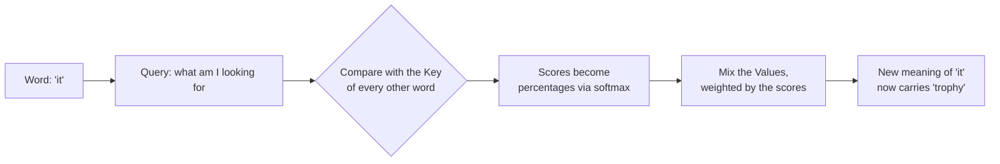
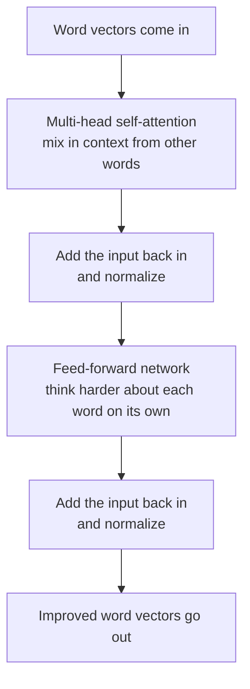

# Chapter 1: The Transformer, the Engine Inside Every Modern Model

**Paper:** *Attention Is All You Need* (2017)

If you read only one paper in this whole collection, make it this one. The Transformer is the design that made GPT, Claude, Gemini, Llama, and every other modern model possible. The title is a small joke that turned out to be true: the authors threw away the complicated machinery everyone was using and kept just one idea, called **attention**, and it worked better than anything before it.

## The problem they were trying to solve

Language is about relationships between words that can be far apart. Take this sentence:

> The trophy did not fit in the suitcase because **it** was too big.

What does "it" refer to? The trophy. Now change one word:

> The trophy did not fit in the suitcase because **it** was too small.

Now "it" refers to the suitcase. To understand the sentence, the model has to look back across several words and figure out which earlier word each word is connected to.

Before 2017, the popular tool for this was the [recurrent neural network](./glossary.md#neural-network), which read a sentence one word at a time, left to right, carrying a running memory. This had two big problems:

1. It was **slow**, because word number 100 could not be processed until words 1 through 99 were done. No skipping ahead, no doing things in parallel.
2. It had a **bad memory**. By the time it reached the end of a long paragraph, it had mostly forgotten the beginning.

The Transformer solves both at once.

## The one big idea: attention

Here is the core move. Instead of reading word by word, the Transformer looks at **all the words at the same time** and lets each word decide which other words it should pay attention to.

A simple analogy. Imagine every word in the sentence is a person in a room, and they are all trying to understand their own role. The word "it" raises its hand and asks the room, "Which of you is relevant to me?" Every other word answers with a relevance score. "Trophy" might shout loudly, "suitcase" a bit softer, "the" almost silently. The word "it" then builds its understanding mostly from the words that answered loudest.

That asking-and-weighing process is [self-attention](./glossary.md#self-attention). Doing it lets every word pull in context from every other word in a single step, no matter how far apart they are.

### How attention actually works, gently

Every word is first turned into a list of numbers called an [embedding](./glossary.md#embedding). A list of numbers is called a [vector](./glossary.md#vector), and you can think of it as the word's location on a giant map of meaning, where similar words sit close together.

For attention, each word creates three different versions of itself:

- A **Query**: "Here is what I am looking for."
- A **Key**: "Here is what I contain."
- A **Value**: "Here is what I will hand over if you pick me."

To decide how much word A should attend to word B, the model compares A's Query with B's Key. A strong match means a high score. All the scores get squashed into percentages that add up to 100 using a function called [softmax](./glossary.md#softmax). Then each word builds its new, context-aware representation by mixing together the Values of the other words, weighted by those percentages.

The beautiful part: the model is not told the rules of grammar. It **learns** what to attend to on its own, by practicing next-word prediction on huge amounts of text.

### Many heads are better than one

A single attention pass captures one kind of relationship. But words relate in many ways at once: grammar, subject matter, tone, who-did-what-to-whom. So the Transformer runs several attention passes in parallel, each free to focus on a different pattern. These parallel passes are called [attention heads](./glossary.md#multi-head-attention). One head might track which noun a pronoun refers to, another might track verb tense, another might link adjectives to the things they describe. Their results are combined. The original paper used eight heads.

## The rest of the machine

Attention is the star, but a Transformer block has a few more parts. Here is the full flow for one block.

Two new pieces appear here:

- The [feed-forward network](./glossary.md#feed-forward-network) is a small processing step applied to each word separately. If attention is "gather information from neighbors," the feed-forward step is "now think about what you gathered."
- The "add the input back in" arrows are called residual connections. They let the original information flow straight through, so deep stacks of blocks do not lose the thread. This is a practical trick that makes very deep models trainable.

A real Transformer stacks many of these blocks on top of each other. Each [layer](./glossary.md#layers-and-depth) refines the meaning a little more. Early layers catch simple patterns like grammar; later layers catch abstract ones like intent.

### One more thing: word order

Because attention looks at all words at once, it has no built-in sense of order. "Dog bites man" and "man bites dog" would look identical. The fix is [positional encoding](./glossary.md#positional-encoding), a small signal added to each word's embedding that tells the model where the word sits in the sequence. Now order is preserved.

## Encoder and decoder

The original Transformer had two halves, an [encoder and a decoder](./glossary.md#encoder-and-decoder). The encoder reads and understands the input (useful for translation). The decoder generates the output one word at a time. Most chat models today, like GPT, use only the decoder half, because their main job is to generate text. It is worth knowing both exist, because the words "encoder" and "decoder" show up constantly.

## Why this paper changed everything

Three reasons, in plain terms:

1. **Speed through parallelism.** Because all words are processed together, training can use modern hardware (GPUs) at full tilt. This is what made it practical to train on the entire internet.
2. **Long-range memory.** Any word can attend directly to any other word, so distance no longer destroys understanding.
3. **It scales.** Make it bigger, feed it more text, and it keeps getting better in a predictable way. That predictability is the subject of the next chapter.

In short, the Transformer is the engine. Everything else in this folder is about fueling it, tuning it, and steering it.

## The one-sentence takeaway

The Transformer lets every word in a sentence directly look at every other word and decide what to pay attention to, and stacking that simple idea many times, at scale, is enough to learn language.

Next: [Chapter 2, Scaling Laws and Chinchilla](./02-scaling-laws-and-compute.md), where we ask how big these models should actually be.
