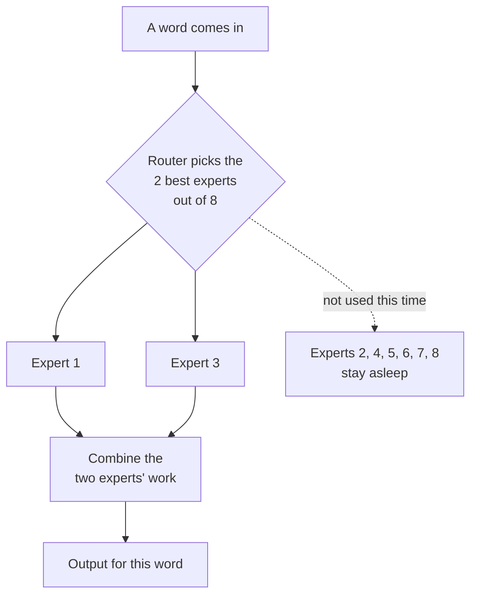
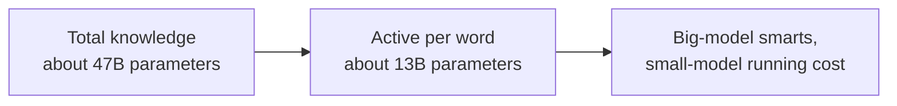
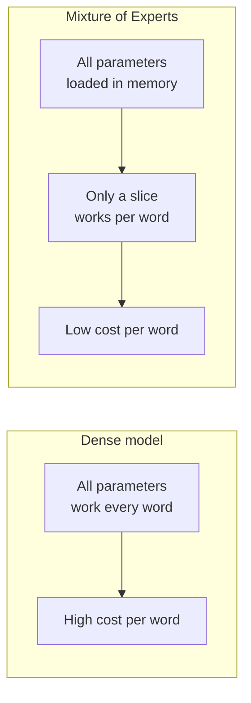

# Chapter 5: Mixtral and Mixture of Experts, More Brain, Same Speed

**Paper:** *Mixtral of Experts* (2024)

We end folder 01 with a clever architecture trick. Chapter 2 taught us that bigger models are smarter but more expensive to run. What if you could have the knowledge of a big model while paying the running cost of a small one? That is exactly what a [Mixture of Experts](./glossary.md#mixture-of-experts-moe), or MoE, delivers, and Mixtral is the open model that made the idea famous.

## The tension we are trying to escape

Recall the trade-off from earlier chapters:

- A bigger model knows more and reasons better.
- But every time you use a normal model, **all** of its parameters do work, so a bigger model costs more for every single answer. This running cost is called [inference](./glossary.md#inference).

A normal model is [dense](./glossary.md#sparse-and-dense-models): the whole network fires for every word. MoE breaks this rule. It builds a model with a huge total number of parameters, but arranges things so that only a **small slice** of them activates for any given word. Lots of knowledge stored, little work done per word.

## The expert panel analogy

Imagine a hospital with eight specialist doctors: a cardiologist, a neurologist, a dermatologist, and so on. A patient walks in. You do not make all eight examine every patient, that would be slow and wasteful. Instead, a receptionist glances at the symptoms and routes the patient to the two most relevant specialists.

That is exactly how Mixtral works. The "specialists" are small sub-networks called experts. The "receptionist" is a small, fast component called the [router](./glossary.md#router-gating-network).

## How Mixtral is built

Inside each layer of the Transformer, Mixtral replaces the single [feed-forward network](./glossary.md#feed-forward-network) from Chapter 1 with **eight** of them, the experts. For every word, the router scores the experts and sends the word to just the **top two**. The other six do nothing for that word and cost nothing.

The numbers tell the story. Mixtral (often written 8x7B) holds about 47 billion parameters in total, so it has a large store of knowledge. But because only two of eight experts are active per word, only about 13 billion parameters actually do work for each word. So:

- **Capacity** of a roughly 47 billion parameter model.
- **Running cost** closer to a 13 billion parameter model.

The result reported in the paper: Mixtral matched or beat much larger dense models such as Llama 2 70B, and rivaled GPT-3.5, while being significantly cheaper and faster to run. That combination is why MoE has become a backbone of many frontier models.

## Do the experts specialize by topic?

A natural guess is that one expert becomes "the math expert" and another "the poetry expert." Interestingly, the paper found the specialization is more subtle than that. The router's choices often track patterns of grammar and structure rather than clean human topics. The important point for a beginner is simply this: the model **learns on its own** how to divide the labor among experts, just as the Transformer learned what to attend to in Chapter 1. Nobody assigns the experts their jobs by hand.

## What you give up

MoE is not free magic. The catch is **memory**. Even though only two experts work per word, all eight must be loaded and ready, because the router might call on any of them for the next word. So an MoE model needs enough memory to hold all its parameters, even if it only uses a fraction at a time. You are trading higher memory for lower compute per word. For services answering millions of requests, that trade is usually well worth it, because compute is the cost that scales with every user, while memory is paid once.

## The one-sentence takeaway

A Mixture of Experts model stores the knowledge of a very large model but, for each word, a small router activates only a couple of expert sub-networks, so you get big-model quality at small-model running cost, paying for it with extra memory to keep all the experts on standby.

Next: [Chapter 6, Judging models](./06-evaluating-models.md), where we ask how anyone can possibly measure whether one model is better than another.
