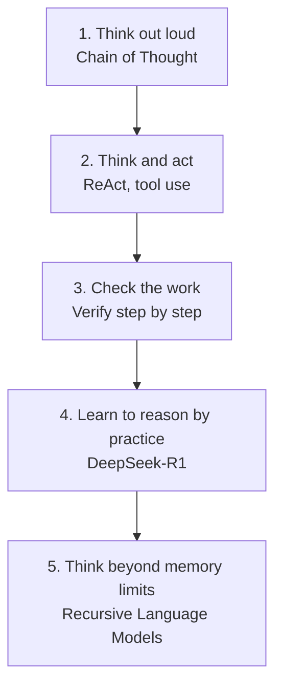

# Start Here: Planning and Reasoning, Explained Simply

In folder 01 you learned how a language model is built, scaled, aligned, and measured. The result was a model that is fluent and knowledgeable. But fluent is not the same as **smart**. A model can write a beautiful sentence and still get a two-step math problem wrong, because answering instantly, in one breath, is not how hard problems get solved.

This folder is about the leap from a model that **answers** to a model that **thinks**. The five papers here trace how researchers taught models to reason step by step, to act in the world by using tools, to check their own work, to learn reasoning through trial and error, and finally to handle problems far larger than their memory.

## How to use these explanations

Read the chapters in order; each one builds on the last. Bold linked terms like [chain of thought](./glossary.md#chain-of-thought) jump to the [glossary](./glossary.md), where every key idea is explained from scratch. If a term feels like it belongs to folder 01 (such as how a Transformer works), you will find it in that folder's glossary; this folder's glossary focuses on reasoning.

You do not need to have memorized folder 01, but it helps to know one thing from it: a model is fundamentally a next-word predictor. Everything in this folder is a clever way of getting more careful thinking out of that simple engine.

## The big picture

The story of this folder is a climb up five steps, each one giving the model a new thinking power.

Here is how the five papers map onto that climb.

| Step | New power | Paper |
|------|-----------|-------|
| Think out loud | Show the steps, get better answers | Chain-of-Thought Prompting |
| Think and act | Mix reasoning with using tools | ReAct |
| Check the work | Reward each step, not just the final answer | Let's Verify Step by Step |
| Learn by practice | Use reinforcement learning to grow reasoning | DeepSeek-R1 |
| Beat memory limits | Process inputs far bigger than the context window | Recursive Language Models |

## Chapter map

1. [Chain of Thought: teaching models to think out loud](./01-chain-of-thought.md)
2. [ReAct: reasoning and acting together](./02-react.md)
3. [Let's Verify Step by Step: rewarding good reasoning, not just right answers](./03-verify-step-by-step.md)
4. [DeepSeek-R1: learning to reason through reinforcement learning](./04-deepseek-r1.md)
5. [Recursive Language Models: thinking beyond the memory limit](./05-recursive-language-models.md)
6. [Glossary: every key term, explained from zero](./glossary.md)

## One idea to hold in your head

A model that answers instantly is using a fixed, small amount of effort per question, no matter how hard the question is. The single thread running through this entire folder is the idea of **spending more effort on harder problems**: more steps, more tool calls, more checking, more practice, more recursion. Once you see that pattern, every paper here becomes a different answer to the same question, "how do we let a model think harder when it needs to?"

Ready? Start with [Chapter 1: Chain of Thought](./01-chain-of-thought.md).
