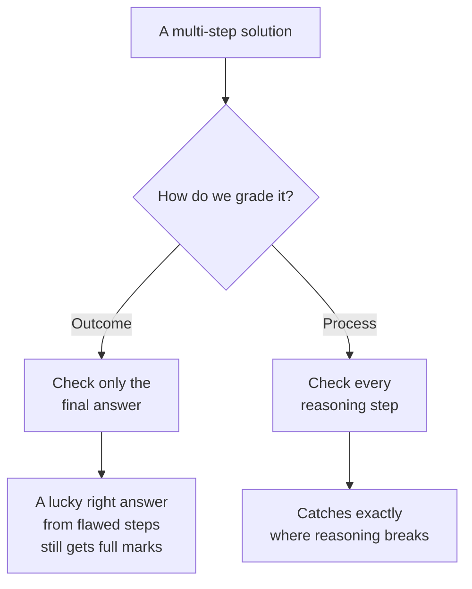
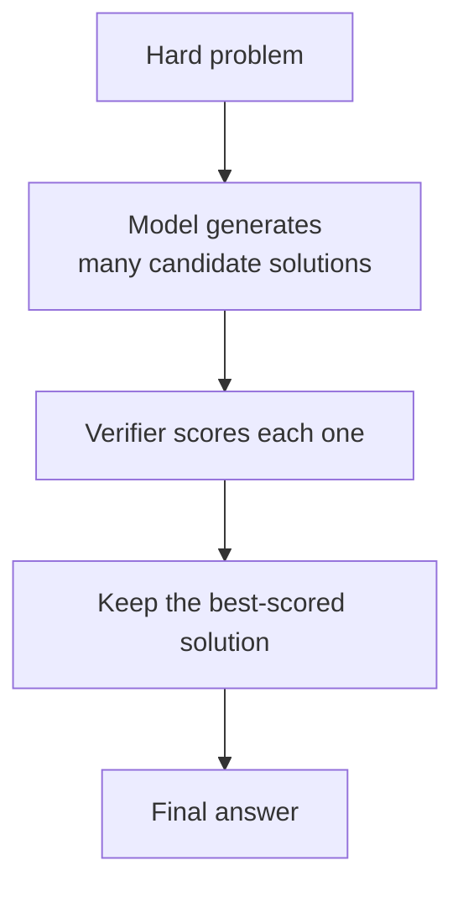

# Chapter 3: Let's Verify Step by Step, Rewarding Good Reasoning

**Paper:** *Let's Verify Step by Step* (2023)

Chapters 1 and 2 got the model to reason and act. But a hard question lurks underneath: when a model produces a long chain of reasoning, how do we judge it? The obvious answer is to check whether the final answer is right. This paper shows that the obvious answer is not the best one. It turns out that grading **each step** of the reasoning, rather than just the final result, makes models dramatically better at hard problems. This is a subtle idea with big consequences.

## The trap of grading only the final answer

Suppose a student solves a long math problem and gets the right final number. Did they understand it? Maybe. Or maybe they made two mistakes that happened to cancel out, or they guessed. If you only check the final answer, you cannot tell the difference, and you might reward sloppy or lucky reasoning that will fail next time.

This is the difference between two ways of giving feedback, and it is the central idea of the paper.

- [Outcome supervision](./glossary.md#outcome-supervision-vs-process-supervision): reward the model based only on whether the final answer is correct.
- [Process supervision](./glossary.md#outcome-supervision-vs-process-supervision): reward the model based on whether each individual step of the reasoning is correct.

## Two kinds of graders

To put this into practice, the researchers trained two kinds of grading models, both relatives of the [reward model](./glossary.md#reward-model) you met in folder 01.

- An [outcome reward model (ORM)](./glossary.md#outcome-reward-model-orm) looks at a whole solution and judges only the final answer.
- A [process reward model (PRM)](./glossary.md#process-reward-model-prm) looks at the solution step by step and judges each step as it goes.

The PRM is a step-by-step [verifier](./glossary.md#verifier): a model whose job is to check reasoning, not to produce it. Human labelers went through thousands of solutions marking each step as correct or not, and the PRM learned to imitate those judgments.

## How a verifier makes a model smarter

Here is how this actually boosts performance. You let the main model generate many candidate solutions to a hard problem (say, dozens of them). Most will be wrong in various ways. Then the verifier scores them, and you pick the solution it rates most highly.

The paper's key result: a **process**-based verifier picks the right solution far more reliably than an **outcome**-based one, especially on genuinely hard math. By checking the reasoning rather than just the answer, the PRM is much harder to fool with confident-sounding but flawed solutions.

## Why process supervision wins

Two reasons, both worth understanding:

First, **precision of feedback.** If a solution goes wrong at step 5 of 10, outcome supervision only knows "the whole thing is wrong." Process supervision pinpoints step 5. That precise signal is far more useful for both selecting good solutions and training better models, the way a teacher's targeted correction beats a bare "wrong" stamped on the page.

Second, **safety and trust.** Process supervision rewards reasoning that is actually sound, not answers that merely happen to be right. A model trained to reason correctly at every step is one you can trust more, because it is not being rewarded for lucky guesses or hidden leaps. This alignment of "good reasoning" with "reward" is part of why the idea matters beyond just raw scores.

## Why this paper mattered

This work established a principle that shapes today's most advanced reasoning systems: the *path* to an answer is worth supervising, not just the destination. The idea of using a verifier to check reasoning and select the best of many attempts is now a standard tool. It connects directly to the next chapter, where DeepSeek-R1 uses reward signals to teach a model to reason, and to the recurring theme of this folder, spending extra effort, here in the form of generating and checking many solutions, to get harder problems right.

## The one-sentence takeaway

Grading every step of a model's reasoning, rather than only its final answer, produces a verifier that is much harder to fool, picks correct solutions to hard problems far more reliably, and rewards genuinely sound thinking instead of lucky guesses.

Next: [Chapter 4, DeepSeek-R1](./04-deepseek-r1.md), where a model learns to reason not from human examples but from reinforcement learning.
