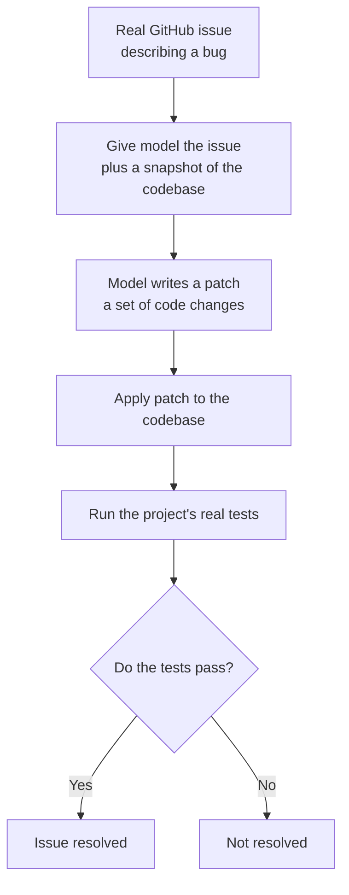

# Chapter 2: SWE-bench, Can a Model Fix a Real Bug in Real Code?

**Paper:** *SWE-bench: Can Language Models Resolve Real-World GitHub Issues?* (2023)

BIG-Bench in the last chapter measured breadth with made-up tasks. SWE-bench takes the opposite tack: one domain, software engineering, but using completely real work pulled straight from open-source projects. It asks a model to do something a professional developer does every day, fix a reported bug in a large existing codebase, and it grades the result the only way that truly counts: by running the tests.

## The problem it solves

Coding benchmarks before SWE-bench, like the popular HumanEval, mostly asked a model to write a small self-contained function from a short description, the kind of problem you could solve in a few lines. Real software work looks nothing like that. Fixing a real bug means navigating a sprawling [repository](./glossary.md#repository-and-codebase), understanding how functions in different files affect each other, and making a small, precise change in the right place. None of that is captured by writing one tidy function in isolation.

The authors also faced the benchmark-builder's eternal dilemma, the same one BIG-Bench wrestled with. A good test must be hard enough to challenge top models, but its answers must still be easy to check automatically. Open-ended essays are hard to grade; tiny puzzles are easy to grade but too simple. Software has a beautiful property that resolves this: code can pose an arbitrarily hard problem, yet a solution can be checked objectively by running [unit tests](./glossary.md#unit-test) and seeing whether they pass.

## The core idea

SWE-bench builds its tasks from the natural history of real projects on GitHub. Whenever developers fix a bug or add a feature, they often file an [issue](./glossary.md#issue-and-pull-request) describing the problem, then later submit a [pull request](./glossary.md#issue-and-pull-request) (a bundle of code changes) that fixes it, and that pull request usually comes with tests that confirm the fix works. SWE-bench harvests these matched pairs.

The model is handed two things: the text of the issue, and a snapshot of the codebase as it was just before the fix. Its job is to produce a [patch](./glossary.md#patch-and-diff), the exact set of edits that resolves the issue. Then SWE-bench applies that patch and runs the repository's own test suite. If the tests that the original human fix was meant to satisfy now pass, the model resolved the issue. This is called [execution-based evaluation](./glossary.md#execution-based-evaluation): the score comes from actually running the code, not from comparing the model's text to a reference answer.

The full benchmark contains 2,294 such task instances drawn from 12 popular Python projects. Because new issues and pull requests appear constantly, the benchmark can be refreshed over time with minimal human effort, which helps it resist going stale.

## What they found

The first results were humbling, and that was the point. The best model they tested, Claude 2, resolved only about 1.96 percent of the issues, fewer than one in fifty. State-of-the-art models that looked dazzling on older coding tests could barely make a dent in real software work. That huge gap is exactly what a good frontier benchmark is supposed to expose: it leaves enormous room to improve and gives the field a clear, hard target.

Two practical contributions came alongside the benchmark. The authors released a training set, SWE-bench-train, of around 19,000 non-test task instances from 37 repositories, so that others could train models for this skill. Using it, they fine-tuned two open models, [SWE-Llama](./glossary.md#swe-llama) 7b and 13b, which had to process [long contexts](../../02-Planning-and-Reasoning/explanations/glossary.md#context-window-and-long-context) of over 100,000 tokens to read enough of a codebase, and in some settings these were competitive with the much larger proprietary models.

## Why it mattered

SWE-bench changed what "good at coding" means. It moved the goalposts from writing isolated snippets to resolving real issues in real projects, judged by real tests, and in doing so it created one of the defining challenges for the wave of [agentic](../../02-Planning-and-Reasoning/explanations/glossary.md#agent) coding systems that followed. The very low starting scores gave the field a long, meaningful ramp to climb, and the percentage of SWE-bench issues a system can resolve quickly became one of the most-watched numbers in AI. The two software-agent papers in folder 03, SWE-agent and OpenHands, exist largely to push this number up.

## The one-sentence takeaway

**SWE-bench measures real software ability by handing a model an actual GitHub bug and a whole codebase and then simply running the tests, turning "can it code?" into an honest, pass-or-fail question that top models initially failed more than 98 percent of the time.**

Next: [Chapter 3, Chatbot Arena](./03-chatbot-arena.md), where there is no correct answer to check against, only which reply real people prefer.
