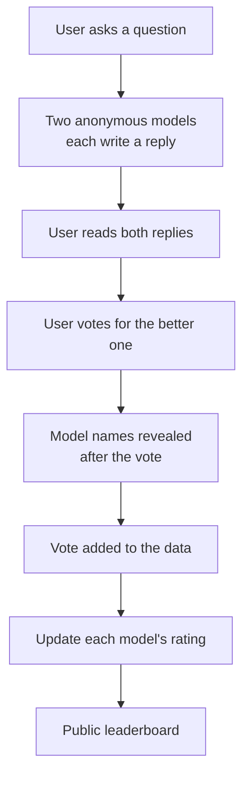

# Chapter 3: Chatbot Arena, Letting Real People Pick the Winner

**Paper:** *Chatbot Arena: An Open Platform for Evaluating LLMs by Human Preference* (2024)

The first two benchmarks both score answers against something objective: a known answer in BIG-Bench, a passing test in SWE-bench. But some of the most important things about a chatbot have no objective answer at all. Which of two helpful, well-written replies is *better*? That depends on human taste and judgment. Chatbot Arena tackles this head-on by turning evaluation into a live, crowd-powered tournament where the only judges are real users.

## The problem it solves

A [static benchmark](./glossary.md#static-vs-live-benchmark) with [ground truth](./glossary.md#ground-truth) answers has three weaknesses when you care about open-ended chat quality. Its questions are fixed, so they cannot capture the messy, interactive way people really use a chatbot. Its fixed test set can leak into training data and become [contaminated](./glossary.md#contamination), quietly inflating scores. And for many real requests, like "help me word this difficult email," there simply is no single correct answer to grade against.

What you actually want to know is which model people *prefer* when they use it for real. That calls for a different kind of benchmark: one whose questions are [live](./glossary.md#static-vs-live-benchmark), always fresh from real users, and whose metric is [human preference](./glossary.md#human-preference) rather than a correct answer.

## The core idea

Chatbot Arena is a free public website where the evaluation is a game. A user types a question and receives two replies from two anonymous models, side by side. The user reads both and votes for the better one. Only after voting are the two models' names revealed.

Hiding the names is the crucial trick. It makes the vote a blind, fair comparison, so a famous brand cannot win on reputation alone. Each vote is a single head-to-head result, like one match in a sports league: this model beat that model on this question. The paper reports the platform had already gathered over 240,000 such votes.

The remaining challenge is turning a pile of individual match results into a trustworthy ranking. You cannot make every model play every other model an equal number of times on equal questions, so the data is lopsided and noisy. Chatbot Arena handles this with established statistical tools. The familiar version of the idea is the [Elo rating](../../01-Foundational-Modelling/explanations/glossary.md#elo-rating) system borrowed from chess, where beating a strong opponent raises your score more than beating a weak one. The paper formalizes this with the [Bradley-Terry model](./glossary.md#bradley-terry-model), a clean statistical method for estimating each model's underlying strength from many pairwise wins and losses, and it reports a [confidence interval](./glossary.md#confidence-interval) around each rating so readers can see how certain a ranking really is.

To get reliable rankings without wasting votes, the platform also chooses *which* pairs of models to show using [active sampling](./glossary.md#active-sampling): it preferentially matches up models whose relative strength is still uncertain, the same way a tournament organizer schedules the games that are most informative.

## Why you can trust it

A reasonable worry is that crowd votes are just noise. The authors checked this carefully and found two reassuring things. The crowdsourced questions were diverse and genuinely discriminating, meaning they actually separate strong models from weak ones rather than being trivially easy. And the crowd's votes agreed well with the judgments of expert raters, suggesting the wisdom of the crowd here is sound, not random.

## A short worked example

Suppose a new model joins the Arena and, in its first matches, beats a model that everyone already agrees is excellent. Under an Elo-style or Bradley-Terry rating, that win counts for a lot, because defeating a strong opponent is strong evidence of strength, and the newcomer's rating jumps. If it had instead beaten a weak model, the rating would barely move, since that result was expected. Over thousands of such matches the ratings settle into an order that reflects real relative quality, with the confidence interval shrinking as more votes come in. This is why a single lucky win cannot crown a model: the system demands consistent wins against tough competition.

## Why it mattered

Chatbot Arena filled the one quadrant the other benchmarks could not reach: live questions judged by human preference. Because its questions are always fresh and never published as a fixed answer key, it is far harder to game by memorization than a static test. It quickly became one of the most cited LLM leaderboards in the field, watched closely by the major model developers, precisely because it measures the thing users ultimately care about, which model is nicer to actually use. It also showed that rigorous statistics and noisy human voting are not enemies: with the right methods, a crowd can produce a ranking as credible as expert review.

## The one-sentence takeaway

**Chatbot Arena measures the unmeasurable, open-ended chat quality, by staging blind head-to-head battles between anonymous models and letting a crowd of real users vote, then converting hundreds of thousands of votes into a trustworthy ranking with proven statistical methods.**

That completes the tour of the three benchmarks. To review any term, see the [Glossary](./glossary.md), or head back to the [start-here page](./00-start-here.md) for the big picture.
