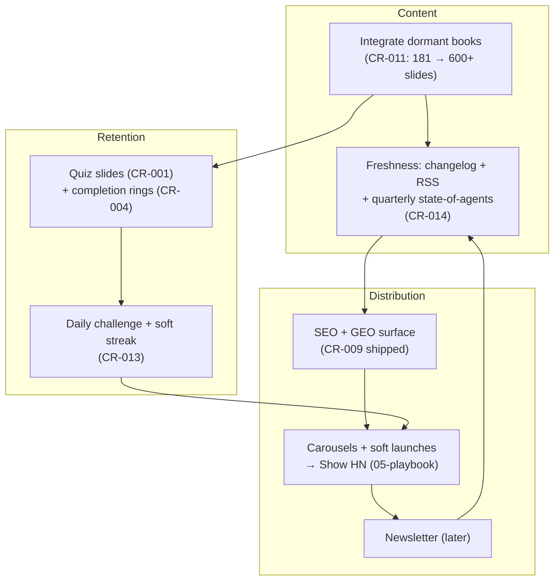

# Growth Master Plan: How Agent YAP Becomes a Default Study Site for Agentic AI

> The "how we are going to do this" file. Written 2026-07-19 from the research
> in `01-gtm-research.md`, the audits in `02`/`04`, and the designs in
> `03`/`05`. Owner: @vivek.d. Review cadence: monthly, against the phase gates
> below. This is a plan, not a spec: every initiative still flows
> CR → PRD → spec per `specs/WORKFLOW.md`.

## North star and guardrails

**North star:** the reference practitioners return to while building agents,
measured by weekly returning readers, not registered users.

**Guardrails (non-negotiable, from the founder and plan.md):**

1. Simple and minimal. White-space-first UI stays; features must not crowd it.
2. Free, no auth, no server-side user state.
3. Practitioner voice (`specs/conventions/content.md`). No marketing copy.
4. Progress mechanics yes, pressure mechanics no (`03-gamification-design.md`).

**Positioning:** "The field guide you return to while building agents."
Technology-agnostic and systems-first, where competitors are framework-tied
courses (see the landscape section of `01-gtm-research.md`).

## The three flywheels

Content feeds distribution (more surface, more launch moments). Retention
turns arrivals into returners. Distribution turns returners' shares into new
arrivals.

## Phased roadmap (approximately 90 days)

Gates are outcomes, not dates. A phase is done when its gate holds.

### Phase A: See and be seen (weeks 1-2)

| Work | Where it is tracked |
|---|---|
| Merge `claude/growth-quick-wins-gx0t42`; set `NEXT_PUBLIC_SITE_URL`; deploy; submit sitemap | CR-2026-009, board row 30 |
| Analytics, cookieless | CR-2026-010, board row 31 |
| Static OG image (per-chapter version can wait) | CR-2026-012 slice 1 |
| Human decisions: production domain; repo public or not | open questions below |

**Gate A:** a live URL where every slide is crawlable, social links unfurl
with a card, and a dashboard shows real traffic numbers.

### Phase B: Publish the library (weeks 2-6)

| Work | Where it is tracked |
|---|---|
| Integrate dormant books, one PR per book, harnesses book first | CR-2026-011, board rows 14-18, 28 |
| Changelog page + RSS | CR-2026-014, board row 33 |
| Quiz blocks into the live book (already-planned Tier-4 work) | CR-2026-001, board row 20 |
| Soft launches per newly live book (Reddit/X/LinkedIn value posts) | `05-distribution-and-seo.md` |

**Gate B:** 4+ books live (roughly 600 slides indexed), at least one quiz per
chapter in the flagship book, changelog shipping, and soft-launch data on
which book resonates.

### Phase C: The launch (weeks 6-10)

| Work | Where it is tracked |
|---|---|
| Completion rings + continue-where-you-left-off | CR-2026-004, board row 23 |
| Share button; per-chapter OG if capacity allows | CR-2026-012 |
| Show HN (playbook conditions met: books, cards, analytics, ideally public repo) | `05-distribution-and-seo.md` |
| Carousel cadence 2-3/week sustained | `05-distribution-and-seo.md` |

**Gate C:** the launch spike happened and was measured; post-launch weekly
visitors settle above pre-launch baseline; return-visitor share is visible.

### Phase D: The habit loop (weeks 10-13)

| Work | Where it is tracked |
|---|---|
| Daily challenge + soft streak | CR-2026-013, board row 29, design in `03` |
| Roadmap mode + placement quiz (if Phase C data supports it) | CR-2026-006, board row 25 |
| Newsletter go/no-go decision with lead-magnet cheat sheets | `05`, new CR if go |

**Gate D:** day-over-day returners measurably above Phase B baseline;
daily-challenge click-through into chapters proves the doorway works.

## Impact vs. effort (initiative ranking)

| Initiative | Impact | Effort | Phase |
|---|---|---|---|
| Dormant-content integration | very high (5x surface, free) | low | B |
| Analytics | enabler for everything | low | A |
| SEO/GEO foundation | high | done on branch | A |
| OG cards + share button | high (every share upgraded) | low | A/C |
| Quiz blocks | high (retention core + evidence-backed) | medium | B |
| Show HN + soft launches | high, one-time spikes | low, timing-sensitive | B/C |
| Carousel cadence | high, compounding | medium, recurring | B onward |
| Completion rings | medium-high | medium | C |
| Daily challenge + streak | medium-high | medium | D |
| Changelog + RSS | medium | low | B |
| Newsletter | high later, zero now | medium | D+ |
| Podcast/explore modes | low-medium | high | parked (CR-007/008) |

## Measurement

Weekly numbers reviewed monthly (all require CR-2026-010 first): unique
visitors; referrer mix with AI assistants broken out; top entry slides;
return-visitor share; chapter completion events; daily-challenge answers and
click-through; GitHub stars if public. Guardrail metric: reader NPS proxy
(search-and-ask usage staying healthy) and no dark-pattern drift.

## Risks and mitigations

| Risk | Mitigation |
|---|---|
| Positioning mismatch floods site with wrong audience (Exercism case) | fixed positioning line used on every surface; launch titles concrete and modest |
| Gamification erodes the calm brand (Duolingo backlash) | `03` rejects pressure mechanics; guardrail metric watched |
| Content staleness in a fast-moving field | changelog + revision cadence + quarterly state-of-agents chapter (`02`) |
| Solo/agent-team burnout on GTM (Exercism case) | carousel pipeline reuses slides nearly 1:1; phases gated, not dated |
| Launch spike onto an unmeasured, cardless site | Phase A is a hard prerequisite for Phase C |
| llms.txt assumed to be a ranking lever | treated explicitly as future-proofing only (`01`, `05`) |

## Open questions (human decisions, not agent calls)

- **Q1:** Production domain (blocks `NEXT_PUBLIC_SITE_URL`, Search Console,
  everything in Phase A). Owner: @vivek.d.
- **Q2:** Repo public (opens Channel 3) or content-repo split? Owner: @vivek.d.
- **Q3:** CR-2026-013 tension with plan.md non-goals: accept the moderated
  daily challenge and amend the non-goals line, or reject at triage.
- **Q4:** Who runs the social cadence (founder, agent-drafted queue with human
  send, or skip Channel 4 initially)?

## Governance

Nothing here bypasses process: quiz blocks, rings, daily challenge, OG/share,
feed, and analytics are Tier-4 features that enter at `/define`/`/prd-to-spec`
from their CRs; content integration is content-ops gated by `npm run build`;
the two session branches stay separate (planning:
`claude/ai-learning-platform-research-gx0t42`; code:
`claude/growth-quick-wins-gx0t42`) so review paths stay clean.
