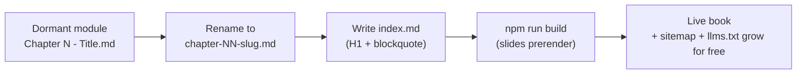

# Content Strategy

> What to publish, in what order, and why. Grounded in the actual inventory of
> `content/` on 2026-07-18. Voice and structure rules live in
> `specs/conventions/content.md` and are not restated here.

## The headline fact: most of the library is invisible

The site currently serves **1 live book (18 chapters, 181 slides)**. On disk
there are roughly **60 authored chapters and explainers**. The single highest
value content move costs no new writing: make the dormant modules pass the
book-discovery rule (`index.md` + `chapter-NN-*.md`, see
`knowledge/invariants/book-discovery.md`).

| Module (folder under `content/`) | Chapters | State | Blocker to going live |
|---|---|---|---|
| `architecture-and-system-design/` | 18 | **Live** | none |
| `building coding agents and harnesses/` | 17 | Dormant | chapters live in `explained/` subfolder; needs book-root `index.md` + files at book root |
| `agentic memory/` | 5 | Dormant | `Chapter N - Title.md` naming fails the `chapter-NN-*.md` regex; no `index.md` |
| `multi-agent/` | 5 | Dormant | same |
| `rag/` | 4 | Dormant | same |
| `context engineering/` | 4 | Dormant | same |
| `research papers/` | ~20 explainers in 5 categories | Dormant | deep nesting + non-chapter naming; needs curation into book(s) |
| `glossary/` | 1 | Dormant | standalone file; needs a decision (book vs. reference view, CR-2026-007 territory) |

Integration is content-ops, not code: rename files, write an `index.md` (first
`#` is the title, first `>` blockquote is the description), leave `sources/`
folders alone (the parser ignores them). **Do not touch the parser**
(`src/lib/content.ts` is exclusive-access and its discovery rule is a
registered invariant).

The SEO surface compounds automatically: sitemap and `llms.txt` (branch
`claude/growth-quick-wins-gx0t42`) are generated from `content.ts`, so every
integrated book adds its slides to both without code changes.

### Suggested go-live order

1. **Building Coding Agents and Harnesses (17 ch).** Largest, most
   differentiated: harness internals content barely exists elsewhere and the
   audience (people using Claude Code, Codex, Cursor) is exactly who shares
   links.
2. **Context Engineering (4 ch)** then **Agentic Memory (5 ch)**: hottest
   search topics of the six, small integration cost.
3. **RAG (4 ch)** and **Multi-Agent (5 ch)**.
4. **Research papers**: curate per-category books ("Foundational Modelling",
   "Planning and Reasoning", "Benchmarks") from the `explanations/` folders.
   Verify attribution posture first: the index credits an external curator, so
   keep the credit visible on the book page.
5. **Glossary**: fold into Explore mode work (CR-2026-007) rather than forcing
   it into the book shape.

Each integration is one PR with `npm run build` as the gate (slides must
prerender). Chapter naming granting one book per PR keeps review and rollback
trivial.

## Freshness: the topic moves monthly, the site should show a pulse

Agentic AI content decays fast (new models, MCP evolution, new harness
features). A static library reads as abandoned within months, and "last
updated" is a ranking and trust signal for both humans and AI assistants.

- **Changelog page + RSS feed** (CR-2026-014): every integrated book, revised
  chapter, or new widget is an entry. Cheap, honest pulse.
- **Revision cadence**: when a chapter's claims go stale, fix the chapter (the
  pipeline regenerates from sources). Stamp revised chapters in the changelog
  rather than inventing per-slide dates.
- **Quarterly "state of agents" chapter** appended to the live book: a
  practitioner summary of what changed (models, protocols, harness releases).
  This is also the natural newsletter/social artifact each quarter.

## Formats that multiply existing content (no new research required)

| Format | Source | Distribution value |
|---|---|---|
| Cheat sheet per book (1 page) | recap of chapter blurbs | the classic dev-share artifact; works as image + PDF |
| Glossary entries as pages | `content/glossary/Glossary.md` | long-tail SEO ("what is context engineering", "agent loop definition") |
| Social carousel per chapter | slides map 1:1 to carousel frames | the reader IS a carousel; exporting 5-8 slides per chapter as images makes X/LinkedIn posts nearly free |
| Quiz-of-the-day artifact | CR-2026-001 quiz blocks | shareable single question; see `docs/growth/03-gamification-design.md` |

The slide format is an underused asset: every chapter is already structured as
a social carousel. Treat the reader as the canonical home and carousels as
teasers linking back to the canonical slide URL.

## What we do not add

- No new topic sprawl until the dormant six are live. Publishing cadence from
  existing inventory beats writing new material for reach.
- No marketing-voice rewrites: the practitioner voice is the differentiator
  (see `specs/conventions/content.md` examples).
- No video pipeline (plan.md non-goal). Podcast mode stays parked as
  CR-2026-008.
