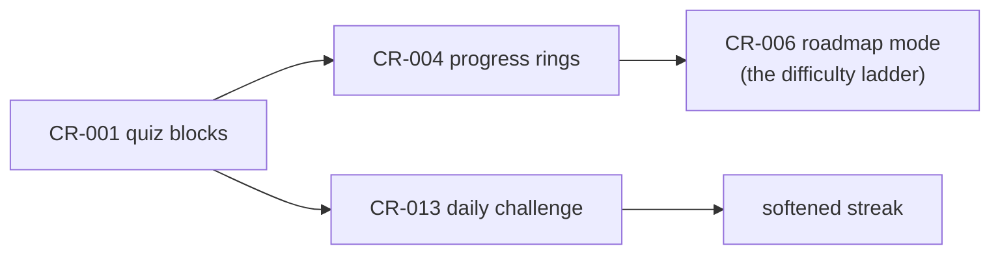

# Gamification Design: LeetCode Energy Without LeetCode Baggage

> Founder ask (2026-07-18): "implement LeetCode-like gamification to keep
> people's interest," with the standing constraints: keep it simple, white
> minimalism, do not overwhelm. Existing decisions this must respect:
> `plan.md` Phase 2 (moderated progress mechanics, CONFIRMED) and its
> non-goals (no auth, no server-side progress, no points/leaderboards).
> Research backing and citations: `docs/growth/01-gtm-research.md`.

## Decompose what "LeetCode-like" actually is

LeetCode retention rests on distinct mechanics. They are separable; we adopt
the ones that survive our constraints.

| Mechanic | What it does | Needs accounts? | Fits us? |
|---|---|---|---|
| Daily challenge (one problem/day) | comeback reason, shared social moment | no (can be date-seeded) | **yes, adapted** |
| Streak counter + monthly badge | loss-aversion hook | server if cross-device | **yes, localStorage, softened** |
| Difficulty ladder (easy/medium/hard) | visible skill progression | no | **yes, as the prerequisite roadmap (CR-2026-006)** |
| Instant pass/fail feedback | tight learning loop | no | **yes: quiz blocks (CR-2026-001)** |
| XP / points economy | quantified grind | yes, to matter | no |
| Leaderboards / contests | competition, community scale | yes | no |
| Paid streak freezes, notification pressure | monetized anxiety | yes | no, brand-hostile |

## What we build (three layers, in order)

### Layer 1: retrieval practice as the engagement engine (already planned)

Quiz slides (CR-2026-001) and completion rings (CR-2026-004) are the
foundation. Retrieval practice is the best-evidenced learning technique in
cognitive science (testing effect); it is also the honest version of
"gamification": the game IS the learning, not decoration around it. Nothing
in this file makes sense before Layer 1 ships.

### Layer 2: the daily challenge (CR-2026-013, the genuinely new piece)

One question a day, LeetCode-daily-challenge shaped, zero backend:

- `/daily` route picks a question **deterministically from the quiz pool by
  date hash**. Everyone worldwide sees the same question on the same day,
  which is what makes "did you get today's one?" shareable.
- Answer reveals the explanation plus a deep link to the exact slide that
  teaches the concept. The challenge is a doorway into the reader, not a
  destination.
- One screen, one question, done. No queue of "next problem" (that becomes a
  grind treadmill and violates the do-not-overwhelm constraint).

### Layer 3: the softened streak (inside the daily challenge)

- localStorage counter: "N days" with a **built-in grace rule** (missing one
  day does not zero the counter; two consecutive misses does). Loss-aversion
  with the cruelty removed.
- Quiet presentation: small text on the daily page, not a flame banner on
  every screen. No notifications, no email, no badges for sale.
- Device-local and honest about it ("streak lives in this browser").

## What we deliberately reject, and why

- **Leaderboards, XP, leagues:** require accounts (a plan.md non-goal),
  reward time-spent over understanding, and invite the comparison anxiety
  that made language-app gamification infamous. Competition mechanics also
  need liquidity (enough daily users to feel alive); at our stage they would
  render as empty rooms.
- **Notification-driven streak pressure:** the well-documented dark side of
  the Duolingo model. Our brand is calm minimalism; a guilt loop is off-key.
- **Timers and speed scoring:** reading comprehension is not a race.

The principle: **progress mechanics yes, pressure mechanics no.** Visible
progress (rings, checkmarks, a gentle streak) respects intrinsic motivation;
pressure mechanics substitute for it and burn trust.

## Amendment this requires (human decision at triage)

`plan.md` non-goals currently read "No auth, no server-side progress, no
points/leaderboards." Layers 1 and 3 comply. The daily challenge complies
technically (no auth, no server state) but a streak counter is arguably
against the spirit of CR-2026-004's "no streaks" reasoning. CR-2026-013
records this tension; if triage accepts the design, amend plan.md non-goals
to: "No auth, no server-side progress, no points/leaderboards/XP.
LocalStorage-only daily-challenge streak with grace rule is allowed."

## Sequencing and dependencies

All Tier 4, frontend lane, LITE dial expected (no danger-list files) except
any slice that edits the SSG slide route.

## How we know it works (needs CR-2026-010 analytics first)

- Return-visit rate (7-day) before vs. after the daily challenge ships.
- Daily-challenge answer rate and its click-through into chapters.
- Chapter completion progression (rings) week over week.
- Guardrail metric: bounce rate on `/daily` (if people answer and leave
  without ever entering the reader, the doorway is not working).
