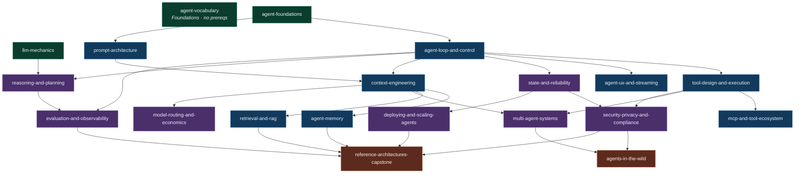

# 01 — Content Inventory and Module Taxonomy

> Research artifact for the 2026 redesign. Read-only audit of `content/` against
> the discovery rule in `src/lib/content.ts`, plus a proposed 20-module taxonomy
> for the assessment product. Measured on branch `feature/learning-platform-v2`,
> 2026-08-02. No repo files were modified to produce this.

---

## 0. The five facts that should drive the redesign

1. **One book is live out of eight non-empty folders.** `architecture-and-system-design`
   is the only folder that satisfies the discovery rule. 199 slides are reachable;
   **431 more slides already exist on disk and are unreachable** (630 total).
2. **The assessment content already exists.** 55 chapters contain a `## Review`
   section. There are **490 multiple-choice questions with written answers and
   distractor options** already authored across `content/`, plus 3 coding
   challenges with Python solutions. The "LeetCode for agentic AI" cold start
   is not a writing problem — it is a parsing and presentation problem.
3. **Those 490 answers do not render today.** `src/components/Markdown.tsx`
   uses `remark-gfm` + `rehype-highlight` with **no `rehype-raw`**, so every
   `<details><summary>Answer</summary>…</details>` node is dropped by
   react-markdown. Live readers see questions and options with no answers.
4. **The `## Review` slide is the fattest slide in almost every chapter** —
   1,961 to 2,832 words on a single slide, versus a median slide of 116 words.
   The quiz is being delivered as a wall of prose at the end of a chapter.
5. **Nothing has frontmatter.** 0 of 137 markdown files start with `---`. There is
   no machine-readable difficulty, tag, prerequisite, or module id anywhere.

---

## 1. The discovery rule, stated precisely

From `src/lib/content.ts` `loadBooks()` (lines 161–251). A directory under
`content/` becomes a live book **iff all three hold**:

| # | Condition | Code |
|---|---|---|
| 1 | It is a direct child directory of `content/` (depth 1, never recursive) | `fs.readdirSync(contentRoot, {withFileTypes:true}).filter(d => d.isDirectory())` |
| 2 | `<dir>/index.md` exists | `if (!fs.existsSync(indexPath)) continue;` |
| 3 | ≥1 file at `<dir>/` root matches `/^chapter-\d+.*\.md$/` | `if (chapterFiles.length === 0) continue;` |

Consequences that matter for wiring:

- **Case-sensitive.** `Chapter 1 - Foo.md` fails on the capital `C` *and* on the
  space where `-\d` is required. Both failures, one regex.
- **Never recurses.** `content/building coding agents and harnesses/explained/`
  has a perfect `index.md` + `chapter-01-*.md` layout and is still invisible,
  because `explained/` is at depth 2.
- **Book slug is the raw directory name, unescaped into the URL**
  (`href = /read/${bookSlug}/${chapterSlug}/${sectionIndex}`). Wiring
  `agentic memory` as-is produces `/read/agentic%20memory/...`. Folder renames
  to kebab-case are required for clean URLs, not optional polish.
- **Chapter slug = filename minus `chapter-` prefix and `.md`.**
  `chapter-01-anatomy.md` → `/read/architecture-and-system-design/01-anatomy/0`.
- **Slides = 1 intro + one per `##`.** The intro slide is dropped only when the
  text between the H1 and the first H2 is empty. H3s do not split.
- **`getPrimaryBook()` returns `books[0]`, i.e. the alphabetically first book dir.**
  `src/app/page.tsx` and `src/app/read/page.tsx` both call it. The moment
  `agentic-memory/` goes live it sorts before `architecture-and-system-design/`
  and **the landing page silently becomes the Agentic Memory book.** This is a
  landmine on the very first wiring PR. Fix it in the same PR (explicit primary
  slug or a `featured: true` in book frontmatter), not after.

---

## 2. Per-folder inventory

Word counts are `str.split()` whitespace tokens. Slide counts are computed by
re-implementing `splitIntoSections()` exactly, so they equal what the parser
would produce today. `sources/` and `old docs/` are excluded from "teachable"
totals throughout (the parser ignores them anyway — they are at depth 2).

### 2.1 Summary table

| Folder | `index.md` at root? | Chapter naming at root | Ch | Slides | Words | Sub-folders | Live? |
|---|---|---|---|---|---|---|---|
| `agentic memory/` | ✗ (`00 - Overview and Reading Order.md`) | `Chapter N - Title.md` | 5 (+1 overview) | 49 | 9,857 | `sources/` (6 files, 1 PDF) | **No** |
| `architecture-and-system-design/` | ✓ | `chapter-NN-slug.md` | 18 | **199** | 49,127 | `old docs/` (19 files, stale dupes) | **Yes** |
| `building coding agents and harnesses/` | ✗ (no files at root at all) | none at root | 0 at root; 17 in `explained/` | 123 | 61,684 | `explained/` (+`explained/glossary/`), `sources/` (18 files, 3 PDFs) | **No** |
| `context engineering/` | ✗ (`00 - Overview…`) | `Chapter N - Title.md` | 4 (+1) | 37 | 12,570 | `sources/` (3) | **No** |
| `dump/` | ✗ | — | 0 | 0 | 0 | — | **No** (empty dir) |
| `glossary/` | ✗ (`Glossary.md`) | none | 1 file, 49 `###` terms | 1 | 3,371 | — | **No** |
| `multi-agent/` | ✗ (`00 - Overview…`) | `Chapter N - Title.md` | 5 (+1) | 50 | 15,447 | `sources/` (6, 1 PDF) | **No** |
| `rag/` | ✗ (`00 - Overview…`) | `Chapter N - Title.md` | 4 (+1) | 39 | 11,812 | `sources/` (3, 1 PDF) | **No** |
| `research papers/` | ✓ | **none at root** → fails cond. 3 | 0 at root; 17 explainers + 3 glossaries nested 2 deep | 132 | 26,413 | `01-…/`…`05-…/`, each with `index.md`, PDFs, some with `explanations/`; plus `research_papers/` (6 PDFs), `download_papers.py` | **No** |

**Totals:** 137 `.md` files, 331,392 words on disk. Teachable (excl. `sources/`,
`old docs/`): 87 files, **196,509 words ≈ 983 minutes of reading at 200 wpm**.
Reachable today: 199 slides / 49,127 words / ~246 minutes — **25% of the library.**

### 2.2 `research papers/` breakdown (the messy one)

| Sub-folder | `index.md` | `explanations/` | Explainer files | Slides | Words | PDFs |
|---|---|---|---|---|---|---|
| `01-Foundational-Modelling` | ✓ (329w) | ✓ | `00-start-here`, `01-the-transformer` … `06-evaluating-models`, `glossary.md` (42 terms) | 55 | 12,971 | 7 |
| `02-Planning-and-Reasoning` | ✓ (404w) | ✓ | `00-start-here`, `01-chain-of-thought` … `05-recursive-language-models`, `glossary.md` (28 terms) | 46 | 7,402 | 5 |
| `03-Applications` | ✓ (243w) | ✗ | **none** | 0 | 243 | 4 |
| `04-Benchmarks` | ✓ (170w) | ✓ | `00-start-here`, `01-big-bench`, `02-swe-bench`, `03-chatbot-arena`, `glossary.md` (28 terms) | 31 | 6,040 | 0 + `download_benchmarks.py` |
| `05-Other-Non-LLM` | ✓ (132w) | ✗ | **none** | 0 | 132 | 1 |
| `research_papers/` | ✗ | ✗ | none | 0 | 0 | 6 (multi-agent swarm papers, orphaned) |

`03-Applications` and `05-Other-Non-LLM` are **PDF-only**: nothing to wire.
`research_papers/` at the root is an orphan PDF dump (CAMEL, MetaGPT, GPTSwarm,
swarm-intelligence papers) with no index and no explainers — it belongs under
`multi-agent/sources/` conceptually.

### 2.3 `old docs/` is a stale duplicate set, not content

`architecture-and-system-design/old docs/` holds 19 files with the *same names*
as the live chapters but ~35% fewer words (1,311 vs 2,389 for ch01; 32,829 total
vs 49,127). It is a pre-rewrite snapshot. It is invisible to the parser (depth 2)
and to search. **Recommendation: delete it in a separate chore PR** — it is
32,829 words of near-duplicate text that will pollute any future embedding index
or LLM-generated question pipeline the moment someone globs `content/**/*.md`.
It is already a live footgun for the `/api/ask` RAG path if retrieval is ever
widened past `getAllSlides()`.

---

## 3. Wiring each dormant folder: exact minimal change

### 3.1 Ranked by (value ÷ effort)

| Rank | Folder | Slides unlocked | Ops needed | Code change? | Verdict |
|---|---|---|---|---|---|
| 1 | `building coding agents and harnesses/` | **123** | 18 `git mv` + 1 dir mv + 1 folder rename | No | **Do first.** Biggest payload, files already correctly named. |
| 2 | `context engineering/` | 37 | 4 renames + 1 new `index.md` + 1 folder rename | No | Highest search demand per unit of work. |
| 3 | `agentic memory/` | 49 | 5 renames + 1 new `index.md` + 1 folder rename | No | |
| 4 | `multi-agent/` | 50 | 5 renames + 1 new `index.md` | No | Folder already kebab-case. |
| 5 | `rag/` | 39 | 4 renames + 1 new `index.md` | No | Folder already kebab-case. |
| 6 | `research papers/01`,`/02`,`/04` | 132 | 3 folder promotions + 17 renames + 3 `index.md` edits | No | Three separate books; needs an attribution decision first. |
| 7 | `glossary/` | 1 → 49 | 1 rename + 1 `index.md` + a `###`→`##` pass | No | **Do not ship as a book.** See §3.6. |

Total unlocked without touching `src/lib/content.ts`: **431 slides, 147,382 words.**

### 3.2 `building coding agents and harnesses/` — flatten `explained/`

The 17 chapters already match `/^chapter-\d+.*\.md$/` and `explained/index.md`
already has the H1 + a usable first paragraph. The only problem is depth.

```
git mv "content/building coding agents and harnesses" content/coding-agents-and-harnesses
cd content/coding-agents-and-harnesses
git mv explained/chapter-*.md .          # 17 files
git mv explained/index.md .              # book index
git mv explained/glossary .              # keeps [glossary](glossary/) links valid
rmdir explained
```

- The relative link `[glossary](glossary/)` in `index.md` and the chapters keeps
  resolving because `glossary/` moves up with them.
- `sources/` stays put and stays invisible (depth 2).
- `index.md` has no `>` blockquote, so `description` falls back to
  `firstParagraph()` — which is the 300-word "What this is" paragraph. Add a
  one-line `> …` blockquote so the card copy is short.

**Why the folder rename too:** `/read/building%20coding%20agents%20and%20harnesses/…`
is not a URL you want in a sitemap, an `llms.txt`, or a shared link.

### 3.3 The four `Chapter N - Title.md` folders

Mechanically identical. Full rename map:

**`content/agentic memory/` → `content/agentic-memory/`**

| From | To |
|---|---|
| `00 - Overview and Reading Order.md` | `chapter-00-overview.md` |
| `Chapter 1 - Why Memory Matters and the Write-Manage-Read Loop.md` | `chapter-01-why-memory-matters.md` |
| `Chapter 2 - The Four Types of Memory.md` | `chapter-02-four-types-of-memory.md` |
| `Chapter 3 - How Memory Is Built and Retrieved.md` | `chapter-03-built-and-retrieved.md` |
| `Chapter 4 - How Memory Fails.md` | `chapter-04-how-memory-fails.md` |
| `Chapter 5 - Governing Evolving Memory SSGM.md` | `chapter-05-governing-evolving-memory.md` |
| *(new)* | `index.md` |

**`content/context engineering/` → `content/context-engineering/`**

`00 - Overview…` → `chapter-00-overview.md`; `Chapter 1 - What Context Engineering Is.md`
→ `chapter-01-what-context-engineering-is.md`; `Chapter 2 - How Context Goes Wrong.md`
→ `chapter-02-how-context-goes-wrong.md`; `Chapter 3 - The Four Moves.md`
→ `chapter-03-the-four-moves.md`; `Chapter 4 - Practical Lessons from Manus.md`
→ `chapter-04-lessons-from-manus.md`; + new `index.md`.

**`content/multi-agent/`** (folder name already fine)

`00 - Overview…` → `chapter-00-overview.md`; `Chapter 1 - The Core Tradeoff.md`
→ `chapter-01-the-core-tradeoff.md`; `Chapter 2 - The Case For Multi-Agent.md`
→ `chapter-02-the-case-for.md`; `Chapter 3 - The Case Against.md`
→ `chapter-03-the-case-against.md`; `Chapter 4 - Why Multi-Agent Systems Fail.md`
→ `chapter-04-why-they-fail.md`; `Chapter 5 - Reconciling the Debate.md`
→ `chapter-05-reconciling-the-debate.md`; + new `index.md`.

**`content/rag/`** (folder name already fine)

`00 - Overview…` → `chapter-00-overview.md`; `Chapter 1 - From Naive RAG to Agentic RAG.md`
→ `chapter-01-naive-to-agentic.md`; `Chapter 2 - The Building Blocks of Agentic Intelligence.md`
→ `chapter-02-building-blocks.md`; `Chapter 3 - The Taxonomy of Agentic RAG Systems.md`
→ `chapter-03-taxonomy.md`; `Chapter 4 - Practical Guidance.md`
→ `chapter-04-practical-guidance.md`; + new `index.md`.

**Do not** just rename the `00 - Overview…` file to `index.md`. Its H1 is
"Agentic Memory: Overview and Reading Order", which would become the book title,
and it has no `>` blockquote so the description would be its first paragraph.
Write a fresh 6-line `index.md` (H1 title + `>` one-line description) and keep
the overview as `chapter-00`.

### 3.4 `research papers/` — promote three sub-folders to books

`research papers/` itself can never be a book: its `index.md` is a category
router and there are no chapters at its root. Promote:

```
git mv "content/research papers/01-Foundational-Modelling" content/llm-foundations
git mv "content/research papers/02-Planning-and-Reasoning"  content/reasoning-and-planning
git mv "content/research papers/04-Benchmarks"              content/benchmarks-and-evals
# in each: move explanations/*.md up, rename, keep the PDFs where they are
```

Rename pattern inside each: `00-start-here.md` → `chapter-00-start-here.md`,
`01-*.md` → `chapter-01-*.md` … , `glossary.md` → `chapter-99-glossary.md`.
Each already has a root `index.md` — but check the H1: `01-Foundational-Modelling/index.md`
starts with a heading you will want to rewrite for a book title.

**Two blockers to resolve before this one:**

1. **Attribution.** `content/research papers/index.md` credits an external
   curator. Promoting these to first-class books changes the framing from
   "reading list" to "our course". Keep the credit line visible in the book
   `index.md`.
2. **Mermaid does not render.** These are the only folders with mermaid — **33
   fenced ```mermaid blocks** (16 in `01-`, 13 in `02-`, 4 in `04-`). `Markdown.tsx`
   has no mermaid plugin, so `rehype-highlight` with `detect:true` will render
   them as syntax-guessed code blocks. Every "big picture" diagram in these
   explainers will ship as unreadable code. Either add mermaid rendering in the
   same PR or these three books ship visibly broken.

`03-Applications` and `05-Other-Non-LLM` have no prose; leave them as a PDF
archive (or move them to `docs/raw/`).

### 3.5 When a `content.ts` change beats mass renaming

`src/lib/content.ts` is **exclusive-access** (`AGENTS.md`, `CLAUDE.md`,
`.claude/rules/stack.md` C2) and its discovery rule is a registered invariant.
Every rename above is coordination-free; every parser change needs a lane
handshake and an invariant update. So the default is: rename.

**Do not** relax the discovery regex to accept `Chapter N - Title.md`. It buys
19 renames of savings and permanently costs you: ugly chapter slugs
(`chapterSlug = file.replace(/^chapter-/,'')` would produce `1 - The Core Tradeoff`
in the URL), a second naming convention to teach every future author, and a
weaker invariant.

**Do** spend the exclusive-access budget on the one parser change you cannot
avoid: **frontmatter**. Module ids, difficulty, prerequisites, and estimated
minutes cannot live anywhere except frontmatter, and `content.ts` is the only
parser. Bundle these into a single coordinated PR:

1. Parse YAML frontmatter on every chapter and on `index.md`, strip it before
   `splitIntoSections()` (otherwise the `---` block lands in the intro slide).
2. Surface it on `Chapter`/`Book` as typed fields.
3. Add `book.featured` (or an explicit primary slug) so `getPrimaryBook()` stops
   meaning "alphabetically first" — see §1.
4. Parse the `## Review` section into a structured `questions[]` instead of
   leaving it as a 2,500-word slide (see §6.3).

That is one PR, one handshake, and it is the PR the whole assessment product
sits on. Splitting discovery-rule tinkering out of it wastes the handshake.

### 3.6 `glossary/` — do not make it a book

`content/glossary/Glossary.md` is 3,371 words with **49 `###` entries and zero
`##`**, so today it would parse to exactly **one 3,366-word slide** — the single
fattest slide in the entire repo. Same shape for
`coding-agents-and-harnesses/explained/glossary/index.md` (40 terms, 0 H2s).

Three glossaries also live inside `research papers/*/explanations/glossary.md`
(42 + 28 + 28 terms) and those *do* have H2 groupings, so they split into 8/6/5
slides.

**Total distinct-ish glossary entries across the repo: 187.**

Recommendation: promote `###` → `##` in the two flat glossaries (a one-line
`sed`, reviewable, zero prose change) and treat glossary terms as a **card deck
primitive**, not a book — 187 term cards is a spaced-repetition deck, which is
exactly the "evaluate yourself" surface the founder asked for. This is the
single cheapest path from "reading site" to "practice site".

### 3.7 The cross-link problem (blocks all of the above from feeling finished)

**324 relative `.md` links across 47 files** — e.g.
`[compaction](../glossary/Glossary.md#compaction)` in
`context engineering/Chapter 3 - The Four Moves.md` (17 of them in that one file).
`Markdown.tsx` renders these as `<a href="../glossary/Glossary.md#compaction">`,
which from `/read/context-engineering/03-the-four-moves/2` resolves to a 404.

They are already broken in the live book (18 arch chapters carry them too), just
less densely. Any wiring PR multiplies visible 404s by 5x.

Fix options, cheapest first:
- **A link resolver in `Markdown.tsx`'s existing `a()` component override**
  (frontend lane, no `content.ts` change): map `*/Glossary.md#anchor` → the
  glossary route, and `chapter-NN-*.md` → the chapter's slide-0 href. This is the
  right call — the override already exists for external links, and it fixes all
  324 links without touching a single content file.
- Rewriting 324 links in markdown: 47 files churned, and it breaks again the next
  time a folder moves.

---

## 4. Prose characterisation (sampled across 6 books)

Read in full or in substantial part: `architecture-and-system-design/chapter-03-tool-design.md`,
`coding agents/explained/chapter-07-sandbox-approvals-checkpoints.md` and
`chapter-06-tools-and-execution.md`, `context engineering/Chapter 3 - The Four Moves.md`,
`multi-agent/Chapter 1 - The Core Tradeoff.md`,
`research papers/01-…/explanations/01-the-transformer.md`,
`research papers/02-…/explanations/00-start-here.md`,
`agentic memory/00 - Overview and Reading Order.md`, `rag/00 - Overview…`,
`glossary/Glossary.md`.

### 4.1 Reading level and voice

Three distinct registers are in the repo, and they are **not** currently
distinguishable by any machine-readable signal:

| Register | Where | Characteristics |
|---|---|---|
| **Practitioner-essay** | `architecture-and-system-design`, `context engineering`, `multi-agent`, `rag` | Second person, bolded claims, "the single most important idea…", tradeoff-first. Assumes you know what an LLM and an API are. Roughly senior-engineer blog level. Occasional first-person asides and emoji slip through (`chapter-03-tool-design.md`: "I would say - Time spent sharpening descriptions…", "(i couldn't find a better word🥲)", "A way to reduce token usage in models :-P" in an H2). That voice inconsistency will read as sloppy next to the calm/cinematic UI. |
| **Textbook-uniform** | `coding-agents-and-harnesses/explained` | Rigid 7-H2 skeleton (below). Densest prose in the repo. Real named systems (Codex `Guardian`, Claude Code permission modes, Manus) with comparison tables. |
| **Explain-like-I'm-curious** | `research papers/*/explanations` | Shortest sentences, analogies before formalism ("imagine every word is a person in a room"), mermaid diagrams, a mapping table per chapter, heavy glossary linking. Clearly the most beginner-accessible content in the repo — and it is the most deeply buried. |

That last point is a product finding: **the only true beginner on-ramp in
`content/` is nested three levels deep inside `research papers/`.** Onboarding
that says "I'm new" currently has nowhere to send someone.

### 4.2 The harness book's uniform skeleton (exploitable)

All 17 chapters of `coding-agents-and-harnesses/explained/` use the same H2s:

```
## Concept explanation
## Why it matters
## How it works: <chapter-specific>
## Code MVP: <chapter-specific>          (15 of 17)
## Connecting to the bigger picture
## Key takeaways
## Review
```

This is the most machine-tractable structure in the repo. `Key takeaways` is
already a 5-bullet summary per chapter (85 bullets total) — free flashcard fronts,
free "module summary" cards, free `llms.txt` payload. `Code MVP` is 15 runnable
Python exercises with solutions.

### 4.3 Chapter length and slide-split behaviour

`splitIntoSections()` gives slides = 1 intro + one per `##`. Measured across all
630 would-be slides (excluding `sources/`, `old docs/`, `index.md`):

| Metric | Value |
|---|---|
| Median slide | **116 words** |
| Mean slide | 296 words |
| p90 slide | 732 words |
| Slides > 600 words | **71** |
| Slides < 120 words | **325** |

Strongly bimodal — half the slides are a single paragraph, and a long tail are
essays. Per book:

| Book | Slides | Words | Words/slide | H2s/chapter |
|---|---|---|---|---|
| `architecture-and-system-design` | 199 | 49,127 | 247 | 6–14 (mean 10.1) |
| `coding agents/explained` | 123 | 61,684 | **501** | **7 in 15 of 17 chapters** |
| `agentic memory` | 49 | 9,857 | 201 | 7–10 |
| `context engineering` | 37 | 12,570 | 340 | 7–9 |
| `multi-agent` | 50 | 15,447 | 309 | 8–10 |
| `rag` | 39 | 11,812 | 303 | 6–11 |
| `rp/01 explanations` | 55 | 12,971 | 236 | 4–7 |
| `rp/02 explanations` | 46 | 7,402 | 161 | 4–7 |
| `rp/04 explanations` | 31 | 6,040 | 195 | 4–6 |

**The harness book is the problem case.** Chapters are 2,444–4,594 words split
across a fixed 7 H2s, so an average slide is 501 words and the worst non-Review
slide is well over 1,000. Fixing it means adding H2s (content edit, 17 files) or
teaching the parser to split long sections on `###` (parser change). Given §3.5,
prefer: **split on `###` when a `##` section exceeds a word threshold**, folded
into the same frontmatter PR. The harness book already has 3–5 `###` per chapter
sitting unused as split points.

### 4.4 Code, tables, diagrams

| Feature | Count | Renders today? |
|---|---|---|
| Fenced code blocks (teachable files) | ~120; 15 of them substantial Python MVPs in the harness book (8 in `chapter-17`) | ✅ `rehype-highlight` |
| GFM tables | present in harness chapters (`ch01` 17 rows, `ch07` 11, `ch12` 7, `ch16` 7), all `research papers` index/start-here files | ✅ `remark-gfm` |
| Mermaid diagrams | **33**, all in `research papers/*/explanations/` | ❌ no mermaid plugin — renders as code |
| `<details>` answer spoilers | **490** | ❌ no `rehype-raw` — silently dropped |
| Relative `.md` links | **324** across 47 files | ❌ 404 |
| Frontmatter | **0** | n/a |

Three of six content features in the repo do not currently render. That is the
real reason the site feels like "excellent reading material and zero assessment":
the assessment is there, it just doesn't come out the other end of the pipeline.

---

## 5. Module taxonomy (20 modules)

Design rules used:

- **Every chapter has exactly one primary module** so progress percentages are
  well-defined and a module can be "completed". Cross-references are a separate
  `alsoDrawsOn` field, not a second membership.
- **Modules are 12–65 slides / 14–103 minutes.** Anything under ~10 slides is
  flagged UNDERWEIGHT and is a content commission, not a shipping unit.
- **Difficulty tiers**: Foundations / Core / Advanced / Frontier. These map to
  the onboarding "level" question; a Frontier module is never assigned to a
  self-declared beginner on day one.
- **`agent-vocabulary` has no prerequisites and no ordering** — it is the card
  deck, drawn from all 187 glossary entries, and it is the natural home for the
  daily-practice loop.

### 5.1 The modules

| # | id | Title | Promise (one line) | Tier | Slides | Min | Primary content |
|---|---|---|---|---|---|---|---|
| 1 | `agent-foundations` | What an Agent Actually Is | Tell an agent apart from a chatbot, and name its six parts. | Foundations | 15 | 24 | `arch/ch01-anatomy`, `harness/ch01-what-is-a-harness` |
| 2 | `agent-vocabulary` | The Vocabulary | 187 terms, one card at a time, until none of them stop you. | Foundations | 108 cards | — | `glossary/Glossary.md` (49), `harness/glossary` (40), `rp/01,02,04 glossary.md` (42+28+28) |
| 3 | `llm-mechanics` | What's Inside the Model | Transformers, scaling laws, alignment, LoRA, MoE — enough to reason about model choice. | Foundations | 47 | 44 | `rp/01/explanations/00`–`06` |
| 4 | `agent-loop-and-control` | The Loop | The ten lines of control flow every agent is built around, and how to stop it safely. | Core | 17 | 27 | `arch/ch02-agent-loop-pattern`, `harness/ch02-the-agent-loop` |
| 5 | `prompt-architecture` | Prompt Architecture | Layered system prompts that survive six months of edits. | Core | 18 | 27 | `arch/ch06-prompt-architecture`, `harness/ch03-building-the-prompt` |
| 6 | `tool-design-and-execution` | Tool Design and Execution | Write tool schemas a model uses correctly on the first try. | Core | 20 | 32 | `arch/ch03-tool-design`, `harness/ch06-tools-and-execution` |
| 7 | `context-engineering` | Context Engineering | Reduce, offload, isolate, retrieve — keep the window minimal and effective. | Core | 65 | 103 | `context-engineering/ch00`–`ch04`, `arch/ch05`, `harness/ch04-tokens`, `harness/ch05-caching` |
| 8 | `agent-memory` | Memory | Write, manage, read — and the failure modes nobody warns you about. | Core | 56 | 67 | `agentic-memory/ch00`–`ch05`, `harness/ch09-memory-outside-the-weights` |
| 9 | `retrieval-and-rag` | Retrieval and Agentic RAG | Choose between RAG, tools, and long context — then build the pipeline. | Core | 57 | 85 | `rag/ch00`–`ch04`, `arch/ch07-retrieval-strategies`, `arch/ch10-document-pipelines` |
| 10 | `mcp-and-tool-ecosystem` | MCP, Skills, and the Deterministic Layer | Extend an agent without rewriting it. | Core | **7** ⚠ | 21 | `harness/ch10-skills-mcp-deterministic` |
| 11 | `agent-ux-and-streaming` | Streaming and Agent UX | Why streaming is an architecture decision, not a frontend one. | Core | 12 | 14 | `arch/ch08-streaming-ux` |
| 12 | `reasoning-and-planning` | Reasoning and Planning | CoT, ReAct, process supervision, RL-trained reasoning, recursive LMs. | Advanced | 40 | 24 | `rp/02/explanations/00`–`05` |
| 13 | `multi-agent-systems` | Multi-Agent Systems | Decide honestly whether you need more than one agent. | Advanced | 57 | 98 | `multi-agent/ch00`–`ch05`, `harness/ch11-subagents-and-orchestration` |
| 14 | `state-and-reliability` | State, Data, and Reliability | Event logs, versioned artifacts, retries, idempotency — surviving failure. | Advanced | 27 | 28 | `arch/ch09-data-modeling`, `arch/ch13-reliability` |
| 15 | `model-routing-and-economics` | Model Routing and Economics | Decouple from one provider; spend tokens where they earn their keep. | Advanced | 32 | 50 | `arch/ch04-provider-abstraction`, `arch/ch14-cost-latency` |
| 16 | `security-privacy-and-compliance` | Security, Isolation, and Compliance | Sandboxes, secrets, tenancy, prompt injection, regulated domains. | Advanced | 42 | 59 | `arch/ch11-security-multitenancy`, `arch/ch12-secrets-byok`, `arch/ch17-domain-and-compliance`, `harness/ch07-sandbox-approvals-checkpoints` |
| 17 | `evaluation-and-observability` | Evaluation and Observability | See inside the agent, then prove it got better. | Advanced | 42 | 49 | `arch/ch15-observability-eval`, `harness/ch12-observability-hooks-sdk`, `rp/04/explanations/00`–`03` |
| 18 | `deploying-and-scaling-agents` | Deploying and Scaling | Stateless workers, queues, parallel tool calls, the app-server protocol. | Advanced | 19 | 32 | `arch/ch16-scaling-infra`, `harness/ch08-parallelism-and-app-server` |
| 19 | `agents-in-the-wild` | Agents in the Wild | Case studies: code-review agents, Manus/CodeAct, deep research. | Frontier | 21 | 67 | `harness/ch13`, `ch14`, `ch15` |
| 20 | `reference-architectures-capstone` | Reference Architecture and Capstone | Assemble everything into a design you can defend in review. | Frontier | 16 | 37 | `arch/ch18-reference-architecture`, `harness/ch17-building-the-full-project` |

**Totals:** 610 reading slides + 108 vocabulary cards = **718 units, ~888 minutes
(14.8 h) of reading**, plus the 490 existing MCQs and 18 code exercises
(15 harness `Code MVP` + 3 `Coding Challenge`).

Coverage check: every teachable `.md` file in `content/` is claimed by exactly one
module except `research papers/03-Applications` and `/05-Other-Non-LLM`
(PDF-only), `research papers/research_papers/` (orphan PDFs), all `sources/`
folders, and `architecture-and-system-design/old docs/` (stale duplicates).

### 5.2 Prerequisite graph



Depth of the longest path is 5 (`agent-foundations → agent-loop-and-control →
prompt-architecture/context-engineering → retrieval-and-rag →
reference-architectures-capstone`), which is a good ceiling: no learner is more
than five modules from the capstone, and the graph has three independent entry
points (`agent-foundations`, `llm-mechanics`, `agent-vocabulary`) — enough to
support distinct onboarding templates without inventing content.

### 5.3 `modules.json` (drop-in)

Suggested home: `content/modules.json` (content-owned, read by `content.ts`) or
`src/lib/modules.json` if you want it in the frontend lane. `contentRefs` are
repo-relative markdown paths **as they will be after the §3 renames**.

```json
{
  "version": 1,
  "generatedFor": "redesign-2026",
  "tiers": ["foundations", "core", "advanced", "frontier"],
  "modules": [
    {
      "id": "agent-foundations",
      "title": "What an Agent Actually Is",
      "promise": "Tell an agent apart from a chatbot, and name its six parts.",
      "tier": "foundations",
      "order": 10,
      "prereqs": [],
      "estimatedSlides": 15,
      "estimatedMinutes": 24,
      "contentRefs": [
        "content/architecture-and-system-design/chapter-01-anatomy.md",
        "content/coding-agents-and-harnesses/chapter-01-what-is-a-harness.md"
      ]
    },
    {
      "id": "agent-vocabulary",
      "title": "The Vocabulary",
      "promise": "187 terms, one card at a time, until none of them stop you.",
      "tier": "foundations",
      "order": 20,
      "prereqs": [],
      "estimatedSlides": 108,
      "estimatedMinutes": 90,
      "mode": "cards",
      "contentRefs": [
        "content/glossary/Glossary.md",
        "content/coding-agents-and-harnesses/glossary/index.md",
        "content/llm-foundations/chapter-99-glossary.md",
        "content/reasoning-and-planning/chapter-99-glossary.md",
        "content/benchmarks-and-evals/chapter-99-glossary.md"
      ]
    },
    {
      "id": "llm-mechanics",
      "title": "What's Inside the Model",
      "promise": "Transformers, scaling laws, alignment, LoRA, MoE — enough to reason about model choice.",
      "tier": "foundations",
      "order": 30,
      "prereqs": [],
      "estimatedSlides": 47,
      "estimatedMinutes": 44,
      "contentRefs": [
        "content/llm-foundations/chapter-00-start-here.md",
        "content/llm-foundations/chapter-01-the-transformer.md",
        "content/llm-foundations/chapter-02-scaling-laws-and-compute.md",
        "content/llm-foundations/chapter-03-alignment-instructgpt-and-dpo.md",
        "content/llm-foundations/chapter-04-efficient-fine-tuning-lora.md",
        "content/llm-foundations/chapter-05-mixture-of-experts-mixtral.md",
        "content/llm-foundations/chapter-06-evaluating-models.md"
      ]
    },
    {
      "id": "agent-loop-and-control",
      "title": "The Loop",
      "promise": "The ten lines of control flow every agent is built around, and how to stop it safely.",
      "tier": "core",
      "order": 40,
      "prereqs": ["agent-foundations"],
      "estimatedSlides": 17,
      "estimatedMinutes": 27,
      "contentRefs": [
        "content/architecture-and-system-design/chapter-02-agent-loop-pattern.md",
        "content/coding-agents-and-harnesses/chapter-02-the-agent-loop.md"
      ]
    },
    {
      "id": "prompt-architecture",
      "title": "Prompt Architecture",
      "promise": "Layered system prompts that survive six months of edits.",
      "tier": "core",
      "order": 50,
      "prereqs": ["agent-foundations"],
      "estimatedSlides": 18,
      "estimatedMinutes": 27,
      "contentRefs": [
        "content/architecture-and-system-design/chapter-06-prompt-architecture.md",
        "content/coding-agents-and-harnesses/chapter-03-building-the-prompt.md"
      ]
    },
    {
      "id": "tool-design-and-execution",
      "title": "Tool Design and Execution",
      "promise": "Write tool schemas a model uses correctly on the first try.",
      "tier": "core",
      "order": 60,
      "prereqs": ["agent-loop-and-control"],
      "estimatedSlides": 20,
      "estimatedMinutes": 32,
      "contentRefs": [
        "content/architecture-and-system-design/chapter-03-tool-design.md",
        "content/coding-agents-and-harnesses/chapter-06-tools-and-execution.md"
      ]
    },
    {
      "id": "context-engineering",
      "title": "Context Engineering",
      "promise": "Reduce, offload, isolate, retrieve — keep the window minimal and effective.",
      "tier": "core",
      "order": 70,
      "prereqs": ["agent-loop-and-control", "prompt-architecture"],
      "estimatedSlides": 65,
      "estimatedMinutes": 103,
      "contentRefs": [
        "content/context-engineering/chapter-00-overview.md",
        "content/context-engineering/chapter-01-what-context-engineering-is.md",
        "content/context-engineering/chapter-02-how-context-goes-wrong.md",
        "content/context-engineering/chapter-03-the-four-moves.md",
        "content/context-engineering/chapter-04-lessons-from-manus.md",
        "content/architecture-and-system-design/chapter-05-context-engineering.md",
        "content/coding-agents-and-harnesses/chapter-04-tokens-and-context.md",
        "content/coding-agents-and-harnesses/chapter-05-caching-and-context-management.md"
      ]
    },
    {
      "id": "agent-memory",
      "title": "Memory",
      "promise": "Write, manage, read — and the failure modes nobody warns you about.",
      "tier": "core",
      "order": 80,
      "prereqs": ["context-engineering"],
      "estimatedSlides": 56,
      "estimatedMinutes": 67,
      "contentRefs": [
        "content/agentic-memory/chapter-00-overview.md",
        "content/agentic-memory/chapter-01-why-memory-matters.md",
        "content/agentic-memory/chapter-02-four-types-of-memory.md",
        "content/agentic-memory/chapter-03-built-and-retrieved.md",
        "content/agentic-memory/chapter-04-how-memory-fails.md",
        "content/agentic-memory/chapter-05-governing-evolving-memory.md",
        "content/coding-agents-and-harnesses/chapter-09-memory-outside-the-weights.md"
      ]
    },
    {
      "id": "retrieval-and-rag",
      "title": "Retrieval and Agentic RAG",
      "promise": "Choose between RAG, tools, and long context — then build the pipeline.",
      "tier": "core",
      "order": 90,
      "prereqs": ["context-engineering"],
      "estimatedSlides": 57,
      "estimatedMinutes": 85,
      "contentRefs": [
        "content/rag/chapter-00-overview.md",
        "content/rag/chapter-01-naive-to-agentic.md",
        "content/rag/chapter-02-building-blocks.md",
        "content/rag/chapter-03-taxonomy.md",
        "content/rag/chapter-04-practical-guidance.md",
        "content/architecture-and-system-design/chapter-07-retrieval-strategies.md",
        "content/architecture-and-system-design/chapter-10-document-pipelines.md"
      ]
    },
    {
      "id": "mcp-and-tool-ecosystem",
      "title": "MCP, Skills, and the Deterministic Layer",
      "promise": "Extend an agent without rewriting it.",
      "tier": "core",
      "order": 100,
      "prereqs": ["tool-design-and-execution"],
      "estimatedSlides": 7,
      "estimatedMinutes": 21,
      "underweight": true,
      "contentRefs": [
        "content/coding-agents-and-harnesses/chapter-10-skills-mcp-deterministic.md"
      ]
    },
    {
      "id": "agent-ux-and-streaming",
      "title": "Streaming and Agent UX",
      "promise": "Why streaming is an architecture decision, not a frontend one.",
      "tier": "core",
      "order": 110,
      "prereqs": ["agent-loop-and-control"],
      "estimatedSlides": 12,
      "estimatedMinutes": 14,
      "contentRefs": [
        "content/architecture-and-system-design/chapter-08-streaming-ux.md"
      ]
    },
    {
      "id": "reasoning-and-planning",
      "title": "Reasoning and Planning",
      "promise": "CoT, ReAct, process supervision, RL-trained reasoning, recursive LMs.",
      "tier": "advanced",
      "order": 120,
      "prereqs": ["llm-mechanics", "agent-loop-and-control"],
      "estimatedSlides": 40,
      "estimatedMinutes": 24,
      "contentRefs": [
        "content/reasoning-and-planning/chapter-00-start-here.md",
        "content/reasoning-and-planning/chapter-01-chain-of-thought.md",
        "content/reasoning-and-planning/chapter-02-react.md",
        "content/reasoning-and-planning/chapter-03-verify-step-by-step.md",
        "content/reasoning-and-planning/chapter-04-deepseek-r1.md",
        "content/reasoning-and-planning/chapter-05-recursive-language-models.md"
      ]
    },
    {
      "id": "multi-agent-systems",
      "title": "Multi-Agent Systems",
      "promise": "Decide honestly whether you need more than one agent.",
      "tier": "advanced",
      "order": 130,
      "prereqs": ["context-engineering", "tool-design-and-execution"],
      "estimatedSlides": 57,
      "estimatedMinutes": 98,
      "contentRefs": [
        "content/multi-agent/chapter-00-overview.md",
        "content/multi-agent/chapter-01-the-core-tradeoff.md",
        "content/multi-agent/chapter-02-the-case-for.md",
        "content/multi-agent/chapter-03-the-case-against.md",
        "content/multi-agent/chapter-04-why-they-fail.md",
        "content/multi-agent/chapter-05-reconciling-the-debate.md",
        "content/coding-agents-and-harnesses/chapter-11-subagents-and-orchestration.md"
      ]
    },
    {
      "id": "state-and-reliability",
      "title": "State, Data, and Reliability",
      "promise": "Event logs, versioned artifacts, retries, idempotency — surviving failure.",
      "tier": "advanced",
      "order": 140,
      "prereqs": ["agent-loop-and-control"],
      "estimatedSlides": 27,
      "estimatedMinutes": 28,
      "contentRefs": [
        "content/architecture-and-system-design/chapter-09-data-modeling.md",
        "content/architecture-and-system-design/chapter-13-reliability.md"
      ]
    },
    {
      "id": "model-routing-and-economics",
      "title": "Model Routing and Economics",
      "promise": "Decouple from one provider; spend tokens where they earn their keep.",
      "tier": "advanced",
      "order": 150,
      "prereqs": ["context-engineering"],
      "estimatedSlides": 32,
      "estimatedMinutes": 50,
      "contentRefs": [
        "content/architecture-and-system-design/chapter-04-provider-abstraction.md",
        "content/architecture-and-system-design/chapter-14-cost-latency.md",
        "content/coding-agents-and-harnesses/chapter-16-production-realities.md"
      ]
    },
    {
      "id": "security-privacy-and-compliance",
      "title": "Security, Isolation, and Compliance",
      "promise": "Sandboxes, secrets, tenancy, prompt injection, regulated domains.",
      "tier": "advanced",
      "order": 160,
      "prereqs": ["tool-design-and-execution", "state-and-reliability"],
      "estimatedSlides": 42,
      "estimatedMinutes": 59,
      "contentRefs": [
        "content/architecture-and-system-design/chapter-11-security-multitenancy.md",
        "content/architecture-and-system-design/chapter-12-secrets-byok.md",
        "content/architecture-and-system-design/chapter-17-domain-and-compliance.md",
        "content/coding-agents-and-harnesses/chapter-07-sandbox-approvals-checkpoints.md"
      ]
    },
    {
      "id": "evaluation-and-observability",
      "title": "Evaluation and Observability",
      "promise": "See inside the agent, then prove it got better.",
      "tier": "advanced",
      "order": 170,
      "prereqs": ["agent-loop-and-control", "reasoning-and-planning"],
      "estimatedSlides": 42,
      "estimatedMinutes": 49,
      "contentRefs": [
        "content/architecture-and-system-design/chapter-15-observability-eval.md",
        "content/coding-agents-and-harnesses/chapter-12-observability-hooks-sdk.md",
        "content/benchmarks-and-evals/chapter-00-start-here.md",
        "content/benchmarks-and-evals/chapter-01-big-bench.md",
        "content/benchmarks-and-evals/chapter-02-swe-bench.md",
        "content/benchmarks-and-evals/chapter-03-chatbot-arena.md"
      ]
    },
    {
      "id": "deploying-and-scaling-agents",
      "title": "Deploying and Scaling",
      "promise": "Stateless workers, queues, parallel tool calls, the app-server protocol.",
      "tier": "advanced",
      "order": 180,
      "prereqs": ["state-and-reliability"],
      "estimatedSlides": 19,
      "estimatedMinutes": 32,
      "contentRefs": [
        "content/architecture-and-system-design/chapter-16-scaling-infra.md",
        "content/coding-agents-and-harnesses/chapter-08-parallelism-and-app-server.md"
      ]
    },
    {
      "id": "agents-in-the-wild",
      "title": "Agents in the Wild",
      "promise": "Case studies: code-review agents, Manus/CodeAct, deep research.",
      "tier": "frontier",
      "order": 190,
      "prereqs": ["multi-agent-systems", "security-privacy-and-compliance"],
      "estimatedSlides": 21,
      "estimatedMinutes": 67,
      "contentRefs": [
        "content/coding-agents-and-harnesses/chapter-13-code-review-security-agents.md",
        "content/coding-agents-and-harnesses/chapter-14-manus-and-codeact.md",
        "content/coding-agents-and-harnesses/chapter-15-deep-research-agents.md"
      ]
    },
    {
      "id": "reference-architectures-capstone",
      "title": "Reference Architecture and Capstone",
      "promise": "Assemble everything into a design you can defend in review.",
      "tier": "frontier",
      "order": 200,
      "prereqs": [
        "retrieval-and-rag",
        "agent-memory",
        "security-privacy-and-compliance",
        "evaluation-and-observability",
        "deploying-and-scaling-agents"
      ],
      "estimatedSlides": 16,
      "estimatedMinutes": 37,
      "contentRefs": [
        "content/architecture-and-system-design/chapter-18-reference-architecture.md",
        "content/coding-agents-and-harnesses/chapter-17-building-the-full-project.md"
      ]
    }
  ]
}
```

---

## 6. Content gaps

### 6.1 Method

Grepped 100+ 2026-relevant terms across all teachable markdown (excluding
`sources/` and `old docs/`). Everything below is **verified absent or thin**, not
assumed. Hit counts are files containing the term.

### 6.2 Verified gaps, ranked by (audience demand × distance from existing content)

| # | Gap | Evidence | Why it matters in 2026 |
|---|---|---|---|
| 1 | **Practitioner evals** | `golden set` 0, `regression test` 0, `tau-bench` 0, `WebArena` 0, `OpenTelemetry` 0, `Langfuse` 0, `LangSmith` 0. `LLM-as-a-judge` 8, but only as a concept. `arch/ch15` is conceptual; `rp/04` is academic benchmarks. | The single biggest hole. Nothing teaches "build a 50-case golden set, gate CI on it, calibrate your judge". This is also **the exact topic the product is about** — a site that can't teach evals can't credibly grade you. |
| 2 | **Agent security, adversarially** | `OWASP` 0, `jailbreak` 0, `red team` 1, `prompt injection` 5 (all one-paragraph mentions). No indirect injection via tool output, no MCP tool-poisoning, no exfiltration-via-image-render, no OWASP LLM Top 10. | `arch/ch11` covers tenancy and authz well but treats injection as a footnote. Attack surface is the #1 blocker to shipping agents in enterprises. |
| 3 | **MCP depth** | `MCP` 17 files but **one chapter** (`harness/ch10`, 7 slides). `Model Context Protocol` in only 4 files. No transports, no OAuth for MCP, no writing a server, no registry/trust model. | Highest-traffic search term in this space. Module 10 is flagged UNDERWEIGHT for exactly this reason. |
| 4 | **Computer use / browser agents** | `computer use` 0, `browser agent` 0, `Playwright` 0, `WebArena` 0. | An entire agent modality with zero coverage. `harness/ch14` mentions Manus's VM but never the browser-control loop, DOM vs screenshot tradeoffs, or grounding. |
| 5 | **Voice / realtime agents** | `voice agent` 0, `realtime API` 0, `TTS` 0, `ASR` 0, `speech` 1. | Second entirely-missing modality. Turn detection, barge-in, latency budgets, tool calls mid-utterance. |
| 6 | **Reranking + modern retrieval** | `rerank` **0**, `GraphRAG` 0, `pgvector` 0, `hybrid search` 1, `chunking` 2. | A 57-slide RAG module with zero coverage of reranking is a credibility hole. `rag/` is survey-level; `arch/ch07` is strategy-level; neither is buildable. |
| 7 | **Frameworks and SDKs, concretely** | `LangGraph` 1, `CrewAI` 1, `LlamaIndex` 1, `AutoGen` 2, `OpenAI Agents SDK` **0**, `AgentKit` 0, `A2A`/`agent2agent` 0. The Claude Agent SDK exists only as a `sources/` file. | Every arriving learner asks "which framework". Answering it is also the best SEO surface the repo could add. |
| 8 | **Concrete deployment** | `serverless` 0, `Kubernetes` 0, `vLLM` 0, `inference server` 0, `firecracker` 0, `gVisor` 0. `Docker` 2. | `arch/ch16` is architecture-shaped, not runbook-shaped. "How do I actually host this" has no answer. |
| 9 | **Compliance specifics** | `GDPR` 0, `DPDP` 0, `SOC 2` 0, `HIPAA` 0, `EU AI Act` 0, `PII` **0**. | `arch/ch17` is written domain-generically. For an India-based team, DPDP is table stakes; EU AI Act obligations for agents landed in 2026. |
| 10 | **Human-in-the-loop and agent UX patterns** | `HITL` 0, `agent UX` 0, `generative UI` 0, `human-in-the-loop` 4 (passing). | `arch/ch08` covers streaming mechanics, nothing on approval UIs, plan-review, interruption, or trust calibration. |
| 11 | **Open-weight / on-device** | `quantiz` 0, `open weights` 0, `on-device` 0, `Qwen` 1. | Cost and privacy conversations both dead-end without this. |
| 12 | **Real 2026 numbers** | `pricing` 3, no price tables, no worked cost example anywhere. | `arch/ch14` teaches the levers but never a number. A cost calculator would be a strong interactive module. |
| 13 | **Search / tree-search planning** | `MCTS` 0, `tree search` 0, `HTN` 0. | `reasoning-and-planning` covers CoT→ReAct→R1 but stops before deliberate search. |

### 6.3 The gap that is *not* a gap — and the biggest opportunity

**Assessment content already exists and is being wasted.**

| Asset | Count | Location | Status |
|---|---|---|---|
| Multiple-choice questions with answers + explanations | **490** | `## Review` → "Quick Check" in 55 chapters | Rendered as prose; **answers invisible** (no `rehype-raw`) |
| Coding challenges with Python solutions | 3 | `agentic memory` ch01, ch03, ch05 (`### Coding Challenge`) | Same |
| `Code MVP` build exercises | 15 | `coding-agents-and-harnesses` ch02–ch16 | Rendered as code blocks, no exercise framing |
| `Key takeaways` bullets | ~85 chapters × 5 | Every harness + memory chapter | Rendered as a bullet slide |
| Glossary term definitions | 187 | 5 glossary files | 2 of 5 render as one giant slide |

Format is consistent enough to parse mechanically:

```
## Review
**Quick Check**            (or  ### Quick Check )

1. <question text>
   - A) <distractor>
   - B) <correct>
   - C) <distractor>
   - D) <distractor>
   <details><summary>Answer</summary>B) <text> - <explanation></details>
```

Two variants to handle: `arch` and `harness` use `**Quick Check**` (bold);
`agentic memory` uses `### Quick Check` and follows with `### Coding Challenge`.
`agentic memory` questions omit the A–D list on some items (5 answers, 0 options)
— those are the only ones needing an author pass.

**Recommendation:** the frontmatter PR (§3.5) should also extract `## Review`
into `Chapter.questions: Question[]` and **remove it from the slide stream**.
That single change: deletes the 71-slide long tail of 2,000-word Review slides,
makes the median slide the whole reading experience, and hands the assessment
feature 490 questions on day one with zero authoring. Everything else in the
"LeetCode for agentic AI" pitch is UI on top of that.

---

## 7. Content-ops: frontmatter schema and cheap backfill

### 7.1 Why frontmatter, not a sidecar

Alternatives considered: a central `modules.json` mapping paths → metadata
(rejected: drifts silently the moment a file is renamed, and renames are exactly
what §3 does 40 of); per-book `book.json` (rejected: duplicates the `index.md`
that already exists and that the parser already reads). Frontmatter travels with
the file through `git mv`, and `index.md` is already a required, parsed file — so
book-level metadata goes in `index.md`'s frontmatter and chapter-level in the
chapter's.

### 7.2 Chapter frontmatter schema

```yaml
---
module: context-engineering          # required · one of modules.json ids
order: 3                             # required · position within the module
difficulty: core                     # required · foundations | core | advanced | frontier
minutes: 18                          # required · round(words / 200)
tags: [compaction, summarization, manus, filesystem-as-memory]   # 3–6, kebab-case
prereqs: [agent-loop-and-control]    # optional · module ids; omit to inherit the module's
sources:                             # optional · provenance, for the credit line
  - "Context Engineering in Manus"
updated: 2026-08-02                  # required · drives "recently updated" + sitemap lastmod
status: published                    # published | draft | archived  (archives `old docs/`)
---
```

### 7.3 Book (`index.md`) frontmatter schema

```yaml
---
slug: context-engineering            # canonical; decouples URL from folder name
featured: false                      # exactly one book true → fixes getPrimaryBook()
tier: core
modules: [context-engineering]       # modules this book primarily feeds
order: 30                            # shelf ordering on /read
credit: "Explains articles by Lance Martin and the Manus team"
---
```

`featured` is the fix for the §1 landmine: `getPrimaryBook()` becomes
`books.find(b => b.featured) ?? books[0]`.

### 7.4 Parser changes required (one coordinated PR on `content.ts`)

1. Strip and parse the `---` block **before** `splitIntoSections()` — otherwise
   YAML lands in the intro slide. (`gray-matter` is the obvious dep; a 20-line
   hand-rolled parser is enough for a flat schema and avoids the dependency.)
2. Add typed fields to `Chapter` and `Book`.
3. `getPrimaryBook()` honours `featured`.
4. Extract `## Review` → `Chapter.questions[]`, drop it from `slides[]`.
5. Split any `##` section over N words on its `###` boundaries (fixes the harness
   book's 501-words-per-slide problem, §4.3).

Items 1–3 are mechanical. Item 4 is the product unlock. Item 5 is the UX unlock.
All five belong in one PR because they all touch `splitIntoSections()`/`loadBooks()`
and the file is exclusive-access — a second handshake for item 5 later is pure waste.

### 7.5 Cheap backfill plan (87 files)

Zero of the required fields need human judgement per file except `tags`.

| Field | How to backfill | Cost |
|---|---|---|
| `module`, `order` | Derived from §5.3 `contentRefs` — the mapping is already written. A 30-line script inverts `modules.json` and writes the field. | Script, minutes |
| `difficulty` | Inherit the module's `tier`. Same script. | Free |
| `minutes` | `round(words / 200)`. Same script. Numbers for all 87 files are already computed in this doc. | Free |
| `updated` | `git log -1 --format=%as -- <file>`. | Free |
| `status` | `published` everywhere except `old docs/` → `archived` (or delete, §2.3). | Free |
| `prereqs` | Omit at chapter level; inherit from the module. Only override for the handful of cross-module chapters. | ~5 files |
| `sources` | Each dormant book's `00 - Overview` file already lists its source articles by name — parse them out. `arch` has none (original writing). | Script + 1 review pass |
| `tags` | The only field needing a model. One batched LLM pass over 87 chapters using the existing `Key takeaways` bullets as input (85 chapters have them) produces 3–6 tags each. Human review is a single scan of an 87-row table. | ~1 hour of review |

Sequence it as: **(a)** one script PR that writes deterministic frontmatter to all
87 files (no prose touched, diff is 8 lines per file, reviewable as a whole),
**(b)** one LLM-assisted PR that adds `tags` only. Never hand-write frontmatter
file by file — 87 files of manual YAML is where this kind of migration dies.

### 7.6 Ongoing enforcement

There is no test runner (`CLAUDE.md`), so the gate has to be `npm run build`.
Make the parser **throw on a chapter missing `module`, `difficulty`, or `minutes`**.
Static generation touches every slide, so a missing field fails the build — which
is the strongest enforcement available in this repo without adding a test
framework, and it costs nothing to add.

---

## 8. Recommended sequence

| Step | Change | Lane | Unlocks |
|---|---|---|---|
| 0 | `Markdown.tsx`: add `rehype-raw` + a link resolver in the existing `a()` override | frontend | 490 answers visible, 324 links fixed |
| 1 | Delete `architecture-and-system-design/old docs/` | chore | −32,829 duplicate words |
| 2 | Flatten `building coding agents and harnesses/explained/` → `content/coding-agents-and-harnesses/` | content-ops | +123 slides |
| 3 | Rename the four `Chapter N - Title.md` books + write 4 `index.md` | content-ops | +175 slides |
| 4 | **One `content.ts` PR**: frontmatter, `featured`, Review→`questions[]`, `###` sub-splitting | backend/shared, **needs handshake** | 490 questions as data; slide lengths sane |
| 5 | Script-backfill frontmatter on 87 files | content-ops | modules become real |
| 6 | Promote `research papers/01,02,04` + add mermaid rendering | content-ops + frontend | +132 slides, 33 diagrams |
| 7 | Glossary `###`→`##` + card deck surface | content-ops + frontend | 187 practice cards |
| 8 | Commission the §6.2 gaps, starting with evals (#1), agent security (#2), MCP depth (#3) | authoring | credibility |

Steps 0–3 are pure win with no coordination cost and unlock 298 slides. Step 4 is
the one place to spend the exclusive-access handshake, and it should carry all
five parser changes at once.
