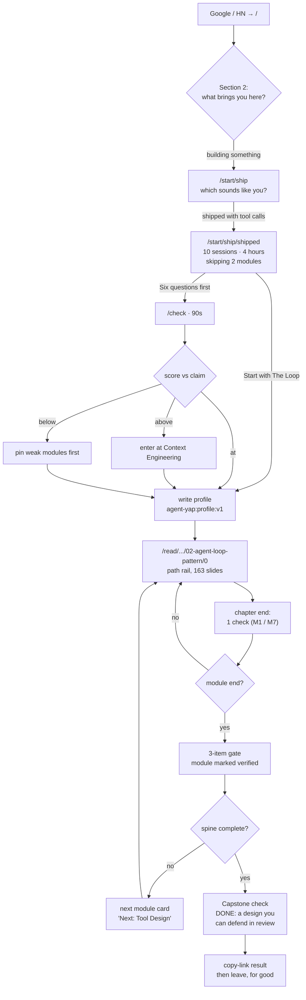
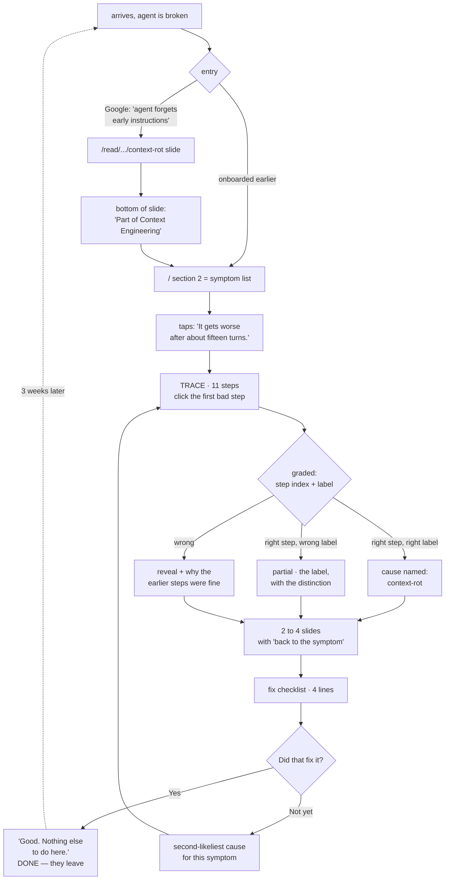
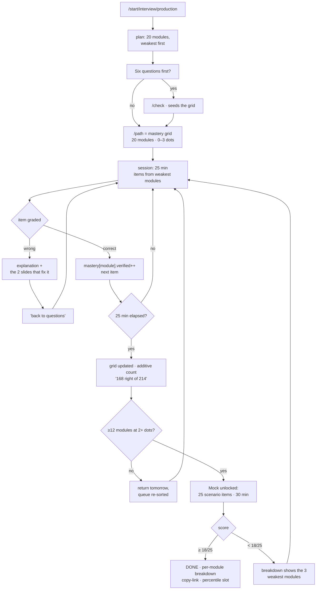
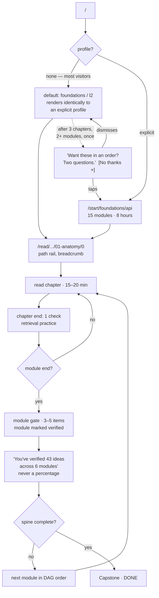
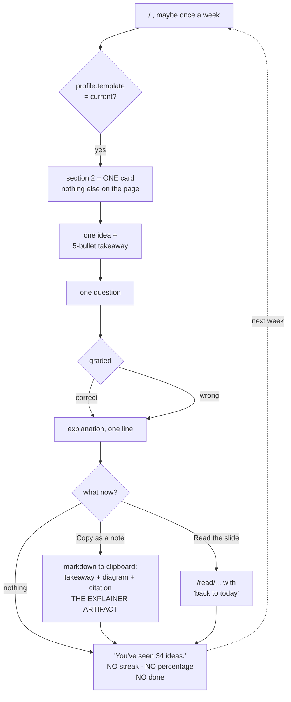

# 08 — Onboarding and the Five Learner Templates

> Design artifact for the 2026 redesign. Grounded in
> `docs/redesign-2026/research/01-content-inventory.md` … `06-visual-identity.md`.
> Research and design only. No repo file was modified to produce this.
> Where this document contradicts a recon report, it says so out loud (§0.2).

---

## 0. The three decisions that drive everything else

### 0.1 Decisions

1. **Two questions, not four.** Five goal options × three level options = 15 distinct
   paths from two taps, roughly nine seconds. Every additional question fails the
   test that report 04 itself established, and §1.2 applies that test question by
   question.
2. **Onboarding is 21 static pages linked by anchors, not a wizard.** No modal, no
   step machine, no Back button, no client state until the final tap. This is the
   single biggest contributor to "it should feel like nothing," and it is also the
   cheapest thing to build in this codebase.
3. **The template is invisible machinery.** The learner never sees the word "template",
   never sees an archetype name, never sees a persona. They see their own answer
   echoed back and a plan. The five templates are five genuinely different products
   (different landing surface, different reader behaviour, different reading:practice
   ratio, different definition of done) that share one content base.

### 0.2 Where this contradicts the recon

| Report | Its position | This document | Why |
|---|---|---|---|
| **04 §Part 5** | 4 questions + optional 6-item calibration, calibration as question 3 | **2 questions**, calibration offered **after** the result screen | 04's own Duolingo finding is that 38 screens survive only because "each answer visibly changes the next screen." Its Q4 (time budget) changes nothing on the next screen, so it fails 04's own test. And its Q3 places the 90-second test *between* the visitor and their first reward, which contradicts 04's own Brilliant finding ("deliberately shows value before the wall"). |
| **04 §Part 5** | Goal options: Building / Interviewing / Keeping up / Teaching others | **Building / Broken / Interviewing / Understanding / Keeping up**, with Teaching folded into `current` as an artifact affordance | 04 elsewhere describes the modal Agent YAP visitor as "an engineer who arrives when they hit a problem at work, possibly three weeks apart." Its own option set has no slot for that person. `debug` is that slot, and it is the most differentiated of the five. "Teaching others" is a real audience but not a different *product shape* — it is `current` plus a copy-as-markdown button. |
| **06 §3-R2 / §4** | One duotone photo colourway per flow template as the "this variant is mine" signal | Duotone appears on **exactly one screen** (`/start/[goal]/[level]`), never as ongoing template chrome | 06's own §4 rule bans imagery on assessment surfaces. Two of the five templates (`interview`, `debug`) are assessment-first, so their primary surface cannot legally carry the duotone under 06's own policy. Carrying template identity in chrome would therefore work for three templates and break for two. Identity is carried by **structure** instead: which surface you land on. Colour confirms; it never informs. |
| **05 Candidate 2** | Path-first rail "requires the module layer, the template definitions, and localStorage path state before it can ship at all. Bigger first increment." | Agreed on the destination, disagreed on the increment | §9 gives a three-increment ship order where increment 1 (the two `/start` pages and the default path) needs no module layer, no localStorage, and no rail change. |
| **02 §3.5** | Cross-book navigation is a hard architectural wall (~820 KB of manifest at 8 books) | Path mode is **cheaper** than today's manifest, not more expensive | A path is bounded (≤ ~340 slides) while a corpus is not. §6.4 turns the wall into an argument *for* personalization. |

### 0.3 What this document does not re-litigate

Taken as settled from report 03 §6: markdown on disk is the content store; `src/lib/content.ts`
is the only parser; one `##` = one slide with a canonical URL; modes are an index plus a
renderer over the same slide list; placement and scoring are deterministic lookup tables with
no AI and no tokens; progress mechanics yes, pressure mechanics no.

---

## 1. The onboarding flow, screen by screen

### 1.1 Route map

Twenty-one statically generated pages and exactly one client island.

| Route | Pages | Rendering | Client JS |
|---|---|---|---|
| `/start` | 1 | SSG | none |
| `/start/[goal]` | 5 | SSG, `generateStaticParams` over 5 goals | none |
| `/start/[goal]/[level]` | 15 | SSG, 5 × 3 | one button (`<BeginPath>`) |
| `/check` | 1 | SSG shell, items from a static JSON | the item runner |
| `/path` | 1 | client, reads `agent-yap:profile:v1` | yes |

Every transition between the first three is a plain `<Link>`. The browser's Back button is the
Back button. The URL is the state. `/start/ship/shipped` is shareable and produces an identical
page for everyone, which means it is cacheable, crawlable, and debuggable by pasting a URL.

Indexing: `/start` goes in the sitemap. The 20 children get `robots: { index: false }` in their
`generateMetadata` and a canonical pointing at `/start`. They are thin, near-duplicate, and there
is nothing to gain from indexing 20 variants of a two-option page.

**Q1 does not need its own screen.** It is section 2 of the landing page (`src/components/Home.tsx`)
for a visitor with no profile. `/start` exists as a canonical destination for the rail's
"Change your path" link and for direct traffic, and it renders the same five links. So for the
first-time visitor arriving at `/`, onboarding is: scroll once, tap, tap, done. There is no
separate onboarding *thing* to enter or exit.

### 1.2 The next-screen test — why exactly two questions

Report 04's finding, restated as a gate: **cut any question whose answer does not visibly change
the very next screen.**

| Candidate question | Changes the next screen? | Verdict |
|---|---|---|
| Goal ("what brings you here") | Yes. Q2's sub-line, and then the entire plan. | **Keep.** |
| Level (self-described) | Yes. The plan's length, and the visible skip line. | **Keep.** |
| Time budget ("10 min / 30 min / browsing") | No. It changes session chunking three screens later. It is also the question users answer worst: everyone picks 30 and does 5. | **Cut.** Derive it from the template (§4), and expose it as an adjustable control on `/path` where it has a visible effect. |
| Role / seniority / company | No. And it duplicates the level question with worse signal. | **Cut.** |
| "How did you hear about us" | No, by construction. | **Cut.** It is analytics wearing an onboarding costume; CR-2026-010 is where that belongs. |
| Topic interests (checkbox grid) | Yes, but it presupposes vocabulary the l1 learner does not have. 05 §C rejects search-first navigation for exactly this reason. | **Cut.** The goal question is a better proxy and needs no vocabulary. |
| Placement (6 items) | Yes, strongly. | **Keep, but move.** See §3. |

The evidence base for keeping the count low, from the recon rather than invented:

- **Duolingo**: 38 screens, ~10% of 60M MAU convert. It survives that length because it is a
  consumer habit product with a huge top of funnel and single-tap screens, and because every
  answer visibly changes the next one (04 §1.13). We have neither the funnel nor four answers
  that pass the test.
- **Brilliant**: ~30 seconds pre-signup, deliberately showing value before any wall (04 §1.8).
- **The Odin Project**: "the strongest onboarding on this list is *three cards and a
  prerequisite*. Not a quiz, not a wizard." (05 §22)
- **Anthropic Academy**: 20+ courses, four filter facets, a search box, and no "start here" —
  named in 05 §16 as the exact anti-pattern we are one step from.
- **50% of all dropout happens in the first two weeks** (04 Part 2). Anything spent before the
  first result is spent from the thinnest part of the budget.

### 1.3 Screen 1 — the goal question

Rendered at `/start` and as landing section 2. Five links, one quiet link, no illustration,
no progress dots, no "Step 1 of 2".

```
What brings you here?

Two questions. Then you can get on with it.

  I'm building something with agents right now.        → /start/ship
  Something I built is broken.                         → /start/debug
  I'm interviewing for AI engineering roles.           → /start/interview
  I want to understand how this actually works.        → /start/foundations
  I need to keep up without going deep.                → /start/current

  Just show me everything.                             → /read
```

Notes on the copy:

- Every option is a first-person sentence in the learner's voice, not a category noun. "Something
  I built is broken" beats "Debugging" because the person in that state is not thinking the word
  "debugging", they are thinking the word "broken".
- No em dashes anywhere (Constitution C5; report 03 §1.1 flags that C5 currently governs
  `content/` only and that UI strings are ungoverned — this document treats C5 as binding on UI
  copy too, and §8 anti-pattern A11 makes that explicit).
- "Just show me everything" writes **nothing** and goes to the shelf. Free-range is not a sixth
  template; it is the no-profile state, which is fully supported (§2.1). Consistency win: one
  fewer state to reason about.

### 1.4 Screen 2 — the level question

Rendered at `/start/[goal]`. The sub-line echoes their answer. Three links, one quiet link.

```
Which sounds most like you?

<echo line, one of five>

  I've called an LLM API and built a chatbot.                                   → l1
  I've shipped something with tool calls and watched it fail in ways I
  didn't predict.                                                               → l2
  I run agents in production and argue about eval harnesses.                    → l3

  Not sure. Start me in the middle.                                             → l2
```

Echo lines, verbatim, one per goal:

| goal | Echo line |
|---|---|
| `ship` | "You're building. Where are you starting from?" |
| `debug` | "Before the symptom list, one thing." |
| `interview` | "You're prepping. How deep does it already go?" |
| `foundations` | "Good. How much do we assume?" |
| `current` | "Fine. How technical should the cards be?" |

Never the words beginner, intermediate, advanced, novice, or expert (04 §Part 5, and the rule is
worth stating: a label the learner did not choose for themselves is a label they will argue with
instead of answering).

The quiet default is **l2**, not l1. The site's dominant register is what 01 §4.1 calls
"practitioner-essay" and describes as assuming "you know what an LLM and an API are". l2 is the
content's own implicit assumption, so it is the honest default for someone who declines to answer.

### 1.5 Screen 3 — the plan (the reward)

Rendered at `/start/[goal]/[level]`. This is the screen the whole flow exists to reach, and it is
the only screen in the onboarding that is allowed a photograph (§7.3).

Structure, top to bottom:

1. **The commitment, as a headline.** Two numbers, nothing else.
2. **The consequence line** — what changed because of their answers, with a one-tap undo. This is
   the single mechanic that makes 04's Duolingo lesson operational.
3. **The plan as numbered steps** (05 §A9, the Anthropic docs `<Steps>` pattern), each row:
   number, module title, `N slides · M min`, and the module's one-line promise. All 20 promises
   are already authored in `01-content-inventory.md` §5.1 — this is free copy.
4. **Three actions**, in descending prominence.

Verbatim for `ship` / `l2`:

```
Ten sessions. About four hours.

Skipping What an Agent Actually Is and What's Inside the Model.
You said you've shipped with tool calls.  [Put them back]

  1  The Loop                     17 slides · 27 min
     The ten lines of control flow every agent is built around, and how to
     stop it safely.
  2  Tool Design and Execution    20 slides · 32 min
     Write tool schemas a model uses correctly on the first try.
  3  Prompt Architecture          18 slides · 27 min
     Layered system prompts that survive six months of edits.
  4  Context Engineering          45 slides · 70 min
     Reduce, offload, isolate, retrieve. Keep the window minimal and effective.
  5  State, Data, and Reliability 27 slides · 28 min
     Event logs, versioned artifacts, retries, idempotency. Surviving failure.
  6  Instrumentation              20 slides · 23 min
     See inside the agent, then prove it got better.
  7  Reference Architecture       16 slides · 37 min
     Assemble everything into a design you can defend in review.

  [ Start with The Loop ]

  Six questions first, so I get this right.   (about ninety seconds)

  Show me everything instead.
```

- `[ Start with The Loop ]` is the one client island in the flow: it writes the profile, then
  navigates to the first slide of `agent-loop-and-control`.
- The second action is the placement offer (§3). It is a text link, not a button, because it must
  read as optional. Its parenthetical is the entire pitch: the cost, stated before the click.
- The third action writes nothing and goes to `/read`. Abandoning here leaves the visitor in a
  valid, fully-supported state.

The "Ten sessions. About four hours." headline is computed, not authored: `ceil(spineMinutes /
sessionMinutes)` and `round(spineMinutes / 60 * 2) / 2` hours. Report 05 §A2 makes the case:
`"31 min"` is the cheapest trust device in the entire teardown, and the word counts to compute it
already exist in `src/lib/content.ts`.

### 1.6 Total cost to the learner

| Step | Taps | Seconds |
|---|---|---|
| Scroll to landing section 2 (or land on `/start`) | 0 | 2 |
| Goal | 1 | 3 |
| Level | 1 | 4 |
| Read the plan, tap Start | 1 | 6 |
| **Total** | **3** | **~15** |

Placement adds ~90 seconds and is never on this path.

---

## 2. The two hard cases

### 2.1 Case A — the visitor who skips onboarding entirely

**What they get: `foundations` at `l2`, with no profile written.**

The critical property is that **an absent profile and a `{template:'foundations', level:'l2'}`
profile must render byte-identically.** This is enforced by a single pure function that every
consumer calls:

```ts
// src/lib/profile.ts
export const DEFAULT_EFFECTIVE: Effective = {
  template: "foundations",
  level: "l2",
  explicit: false,
};

export function effectiveProfile(p: Profile | null): Effective {
  if (!p) return DEFAULT_EFFECTIVE;
  return { template: p.template, level: p.level, explicit: true };
}
```

Three reasons this matters more than it looks:

1. **The no-profile state is the most-exercised state on the site** (every crawler, every
   first-time visitor, every incognito session, every SSR pass). Making it a special-cased empty
   state guarantees it will be the least-tested and most-broken surface. Making it the default
   path means it gets exercised by everyone including us.
2. **Adopting a path later is then a pure upgrade with nothing to undo.** There is no "convert
   your anonymous session" step, because there was never an anonymous session to convert.
3. **The server always renders the default path.** `getServerSnapshot()` returns `null`
   (the pattern already proven in `src/lib/progress.ts:130`), so server HTML is always the
   canonical curriculum. That is also the SEO-correct HTML. The crawler sees the course; the
   human sees theirs one tick later. No mismatch, no flash.

**Nothing in the UI ever says "you haven't onboarded."** No banner, no empty state, no dashed
placeholder card, no "complete your profile" nudge. The default path is presented as *the* path,
because it is.

**How they adopt a path later.** Three affordances, all of them one line of text in a place the
learner is already looking. Zero of them are settings screens.

| Affordance | Where | Copy | Fires |
|---|---|---|---|
| Rail footer row | last row of `Rail.tsx`, below the chapter list | `Change your path` | always, both modes |
| Module boundary | slide footer when the next slide crosses a module edge | `You've finished The Loop. Next: Prompt Architecture.` with `or pick a different direction` | at module ends |
| The one-time invitation | in the `ResumePill` slot | `Want these in an order? Two questions.`  `[No thanks ×]` | **once per browser**, after ≥3 chapters read across ≥2 modules with no profile |

The invitation is the only interruption in the entire product. Its conditions are deliberate: it
fires **after** demonstrated engagement (the visitor has already voted with their time), it fires
**once**, and `[No thanks ×]` writes `promptDismissedAt` and it never returns. Anti-pattern A14
in §8 is the rule that keeps it that way.

### 2.2 Case B — the visitor who lands deep on a chapter from Google

Four invariants. These are the strongest rules in this document because breaking any of them
costs the site its only acquisition channel: 199 statically generated slide pages today, ~630
after the wiring work in 01 §3.

> **P-ONBOARD-001.** No route under `/read/**` ever renders an onboarding gate, modal,
> interstitial, banner, toast, or redirect. Ever.

> **P-ONBOARD-002.** A slide page's server HTML is identical with and without a profile.
> Personalization on `/read/**` is confined to two client-hydrated targets: the `next` href and
> the rail's contents.

> **P-ONBOARD-003.** No route under `/read/**` redirects to `/start`, `/path`, or `/check` under
> any condition.

> **P-ONBOARD-004.** No profile write is ever triggered by reading behaviour. Reading five RAG
> chapters must not silently set `template: 'ship'`.

Why each one, concretely:

- **001** — an interstitial on the acquisition surface is a bounce, and on a page whose LCP is
  server-rendered prose it is also a Core Web Vitals regression on 630 pages at once. There is no
  version of this that is worth it.
- **002** — the slide route is SSG (`[slide]/page.tsx:10-24`). If the profile changed the server
  HTML, either every page would need 15 variants or the route would have to leave SSG. Both are
  disqualifying. Confining personalization to two hydrated targets keeps the whole thing static.
- **003** — a redirect breaks the shared link, breaks the crawler, and breaks the back button.
- **004** — inferred identity the learner did not ask for is what makes software feel
  unpredictable. Behaviour feeds *mastery*; only an explicit tap on `/start` feeds *identity*.

**What a cold deep-landed reader actually sees.** Exactly one new element compared to today, and
it is content, not personalization:

```
                          [ end of the prose ]
  ────────────────────────────────────────────────────────────
  Part of Context Engineering. 45 slides, 70 minutes.
  See the whole module.
                                              ← prev    next →
```

That line is identical whether or not a profile exists. It happens to be the on-ramp, because a
person who just read one slide and liked it will click "see the whole module", which is the
module page, which has a `Start this module` control, which is a path adoption without ever having
been an onboarding prompt. The best onboarding for the deep-landed visitor is a good next link.

The path only becomes visible on their **second** page view, and only in the rail. Progressive by
construction.

---

## 3. Placement — the optional six-item diagnostic

### 3.1 When it is offered

- **Never before the plan.** It is offered as the second action on `/start/[goal]/[level]`
  (§1.5) and permanently as a link on `/path`.
- **Never as an interruption.** It has a route (`/check`), it is entered by a tap, and it is
  abandonable at any item with no penalty and no state written.

Two arguments for offering it after the plan rather than before it, both drawn from 04:

1. **The plan is the reward and the reward has to come first.** Brilliant "deliberately shows
   value before the wall" (04 §1.8). Charging 90 seconds before the visitor has seen anything is
   spending from the thinnest part of the budget (50% of loss is in the first two weeks).
2. **You cannot meaningfully consent to being measured against a curriculum you have not seen.**
   Before the plan, "six questions" is an unexplained test. After the plan, it is a concrete
   proposition: *these seven modules, in this order, and this is how you check that the order is
   right.*

### 3.2 Length and shape

Six items, roughly 90 seconds. DataCamp Signal is ~10 minutes with real Item Response Theory
(04 §1.7); 04's own verdict is "steal the shape, not the math. A fixed 6–8 item calibration set
with hand-assigned difficulty tiers gets ~80% of the placement value at ~2% of the cost." We
deliberately sit at the bottom of that range because our test is optional and competing against a
back button, not bundled into a paid product.

Presentation:

- One item per screen. No timer. No progress bar (05 §B1 rejects progress bars outright).
- A bare `3 / 6` counter in `tabular-nums`, matching the reader chrome's existing `NN / MM`
  (`ReaderChrome.tsx:302`). Zero new UI vocabulary.
- Zero imagery, unconditionally (06 §4: "a quiz with ambient art is a quiz you don't trust").
  On `/check` the `AmbientBackdrop` shader does not mount at all.
- No feedback between items. Verdicts arrive at the end, all at once, with a per-item review
  behind one tap.

### 3.3 The item pool

**36 items total: 12 per level band, each tagged with a module id.** Not 5 × 12 per template —
level is a property of the learner, not of the goal, so the pool is shared and the *selection*
is template-aware.

Selection for a learner claiming level `L`:

```
serve 2 items from band(L-1), 2 from band(L), 2 from band(L+1)
  l1 → 3 from l1, 3 from l2   (no band below)
  l3 → 3 from l2, 3 from l3   (no band above)
prefer items whose module id is on this template's spine
tie-break deterministically on seed = fnv1a(template + level + dayIndex)
```

The day-indexed seed means: retaking within a day serves the same six items (no reroll-until-you-pass),
retaking tomorrow serves different ones (an honest retake is possible). This reuses the
`moduleSeed` FNV-1a helper already specified in `06-visual-identity.md` §2c.

**Where the items come from.** Report 01 §6.3 found **490 authored MCQs with distractors and
explanations** already on disk in `## Review` sections, currently invisible because
`Markdown.tsx` lacks `rehype-raw`. The placement pool is **hand-picked from those 490, not
sampled**, against one criterion:

> A placement item must be answerable by a practitioner who has never read this site.

Most of the 490 are chapter-review items that presuppose the chapter. Expected yield is low —
call it 15–20%, which is 70–100 candidates, comfortably more than the 36 needed. This is a
selection and tagging job measured in hours, not an authoring job. It is the single cheapest
high-value task in the whole redesign.

### 3.4 Scoring

Band-weighted, deterministic, a pure function, no AI (CR-2026-006's constraint: "pure lookup
table, no AI, no tokens").

| Item band relative to claim | Points if correct |
|---|---|
| below | 1 |
| at | 2 |
| above | 3 |

Maximum 12. Bands:

| Score | Band | Meaning |
|---|---|---|
| 0–3 | `below` | the claim is not supported |
| 4–8 | `at` | the claim is confirmed |
| 9–12 | `above` | the claim is understated |

**Placement can move a learner at most one rung.** Six items is not enough evidence for two, and
a two-rung jump is precisely what makes a diagnostic feel arbitrary.

### 3.5 Resolving disagreement between self-report and measurement

This is where most products get it wrong, so it gets two explicit rules.

> **Rule 1 — asymmetric trust.** A measurement that is *higher* than the self-report is applied
> silently. A measurement that is *lower* is **never** applied silently, and never demotes.

Over-placing someone against their own claim is the failure that makes people close the tab
("this thing thinks I'm an idiot"). Under-placing costs them a few minutes of material they
already know, which they can skip in one tap. The asymmetry is not squeamishness; it reflects the
asymmetric cost of the two errors.

The three outcomes, verbatim:

**Above** (measured > claimed):

```
You're ahead of where you put yourself.
Starting you at Context Engineering instead of The Loop.
                                     4 of 6 · see what you got
[ Start with Context Engineering ]
No, start me earlier.
```

**At** (measured == claimed):

```
That matches what you said. Starting at The Loop.
                                     4 of 6 · see what you got
[ Start with The Loop ]
```

**Below** (measured < claimed) — the level is **not** changed. Instead of subtracting, we add:

```
Two of these tripped you up: Tool Design and Context Engineering.
I've put them first. Everything else is where you said it was.
                                     2 of 6 · see what you got
[ Start with Tool Design ]
```

The raw count (`4 of 6`) is shown, small, next to the verdict. Engineers will want it, and
hiding it reads as evasive. What is never shown is the count converted into a *label* — no
"Level: Intermediate", no grade, no badge. The count is evidence; the level stays the learner's
own claim.

> **Rule 2 — measurement is stored as evidence, never as identity.** `placement` is its own
> field. It never overwrites `level`.

```ts
placement: {
  at: 1754130000000,
  score: 9,
  band: "above",
  weak: ["tool-design-and-execution", "context-engineering"],  // max 3
  itemSet: "pool-v1/2026-08-02",
}
```

Consequences: the disagreement is *recorded* rather than resolved by fiat; it is fully
reversible; a second attempt overwrites `placement` and leaves `level` untouched; and `weak[]`
is directly consumable by the review queue and by the `interview` template's mastery grid
without any further plumbing.

---

## 4. The five templates

### 4.0 Why these five, and why they are not skins

Each is differentiated on five axes simultaneously. If any two rows below were identical, the
two templates would collapse into one.

| | `ship` | `debug` | `interview` | `foundations` | `current` |
|---|---|---|---|---|---|
| **Primary surface** | next-module card | symptom list | mastery grid + mock | numbered path | one card |
| **Ordering principle** | build order | symptom lookup (no order) | weakest-first breadth | prerequisite DAG | recency × unseen |
| **Reader role** | path rail, linear | trace-first, prose second | remediation only | the product | escape hatch |
| **Reading : practice** | 3 : 1 | 1 : 2 | 1 : 4 | 5 : 1 | 1 : 1 |
| **Session** | 25 min, deep | 5–10 min, episodic | 25 min, timed | 15–20 min | 5 min, once |
| **Done means** | capstone defended | "yes, it's fixed" | mock ≥ 18/25 | capstone + module gates | *there is no done* |
| **Success looks like** | they return tomorrow | **they don't come back today** | they schedule a mock | 26 sessions over 6 weeks | one visit a week, forever |

That last row is the strongest evidence these are different products: `debug` is the only
template where the learner leaving quickly is the *goal*, and `current` is the only one with no
completion state at all. You cannot skin your way to those.

### 4.1 Module slices — the mechanism that makes recombination real

Four modules in the 01 taxonomy are too large to hand to every template whole
(`context-engineering` 65 slides, `multi-agent-systems` 57, `retrieval-and-rag` 57,
`agent-memory` 56). A template takes a **named slice**, which is nothing more than a chapter-id
list in the template definition. No new content, no new parser behaviour, no duplication.

| Module | Slice | Chapters | Slides | Min |
|---|---|---|---|---|
| `context-engineering` | `@core` | `context-engineering/ch01–04`, `arch/ch05` | ~45 | 70 |
| | `@caching` | `harness/ch04`, `ch05` | ~20 | 33 |
| `agent-memory` | `@core` | `agentic-memory/ch01–03` | ~28 | 34 |
| | `@failures` | `agentic-memory/ch04–05`, `harness/ch09` | ~28 | 33 |
| `retrieval-and-rag` | `@decide` | `rag/ch00–01`, `arch/ch07` | ~25 | 38 |
| | `@build` | `rag/ch02–04`, `arch/ch10` | ~32 | 47 |
| `multi-agent-systems` | `@decide` | `multi-agent/ch01–03` | ~28 | 48 |
| | `@build` | `multi-agent/ch04–05`, `harness/ch11` | ~29 | 50 |
| `security-privacy-and-compliance` | `@injection` | `arch/ch11`, `harness/ch07` | ~22 | 31 |
| | `@compliance` | `arch/ch12`, `ch17` | ~20 | 28 |
| `evaluation-and-observability` | `@instrument` | `arch/ch15`, `harness/ch12` | ~20 | 23 |
| | `@benchmarks` | `benchmarks-and-evals/ch00–03` | ~22 | 26 |

This is the concrete answer to "content decomposed into 10-20 modules recombined per learner":
**20 modules, 12 of which have two slices, recombined by five templates × three levels into 15
distinct spines from one content base.** Nobody authors a second curriculum.

Every template also has a **shelf**: modules and slices reachable in one tap from the rail but
not counted toward the spine, not counted in the headline time estimate, and not blocking
completion.

---

### 4.2 `ship` — "I'm building something with agents right now."

**Who.** An engineer with a deadline and a half-built agent. They are not here to learn the
field; they are here to not make the three mistakes that will cost them a week. They will use the
site intensely for two to four weeks and then never again, and that is a success.

**Signal.** `goal = ship`.

**Goal.** Ship the thing, and be able to defend the design in review.

**Session shape.** 25 minutes, deep, one module chunk. Resumed most working days while the build
lasts. Highest tolerance for long slides of the five.

**Spine (l2), ordered by build sequence rather than pedagogy:**

| # | Module | Slides | Min |
|---|---|---|---|
| 1 | `agent-loop-and-control` | 17 | 27 |
| 2 | `tool-design-and-execution` | 20 | 32 |
| 3 | `prompt-architecture` | 18 | 27 |
| 4 | `context-engineering@core` | 45 | 70 |
| 5 | `state-and-reliability` | 27 | 28 |
| 6 | `evaluation-and-observability@instrument` | 20 | 23 |
| 7 | `reference-architectures-capstone` | 16 | 37 |
| | **Total** | **163** | **244** (4.1 h, 10 sessions) |

- **l1** prepends `agent-foundations` (15 / 24) → 178 slides / 268 min.
- **l3** drops 1–3 to the shelf and promotes `evaluation-and-observability` (full),
  `security-privacy-and-compliance` (full), `model-routing-and-economics`,
  `deploying-and-scaling-agents` → 223 slides / 325 min.

**Shelf:** `context-engineering@caching`, `agent-memory@core`, `retrieval-and-rag@decide`,
`multi-agent-systems@decide`, `security@injection`, `mcp-and-tool-ecosystem`,
`agent-ux-and-streaming`.

**Reading : practice = 3 : 1.** A check roughly every four slides. For this learner the check is
a *tripwire*, not a quiz: its job is to say "you are about to make this mistake", so the item type
skews to M1 (failure-mode distractors) and M7 (config selection with accepted ranges) rather than
recall.

**Landing (section 2):** one line of commitment, the next module card, a disclosure for the whole
spine. `You're on the build path. 7 modules, about 4 hours. Next: Tool Design and Execution.`

**Reader:** path-scoped rail, spine flat with slice boundaries marked, `Browse all` last row.
Chapter-end check. Module-end gate of three items.

**Done:** `reference-architectures-capstone` complete and its capstone check passed. The stated
artifact is the module's own promise: *a design you can defend in review.*

**Content readiness: green.** Every module in the l2 spine exists on disk today. It needs the 01
§3 wiring work (`coding-agents-and-harnesses` flatten, `context-engineering` rename) and nothing
authored.



---

### 4.3 `debug` — "Something I built is broken."

**Who.** The modal Agent YAP visitor, per report 04's own characterisation: "an engineer who
arrives when they hit a problem at work, possibly three weeks apart." They have a symptom and no
patience. They do not want a curriculum; they want the paragraph that explains what is happening
to them.

**Signal.** `goal = debug`.

**Goal.** Name the failure, fix it, leave.

**Session shape.** 5–10 minutes. One symptom. Episodic, possibly a single visit ever.
**Success is that they do not come back today.**

**There is no module sequence.** The DAG is not traversed; it is *queried*. This is the
structural reason `debug` is not a skin: its entry surface is a symptom index, and no other
template has one.

**The symptom index — 14 lines, in the learner's words**, each mapped to one label from the M3
failure taxonomy (04 §M3), which is also the glossary vocabulary and the module tag vocabulary
(author once, use three ways):

| Symptom, verbatim | Label | Lands on |
|---|---|---|
| "It gets worse after about fifteen turns." | `context-rot` | `context-engineering@core` |
| "It ignores instructions I gave early in the conversation." | `lost-in-the-middle` | `context-engineering@core` |
| "It calls the wrong tool." | `tool-schema-ambiguity` | `tool-design-and-execution` |
| "It makes up arguments to my tools." | `hallucinated-tool-arg` | `tool-design-and-execution` |
| "It loops forever." | `unbounded-loop` | `agent-loop-and-control` |
| "It repeats work it already did." | `non-idempotent-retry` | `state-and-reliability` |
| "It retrieves the right document and still answers wrong." | `retrieval-distractor` | `retrieval-and-rag@decide` |
| "It can't find things I know are in the index." | `retrieval-miss` | `retrieval-and-rag@build` |
| "It remembers something that stopped being true." | `stale-memory-write` | `agent-memory@failures` |
| "A web page made it do something I didn't ask for." | `prompt-injection` | `security@injection` |
| "The subagent went off and did its own thing." | `over-eager-delegation` | `multi-agent-systems@decide` |
| "It costs ten times what I estimated." | `budget-exhaustion` | `model-routing-and-economics` |
| "It's slow and I can't tell where the time goes." | `latency-blindness` | `evaluation-and-observability@instrument` |
| "It passes my tests and fails in production." | `eval-gap` | `evaluation-and-observability@instrument` |

**The symptom card — three parts, in this order:**

1. **A trace.** An authored 8–14 step agent trace (04 §M2, the flagship mechanic). "Click the
   first step that went wrong", then "why" from the fixed taxonomy. Graded by integer equality
   and label equality, with natural partial credit.
2. **Two to four slides.** The prose that explains the cause, deep-linked, read inside the
   reader with a persistent `back to the symptom` affordance.
3. **A fix checklist.** Three to five imperative lines. Not prose.

**Reading : practice = 1 : 2.** The highest practice ratio of the five, and the only template
where practice comes *first*. Justified twice over by 04: Brilliant's problem-before-explanation
architecture, and the Maven evals pedagogy ("here is a broken agent, find the break") described
as the atomic unit of the most respected paid course in the space.

**Landing (section 2):** the 14 symptoms as 14 sentences. No module grid, no photograph, no
progress, no path. This is the most extreme surface in the product and it should look like it.

**Reader:** the trace renderer first; prose second, opened with a return affordance; the rail is
collapsed by default because there is no path to show.

**Done:** one question at the end of the card. `Did that fix it?` → `Yes` closes the loop with
`Good. Nothing else to do here.` → `Not yet` routes to the second-most-likely cause for that
symptom and offers `⌘K` for anything else.

**Content readiness: red, and this is the one to be honest about.** Report 01's verified gaps hit
`debug` hardest:

- `prompt-injection` — 5 files, all one-paragraph mentions; `OWASP` 0, `jailbreak` 0 (01 gap #2).
- `budget-exhaustion` — `arch/ch14` "teaches the levers but never a number"; no price tables, no
  worked example (01 gap #12).
- `eval-gap` / `latency-blindness` — `golden set` 0, `regression test` 0, `OpenTelemetry` 0,
  `Langfuse` 0 (01 gap #1, "the single biggest hole").
- All 14 need an authored trace, and zero traces exist today.

So `debug` is the highest-value and highest-authoring-cost template. **Ship it third**, and
sequence its 14 symptoms so the six with green content go first. See §9.



---

### 4.4 `interview` — "I'm interviewing for AI engineering roles."

**Who.** Someone with a loop scheduled. They want coverage and a number, and they are the only
audience for whom volume is genuinely a virtue.

**Signal.** `goal = interview`.

**Goal.** Know where the holes are, close them, and get a score they believe.

**Session shape.** 25 minutes, question-first, timed by choice. Highest items-per-session of the
five.

**Sequence: breadth over the whole surface, ordered weakest-first.** Not a path — a queue over
all 20 modules at depth 1, re-sorted after every session by (module coverage × item difficulty ×
time since last correct). The 20-module mastery grid *is* the sequence, made visible.

The corpus this template runs on already exists (01 §6.3):

| Asset | Count | Status |
|---|---|---|
| MCQs with distractors and explanations | **490** | on disk, invisible (no `rehype-raw`) |
| `Key takeaways` bullets | ~85 chapters × 5 = **425** | rendered as bullet slides; 01 calls them "free flashcard fronts" |
| Coding challenges with solutions | 3 | on disk |
| `Code MVP` exercises | 15 | on disk, no exercise framing |
| Authored traces (M2) | **0** | needs ~18, shared with `debug` |

**Reading : practice = 1 : 4.** This is a question product with reading as remediation. You
answer, you are wrong, you are dropped on the two slides that fix it, you return to the queue.

**Landing (section 2):** `Where you stand.` A 20-cell mastery grid, 0–3 dots per module, derived
**only from graded items** (never from slides read, never from self-rating — 04's rule). Below it
one number, additive: `168 items right of 214 attempted.` Then one button:
`Mock: 25 questions, 30 minutes.`

**Reader:** almost never entered as a reader. It appears as remediation with a persistent
`back to questions` control.

**Done:** the mock. 25 scenario items in 30 minutes, threshold **18 / 25 (72%)**, reported as a
per-module breakdown rather than a grade.

Three deliberate choices in that number:

- **It is scenario-based MCQ, not code.** The strongest single fact in report 04: Anthropic's own
  Architect certification is 60 multiple-choice and multiple-response questions in 120 minutes at
  a 720/1000 scale, and it is scenario-based. The organisation with the deepest knowledge of
  agentic AI grades agentic competence with MCQ. We do not need a code sandbox to be credible,
  and AgenticPrep's Python-plus-test-runner path is precisely the expensive path we decline to
  follow (04 §1.18).
- **The threshold is stated and low.** Hugging Face's Agents Course requires ≥30% on GAIA and
  that bar "still filters hard" (04 §1.14). A stated numeric threshold is the only defensible
  "you can do this" claim.
- **No certificate.** 04's finding: certificates for watching are cosmetic. The artifact is the
  per-module breakdown, shareable via copy-link (CR-2026-012 slice 1).

**The percentile slot.** 04 says engineers trust a percentile more than a badge, and report 03
§2.2 establishes that anonymous aggregate *item* statistics are permissible (nothing stored about
a person, only about a question) once CR-2026-010 lands. So: **design the percentile slot into
the result screen now and leave it empty until aggregate data exists.** Do not fabricate it, and
do not retrofit the layout later.

**Content readiness: amber, and it is the cheapest amber.** All 490 items exist; they need
`rehype-raw` (a one-line `Markdown.tsx` change, 01 §8 step 0), extraction into
`Chapter.questions[]` (01 §7.4 item 4), and a difficulty tag. That is a tagging job, not an
authoring job. The mock itself needs ~25 scenario items authored fresh, because chapter-review
items presuppose the chapter.



---

### 4.5 `foundations` — "I want to understand how this actually works."

**Who.** Someone with genuine curiosity and no immediate deadline. Also, and importantly, the
**default for every visitor who never onboards** (§2.1), which makes this the most-rendered
template on the site by a wide margin.

**Signal.** `goal = foundations`, **or** no profile at all.

**Goal.** A real mental model of the field, in a defensible order.

**Session shape.** 15–20 minutes. Reading-first. One chapter per sitting.

**Spine (l1) — the prerequisite DAG from 01 §5.2, topologically sorted:**

| # | Module | Slides | Min |
|---|---|---|---|
| — | `agent-vocabulary` | 108 cards | pinned side deck, not in the linear count |
| 1 | `agent-foundations` | 15 | 24 |
| 2 | `llm-mechanics` | 47 | 44 |
| 3 | `agent-loop-and-control` | 17 | 27 |
| 4 | `prompt-architecture` | 18 | 27 |
| 5 | `tool-design-and-execution` | 20 | 32 |
| 6 | `context-engineering@core` | 45 | 70 |
| 7 | `agent-memory@core` | 28 | 34 |
| 8 | `retrieval-and-rag@decide` | 25 | 38 |
| 9 | `agent-ux-and-streaming` | 12 | 14 |
| 10 | `state-and-reliability` | 27 | 28 |
| 11 | `evaluation-and-observability@instrument` | 20 | 23 |
| 12 | `security-privacy-and-compliance@injection` | 22 | 31 |
| 13 | `multi-agent-systems@decide` | 28 | 48 |
| 14 | `reference-architectures-capstone` | 16 | 37 |
| | **Total** | **340** | **477** (8.0 h, ~26 sessions) |

- **l2** drops `agent-foundations` and `llm-mechanics` to the shelf → 278 slides / 409 min
  (6.8 h, ~23 sessions).
- **l3** is not a shorter version of the same path. It is a **different tier**:
  `reasoning-and-planning`, `multi-agent-systems` (full), `evaluation-and-observability` (full),
  `security-privacy-and-compliance` (full), `model-routing-and-economics`,
  `deploying-and-scaling-agents`, `agents-in-the-wild`, `reference-architectures-capstone` →
  269 slides / 416 min. The headline for l3 is not the length, it is the **skip**:
  `You'll skip 11 modules. Here are the 8 that are actually new.`

Note that `llm-mechanics` is the module 01 §4.1 identifies as the repo's only true beginner
on-ramp ("explain-like-I'm-curious" register, buried three levels deep inside
`research papers/`). It is at position 2 of the l1 spine specifically so that the one piece of
genuinely accessible content in the corpus reaches the one learner who needs it.

**Reading : practice = 5 : 1.** One check at chapter end. Reading is the product here; the check
is punctuation, and its job is retrieval practice, not measurement.

**Landing (section 2):** the whole path as numbered steps with per-module reading time (05 §A9 +
§A2). `15 modules. About 8 hours. Start at the top.` Next 3 highlighted.

**Reader:** exactly what ships today, plus the breadcrumb (05 §A5) and the path-scoped rail
(05 Candidate 2).

**Done:** capstone complete, plus a module gate cleared on every spine module. Reported as an
additive count — `You've verified 43 ideas across 14 modules` — **never as a percentage of the
corpus.** 04's rule 3 is unambiguous and the reason is specific to this repo: 431 slides are
about to become reachable (01 §0), so a global percentage is a number that goes *down* every time
we ship.

**Content readiness: green.** The entire l1 spine exists on disk. It needs 01 §3 wiring
(three folder renames plus the `explained/` flatten) and nothing authored.



---

### 4.6 `current` — "I need to keep up without going deep."

**Who.** A staff engineer, a CTO, a PM, a tech lead. Also the person who has to *explain* this to
other people. They will never read 340 slides and pretending otherwise wastes both parties' time.

**Signal.** `goal = current`.

**Goal.** Not be surprised in a meeting.

**Session shape.** **One card. Five minutes. Once.** This is the most extreme minimalism in the
product and the surface should look like it: a single card on an otherwise empty page.

**Sequence: none.** It is a queue, not a path, sorted by (recency of content × unseen by you).
The card pool:

| Source | Count | Status |
|---|---|---|
| `Key takeaways` bullets | ~425 | on disk (01 §4.2) |
| Glossary terms | 187 | on disk, 2 of 5 files render as one giant slide (01 §3.6) |
| MCQs | 490 | on disk, answers invisible today |

**The card:** one idea, its five-bullet takeaway, one question, one deep link to the slide if they
want more. That is the whole surface.

**Reading : practice = 1 : 1.** One takeaway, one check.

**The Explainer affordance — the one thing no other template has.** A `Copy as a note` control
that yields the takeaway, the diagram, and the citation as markdown, ready to paste into Slack,
Notion, or an internal doc. It is nearly free (the content is already markdown) and it is the
only artifact this audience actually wants. This is why "teaching others" does not need its own
template: it needs one button.

**Landing (section 2):** the card. Nothing else.

**Reader:** rarely entered. The deep link is the escape hatch and it lands in normal reader
chrome with a `back to today` control.

**Done: there is no done, and the copy says so.**

```
There's no finish line here. There's today's.
You've seen 34 ideas.
```

**No streak. Not now, not later.** 04's analysis is decisive: streaks are load-bearing for
Duolingo (2.4× retention at 7+ days) because it is a daily consumer habit product with DAU as its
North Star. Our user shows up when work breaks, possibly three weeks apart, and a broken streak
for that person is an exit rather than a hook. The 2025 literature on streak anxiety and
pain-point monetization is extensive and it is not a brand we want. If a habit signal is ever
wanted, copy Boot.dev's **Embers** (forgiveness built in before the streak breaks), never the
streak. And note 04's most damning data point: the most gamified platform on the list has users
who describe its gamification as "just part of the aesthetics and theme."

What replaces it: **an additive count.** `You've seen 34 ideas.` It only goes up, it cannot be
lost, and losing it is not a punishment because there is nothing to lose.

**Content readiness: green for the pool, amber for the plumbing.** The 425 takeaways and 187 terms
exist. They need the `###` → `##` glossary pass (01 §3.6, a one-line `sed`) and the
`Chapter.questions[]` extraction (01 §7.4).



---

### 4.7 What the landing page shows, per template

**Rule: the top 600px of `/` is identical for everyone.** The hero is the SEO surface and the LCP
element; it must be stable, static, and server-rendered. Personalization is a swap of **section
2 only**, which is below the fold, which means it can be a client island with no CLS on the LCP
element.

| Profile | Section 2 |
|---|---|
| none | the five `/start` choices — onboarding *is* section 2 |
| `foundations` | the numbered path, next 3 highlighted, per-module reading time |
| `ship` | commitment line, next-module card, spine disclosure |
| `debug` | the 14 symptoms as 14 sentences |
| `interview` | 20-cell mastery grid, additive count, `Mock: 25 questions, 30 minutes` |
| `current` | one card |

Five genuinely different landing pages out of one route and one hero.

---

## 5. The personalization data model

### 5.1 Three keys, not one

| Key | Owner | Write frequency | Reset semantics |
|---|---|---|---|
| `agent-yap:progress:v1` | **existing, untouched** (`src/lib/progress.ts`) | every slide | "forget what I've read" |
| `agent-yap:profile:v1` | new, `src/lib/profile.ts` | ~5 writes in a lifetime | "change my path" |
| `agent-yap:mastery:v1` | new, `src/lib/mastery.ts` | every graded item | "forget what I know" |

Why three and not one:

1. **Report 03 §3 row 23 forbids extending `progress:v1`** — verbatim: "Do not extend v1 with
   learner-profile fields. It has no migration path and P-READER-002 promises monotonicity over
   that shape. Use a separate `agent-yap:profile:v1` key."
2. **Different corruption blast radius.** A mastery blob is the largest and fastest-growing of the
   three and therefore the likeliest to hit a quota or a bad write. It must not be able to take
   the profile down with it. Under the defensive-parse-resets-to-zero discipline inherited from
   `progress.ts:36`, one key's corruption resets exactly one key.
3. **Different reset semantics the user will actually want.** "Start the path over" and "forget
   what I know" are different requests and a learner will ask for one without the other.
4. **Different write frequency.** Cross-tab sync fires a `storage` event per write
   (`progress.ts:83-91`). Keeping a five-writes-per-lifetime key out of a per-keystroke-adjacent
   key's event stream is free and avoids pointless re-renders.

### 5.2 Schemas

```ts
// src/lib/profile.ts
const STORAGE_KEY = "agent-yap:profile:v1";

export type TemplateId = "ship" | "debug" | "interview" | "foundations" | "current";
export type LevelId = "l1" | "l2" | "l3";

export interface Profile {
  version: 1;
  createdAt: number;

  /** Q1. The only thing that selects a template. Never inferred from behaviour. */
  template: TemplateId;

  /** Q2. Self-reported. ONLY the user changes this. Placement never overwrites it. */
  level: LevelId;

  /** How this profile came to exist. Drives nothing; exists so we can debug reports. */
  source: "onboarding" | "switch";

  /** Evidence, not identity. Absent until /check is completed. */
  placement?: {
    at: number;
    score: number;                  // 0..12
    band: "below" | "at" | "above";
    weak: string[];                 // module ids, max 3
    itemSet: string;                // pool version + date, for reproducibility
  };

  /** Module ids the user pinned to the top of the path. Ordered. Max 5. */
  pinned: string[];

  /** Module ids the user dismissed from the path. This is the entire preference system. */
  hidden: string[];

  /** Set when the one-time path invitation is dismissed. Never fires again. */
  promptDismissedAt?: number;
}
```

```ts
// src/lib/mastery.ts
const STORAGE_KEY = "agent-yap:mastery:v1";

export interface Mastery {
  version: 1;
  /** itemId -> attempts, correct, last epoch ms. Feeds the review scheduler. */
  items: Record<string, { n: number; k: number; last: number }>;
  /**
   * moduleId -> count of DISTINCT items answered correctly, and when.
   * A COUNT, never a percentage (04 Part 2 rule 3): the corpus is about to grow
   * by 431 slides, so a percentage is a number that goes down when we ship.
   */
  modules: Record<string, { verified: number; last: number }>;
}
```

**A module is "verified" at 3 distinct correct items for modules under 20 slides, 5 for the rest.**
Derived from graded items only. Never from slides read (that is `progress:v1`'s job and it means
something different). Never from self-rating — 04's verdict on the roadmap.sh three-button
flashcard is explicit: it "measures confidence, not capability," so it may feed the review
scheduler and may never feed a mastery claim.

### 5.3 The module skeleton

`src/lib/profile.ts` is a near-copy of `src/lib/progress.ts`. Copy it verbatim rather than
inventing a second pattern — report 02 §5 ranks the existing hydration discipline as the second
most expensive thing in the codebase to lose, and lists "level, learner type, goal, template
assignment, quiz results" as exactly the fields that would otherwise become hydration-flash
landmines.

The five pieces to preserve, unchanged:

1. `useSyncExternalStore(subscribe, getSnapshot, getServerSnapshot)`.
2. `getServerSnapshot()` returns **`null`** — server HTML and the first client render agree on
   "nothing", and the real value applies one tick later. No mismatch, no flash.
3. Defensive parse: any corruption or `version !== 1` returns the zero-state
   (`progress.ts:36-57`). Never migrate in place.
4. Module-level no-op when `window.localStorage` throws (private mode, quota) — the profile lives
   in memory for the session and evaporates. Already precedented, already acceptable.
5. Cross-tab sync via the `storage` event (`progress.ts:83-91`).

One deliberate difference: `progress.ts` grows monotonically by design. `profile.ts` does not —
`template`, `level`, `pinned`, and `hidden` are all mutable. So P-READER-002's monotonicity
promise applies to `progress:v1` only, and the new key must not be folded under it. That is a
second, independent reason for the split.

### 5.4 Versioning policy

- **Additive optional field** → no version bump. Older blobs parse; the field reads `undefined`.
- **Changed meaning of an existing field, or a removed field** → bump to `v2`, new key
  (`agent-yap:profile:v2`), and the old key is ignored, not migrated.
- **No in-place migration, ever.** Justified by cost: re-creating a profile is two taps and about
  nine seconds (§1.6). Migration code is a permanent liability priced against a nine-second
  inconvenience. Mastery is the expensive one to lose, which is a further argument for keeping it
  in its own key with its own version so a profile schema change never touches it.

### 5.5 Degradation, in order of severity

| Condition | Behaviour |
|---|---|
| SSR / first paint | `getServerSnapshot()` → `null` → `DEFAULT_EFFECTIVE` → the canonical `foundations` path. This is also the SEO-correct HTML. |
| No profile ever written | Identical to the above, permanently. Fully supported, never flagged (§2.1). |
| localStorage unavailable | In-memory for the session, evaporates on close. No error surfaced. |
| Corrupt profile blob | Silently resets to zero-state → default path. Nine seconds to rebuild. |
| Corrupt mastery blob | Silently resets. Profile and reading progress survive. |
| Profile references a module id that no longer exists | The path builder drops unknown ids and logs nothing to the user. Content ids will churn; the path must be resilient to it, not validated against it at runtime. A build-time validator (03 §5.1) catches the real drift. |
| Profile written by a newer version of the site | `version !== 1` → zero-state. |

### 5.6 Editing and resetting

There is no settings screen. See §7 for the rule that keeps it that way.

| What | Where it is edited | Effect |
|---|---|---|
| `template` | `/start`, reached from the rail's last row | overwrites `template` + `level`. **Preserves** `placement`, `pinned`, `hidden`. Never touches mastery or progress. |
| `level` | the `[Put them back]` link in the skip-consequence line | overwrites `level` only |
| `pinned` | tap the pin on any module row | toggle; max 5 |
| `hidden` | `×` on a recommendation; un-hide from `Browse all` | append / remove |
| everything | `/start?reset=1`, linked once from the footer | shows exactly which three keys will be cleared, requires a second tap |

Switching templates **must not feel like losing your work**, which is why `placement`, `pinned`,
`hidden`, mastery, and reading progress all survive it. A learner who moves from `foundations` to
`interview` after two weeks should see their mastery grid already half-populated. That is the
single strongest argument for a shared content base with recombining paths, and it should be
visible the moment they switch.

### 5.7 Do we need accounts, and when

**Not now.** Everything in §4 works without one. Report 03 §2.1 is right that the cost is
specific and should be named rather than discovered: device-bound state is lost on a cache clear,
in incognito, and on the phone-to-laptop transition, which is exactly the transition a "read on
mobile, practise on desktop" learner makes.

**The stopgap, per 03 §2.1: a portable progress code.** Export all three keys as one
base64url blob; import from a paste field or a `#p=` URL fragment. Two implementation notes:

- Compress before encoding. A mastery blob with 490 items is roughly 30 KB of JSON; with
  `CompressionStream("deflate-raw")` it lands near 8 KB of base64url, which is pasteable and
  fits in a URL fragment.
- The fragment never reaches the server, which is the correct privacy property and is compatible
  with P-READER-002 as written.

**Three triggers that would each independently justify accounts.** None has fired:

1. **The mock score becomes something a person cites to someone else.** A score editable in
   devtools is not a credential. The moment `interview`'s result is used as evidence to a third
   party, it needs a server. Until then it is a private measurement and localStorage is correct.
2. **Cross-device becomes the modal usage rather than an edge case.** Unmeasurable today;
   CR-2026-010 (cookieless analytics) is the prerequisite for even knowing.
3. **A spaced-repetition scheduler becomes the primary reason people return.** FSRS state that
   silently exists on one browser only will stop working without the learner understanding why,
   and a review product that quietly forgets you is worse than no review product.

Trigger 3 is the one most likely to fire first, because the review queue is the obvious next
thing after mastery. Worth watching.

---

## 6. Architecture notes that constrain the above

### 6.1 The template registry is a sidecar, validated at build time

Per report 03 §5.1: `src/lib/content.ts` is exclusive-access and on the danger list, and there is
no frontmatter parser today. The template definitions live in a sidecar
(`src/lib/curriculum/templates.json`, sibling to the `modules.json` in 01 §5.3), and a build-time
validator cross-checks every referenced module id and chapter slug against `getAllSlides()`,
failing `npm run build`. That converts the sidecar's one real weakness (drift on rename) into a
build-gated invariant, which is the trust model ADR-005 endorses and the only enforcement
available without a test runner.

Note that 01 §7 argues for frontmatter and 03 §5.1 argues for a sidecar. They are not in
conflict for *this* feature: chapter-level metadata (module, difficulty, minutes) belongs in
frontmatter because it travels with the file through `git mv`; the template definitions are
site-level policy that belongs nowhere near the content files. Both, at different layers.

### 6.2 Assessment surfaces are not slides

Report 03 §1.2 already registered this as a clarification to ADR-003 rather than a breach:
`/start`, `/check`, `/path`, the mock, and the results screens are their own routes and must not
be forced into `/read/[book]/[chapter]/[slide]`. This document depends on that clarification
being made explicit before any of it is built.

### 6.3 Exactly one "next" computation

Report 02 §3.9 documents a live bug: `lastHref` is a single global pointer while `read` is keyed
by book, so the resume pill "silently never renders cross-book" and the landing CTA can say
"Continue reading" while pointing into a book abandoned three books ago. Adding a path makes
this worse, not better: there would then be four surfaces (the pill, the landing CTA, the rail's
active row, the slide footer's next button) each capable of computing a different answer.

> **Rule.** One exported function, `nextInPath(effective, progress, mastery): NavTarget | null`.
> The pill, the landing CTA, the rail, and the slide footer all render it and none of them
> computes anything. If two surfaces can disagree, they will.

### 6.4 Path mode is cheaper than today's manifest

Report 02 §3.5 measures the nav manifest at **105,166 bytes for 199 slides** (2× duplicated,
`content.ts:357` and `:363`), embedded in the RSC payload of every one of the 199 static pages,
and warns that cross-book navigation takes it to ~820 KB at 8 books and ~2 MB at 20 — "a hard
architectural wall, and the 'recombine 10-20 modules per learner' plan walks straight into it."

It does not, if the path manifest is built correctly:

- A path is **bounded by construction** (≤ ~340 slides for the longest spine, `foundations/l1`)
  while a corpus is not. `foundations/l2` is 278 slides. Once the duplication at `content.ts:363`
  is removed, a path manifest is ~12 KB.
- There are exactly **15 canonical path manifests** (5 templates × 3 levels). Generate them at
  build time to static JSON at `/paths/[template]-[level].json`.
- The slide route stays SSG and stays ignorant of the profile. It ships today's book manifest as
  the server-rendered fallback; the client fetches its path manifest once, caches it, and swaps
  the rail. `pinned` and `hidden` are applied client-side as a reorder and a filter on top.

Net: **15 × 12 KB of static JSON, one 12 KB fetch per session, and the per-page RSC payload gets
smaller, not larger.** Personalization here is a performance win. That inverts 02 §3.5's warning
and is worth stating in the spec so nobody re-derives the wall.

---

## 7. Control and escape

Personalization that cannot be overridden is a trap. Eight rules, none of which produce a
settings screen.

### 7.1 The path recommends; it never locks

CR-2026-006's own constraint, verbatim, and report 03 §3 row 25 says to keep all four of its
constraints as written. **No module is ever disabled, greyed out, padlocked, or gated.** A
prerequisite renders as one line at the top of a module you jumped into:

```
This assumes The Loop, which you haven't read.
Read that first.   ·   Carry on.
```

Two links. No modal, no confirmation, no "are you sure".

### 7.2 Every rail's last row is `Browse all`

Report 05 Candidate 2. One tap from path mode to the full tree, and the tree's first row is
`Back to your path`. There is no toggle, no persisted mode flag, no setting — just two rows that
point at each other. The learner never has to reason about what mode they are in because the way
out is always visible in the same place.

### 7.3 `⌘K` searches everything, always

Report 05 §A3. The palette ignores the path entirely and always searches the whole corpus. It is
the universal escape hatch and it costs zero permanent chrome, which is why 05 §B2 rejects an
always-visible header search input.

### 7.4 Dismiss, do not configure

Every recommendation carries an `×`. `×` appends to `hidden[]`. **That list is the entire
preference system.** No checkboxes, no toggles, no "recommendation settings", no notification
preferences, no density options.

### 7.5 Pin, do not reorder

The learner cannot drag-reorder the path. Drag-reorder is a settings screen in disguise, it is
hostile on touch, and it produces orderings that violate prerequisites with no way to warn about
it. They can **pin** a module to the top; max 5; pinning again unpins. One control, one gesture,
idempotent.

### 7.6 Free-range is the absence of a profile, not a sixth template

`Just show me everything` on `/start` writes nothing and goes to `/read`. That is byte-identical
to the never-onboarded state, which is already the most-exercised state on the site (§2.1). One
fewer state to build, one fewer state to break.

### 7.7 Nothing the personalization does is invisible

Every place the path differs from the canonical order carries a one-line reason with a one-tap
undo:

```
Skipping What an Agent Actually Is and What's Inside the Model.
You said you've shipped with tool calls.  [Put them back]
```

Shown once, at the top of the path, not repeated on every screen. This is the anti-black-box
rule and it costs one line of text.

### 7.8 The rule that prevents settings screens

> **Every preference must be editable at the point where it has an effect. A preference with no
> natural point of effect should not exist.**

| Preference | Its point of effect | Therefore edited from |
|---|---|---|
| `template` | the path you see in the rail | the rail's last row |
| `level` | the skip line on the path | the `[Put them back]` link in that line |
| `hidden` | the module missing from your path | `Browse all`, where you notice it is gone |
| `pinned` | the module at the top | the pin on that row |
| session length | the size of the "next" chunk | a control on `/path`, next to the chunk |

Apply the rule to the questions we cut in §1.2 and it produces the same answers: a time budget
asked in onboarding has no point of effect at the moment it is asked, which is exactly why it
failed the next-screen test. The two rules are the same rule seen from two directions.

---

## 8. Anti-patterns

Fifteen ways to violate minimalism with personalization, each with the rule that prevents it.

**A1 — The wizard.** A multi-step modal with progress dots, Back/Next, and "Step 2 of 5".
→ *Rule:* onboarding is plain anchor links between static pages. If it needs a Back button, the
browser already has one.

**A2 — Persona naming.** "You're a Firefighter!", "Welcome, Builder", an archetype badge.
→ *Rule:* the UI never uses a word for the learner that the learner did not type. Echo their
answer; never label them.

**A3 — The blocking interstitial.** Anything between a Google visitor and the prose.
→ *Rule:* P-ONBOARD-001 through 004 (§2.2). `/read/**` renders identically with and without a
profile, except the `next` target and the rail contents.

**A4 — A question whose answer changes nothing on the next screen.** Time budget, role, company
size, "how did you hear about us".
→ *Rule:* the next-screen test (§1.2). Cut it, or move it to where it has an effect.

**A5 — Inferring identity from behaviour.** Reading five RAG chapters silently setting
`template: 'ship'`.
→ *Rule:* P-ONBOARD-004. Behaviour feeds mastery; only an explicit tap feeds identity.

**A6 — A global completion percentage.** "You're 8% through Agent YAP."
→ *Rule:* every progress number is an additive count scoped to a module or a path. Never a
percentage of the corpus. 431 slides are about to become reachable; a global percentage is a
number that goes *down* when we ship. (04 Part 2 rule 3.)

**A7 — Streaks.** Any mechanic whose failure state punishes absence.
→ *Rule:* no loss-aversion mechanics. Our learner arrives when work breaks, three weeks apart.
If a habit signal is ever wanted, it is Embers (forgiveness), never a streak.

**A8 — Gating on prerequisites.** Padlocks, greyed rows, "complete Module 2 to unlock".
→ *Rule:* prerequisites are a sentence with two links, never a lock (§7.1, CR-2026-006).

**A9 — Two surfaces that compute "next" differently.** The landing CTA and the rail disagreeing.
→ *Rule:* one exported `nextInPath()`; every surface renders it and none computes (§6.3). This
bug already exists today at `progress.ts:17` and `ReaderChrome.tsx:128-131`; adding a path
without fixing it makes it four-way.

**A10 — A settings screen.** Even a small one. Even "just for the path".
→ *Rule:* every preference is edited at its point of effect (§7.8).

**A11 — Ungoverned UI copy.** Onboarding, results, and quiz explanations written in a different
voice from `content/`, with em dashes and exclamation marks.
→ *Rule:* Constitution C5 binds UI strings, not just `content/`. Report 03 §1.1 flags this scope
gap; this redesign writes hundreds of these strings and is the right moment to close it.

**A12 — Personalizing the prose itself.** Rewriting chapter text per level, hiding "advanced"
paragraphs, injecting a tailored intro.
→ *Rule:* personalization selects *which* content, never *what the content says*. One canonical
text per slide is required by SSG, by the per-slide canonical URL (ADR-003), by `llms.txt`, and
by `/api/ask` citations. Forking the prose forks all four.

**A13 — A placement test that demotes.** Measured below your claim, so your level drops.
→ *Rule:* asymmetric trust (§3.5). Measurement may promote silently; when it disagrees downward
it may only *add* modules, never subtract a level.

**A14 — Re-asking.** "Let's personalize your experience!" on every visit, or a dismissed prompt
that comes back next week.
→ *Rule:* the invitation fires at most once per browser, only after demonstrated engagement
(≥3 chapters across ≥2 modules), and `promptDismissedAt` is permanent.

**A15 — Chrome as the template signal.** A different accent colour or a duotone banner as the
only way to tell which template you are in.
→ *Rule:* template identity is carried by **structure** (which surface you land on), never by
chrome. Colour confirms, it never informs. This is also forced by 06 §4, which bans imagery on
assessment surfaces: two of five templates are assessment-first and cannot carry the signal.

---

## 9. Ship order

Three increments, each independently shippable and each valuable on its own. This directly
addresses report 05 Candidate 2's objection that path-first "requires the module layer, the
template definitions, and localStorage path state before it can ship at all."

### Increment 1 — onboarding with no personalization behind it

No module layer, no localStorage, no rail change, no assessment.

1. `Markdown.tsx`: add `rehype-raw` and the link resolver in the existing `a()` override
   (01 §8 step 0). 490 answers become visible, 324 relative links stop 404ing. Unrelated to
   onboarding, but it is the cheapest change in the repo and everything downstream assumes it.
2. Wire the dormant books (01 §3 steps 1–3): flatten `explained/`, rename the four
   `Chapter N - Title.md` folders. +298 slides, no code change. Fix `getPrimaryBook()` in the
   same PR (02 §3.2 landmine).
3. `/start`, `/start/[goal]`, `/start/[goal]/[level]` as 21 static pages. The plan on screen 3 is
   real (it renders the actual module list with real counts) but the `Start` button just links to
   the first slide. **No profile is written yet.**
4. Landing section 2 becomes the five choices for everyone.

Shippable value: the site acquires an opinionated "start here" for the first time, which 05 §16
identifies as the single thing separating a usable curriculum from the Anthropic Academy
anti-pattern.

### Increment 2 — the profile and two templates

5. `src/lib/profile.ts` (copy of `progress.ts`), `effectiveProfile()`, `nextInPath()`.
6. `templates.json` + the build-time validator. Define `foundations` and `ship` only.
7. The path-scoped rail with `Browse all` (05 Candidate 2), the 15 static path manifests, and the
   breadcrumb (05 §A5).
8. The one-time invitation, the rail's `Change your path` row, the module context line at the
   slide footer.

Shippable value: two real templates. `foundations` is the default so it is exercised by every
visitor; `ship` is the differentiated one and both are content-green today.

### Increment 3 — assessment, then the two templates that need it

9. `content.ts` frontmatter PR (01 §7.4, the one exclusive-access handshake): frontmatter,
   `featured`, `## Review` → `Chapter.questions[]`, `###` sub-splitting.
10. `src/lib/mastery.ts`, the M1 renderer, module gates, the mastery grid.
11. The 36-item placement pool (hand-picked from the 490) and `/check`.
12. `interview` (needs only tagging), then `current` (needs the glossary pass).
13. **`debug` last**, because it needs ~14 authored traces and it lands on the three thinnest
    content areas in the repo (01 gaps #1 evals, #2 adversarial security, #12 real cost numbers).
    Sequence its 14 symptoms so the six with green content ship first.

### Content readiness by template

| Template | Readiness | Blocking work |
|---|---|---|
| `foundations` | **green** | 01 §3 wiring only |
| `ship` | **green** | 01 §3 wiring only |
| `interview` | **amber** | `rehype-raw`, `questions[]` extraction, difficulty tagging of 490 items, ~25 fresh mock items |
| `current` | **amber** | glossary `###`→`##` pass, `questions[]` extraction |
| `debug` | **red** | ~14 authored traces, plus 01 gaps #1, #2, #12 |

The uncomfortable but correct conclusion: **the two templates the founder's vision most needs
(`debug` and `interview`) sit on the two thinnest parts of the corpus, and the two that ship
today are the ones closest to what the site already is.** That is not an argument to reorder. It
is an argument to start the evals and adversarial-security authoring (01 gap #1, #2) in parallel
with increment 1, because it is the long pole and it is also, per 01, the topic a site claiming
to grade you cannot credibly lack.

---

## 10. Open questions for the founder

1. **Five templates or four?** `current` is the weakest of the five on learning value and the
   strongest on retention-per-effort. It is also the only one with no completion state, which is
   an unusual thing to ship. Cutting it folds its audience into `foundations` at `l3` and loses
   the Explainer artifact.
2. **Is `18 / 25` the right mock threshold?** It is chosen to echo Hugging Face's deliberately
   low, still-filtering GAIA bar. It is defensible at 72% and arbitrary in the last digit.
3. **Does the mock get a copy-link result page?** CR-2026-012 slice 1 makes it cheap. It is also
   the closest this product comes to a credential, which is trigger 1 for accounts (§5.7).
4. **Ordering `debug` last is correct on cost and wrong on differentiation.** It is the template
   nobody else has and the one that best answers "LeetCode for agentic AI". Accepting a slower
   first version of it (fewer symptoms, prose before traces) would move it into increment 2.
5. **Does the duotone on the `/start/[goal]/[level]` screen survive at all?** It is one screen,
   seen once or twice per learner. That is either the most efficient possible use of the
   founder's photography, or one image too many. §0.2 argues the former; it is a taste call.
