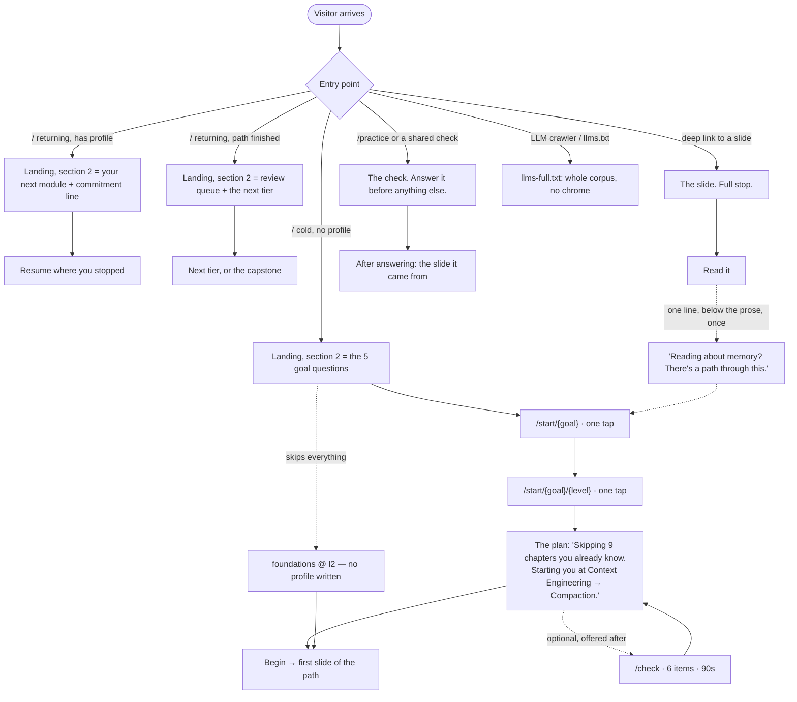
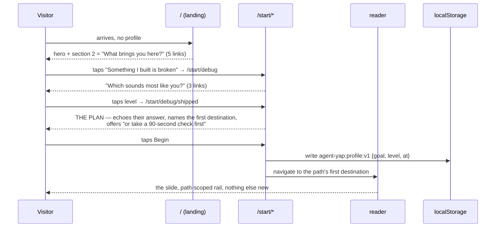
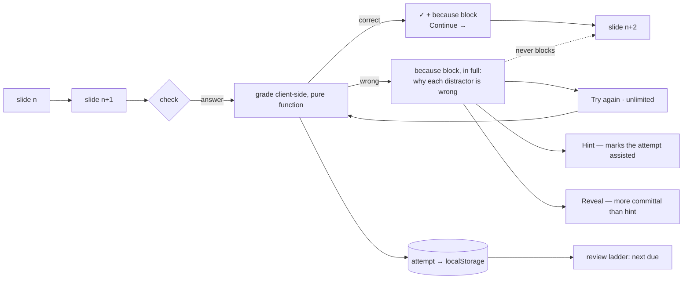
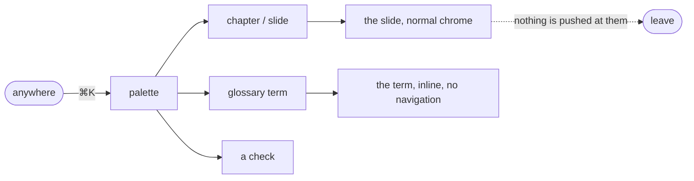
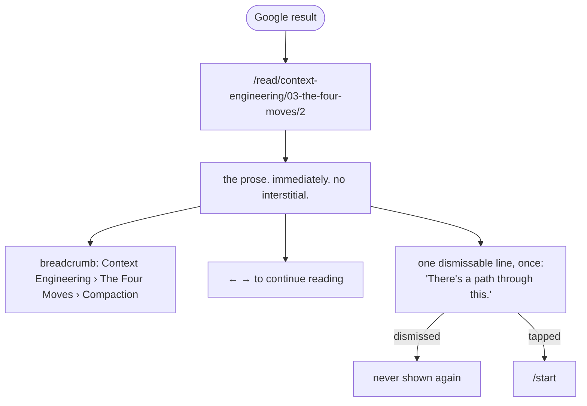

# 09 — Information Architecture, Routing, and End-to-End Flows

> The site map, the URL contract, and every user flow at 20-module scale.
> Consistent with report 08's five templates (`ship` · `debug` · `interview` ·
> `foundations` · `current`), three levels (`l1`/`l2`/`l3`), and its route map for
> `/start`. Consistent with report 05's navigation verdict ("path first, tree on
> demand"). Where it extends or overrides them, it says so.

---

## 0. The one architectural fact that shapes everything

**Agent YAP is currently a single-book site wearing a multi-book URL scheme.**

- `/read` → `redirect(getPrimaryBook().slides[0].href)` — [src/app/read/page.tsx:5](src/app/read/page.tsx:5)
- `/read/[book]` → also a bare redirect — `src/app/read/[book]/page.tsx:12`
- `getPrimaryBook()` returns `books[0]`, the alphabetically first discovered folder

So there is **no shelf page, no book overview, no chapter landing** — three
levels of the URL hierarchy exist and none of them render anything. And the
moment `agentic-memory/` is wired it sorts before
`architecture-and-system-design/` and **the landing page silently becomes a
different book**.

Everything below assumes two things are fixed first, in the same PR:

1. `book.featured` in `index.md` frontmatter →
   `getPrimaryBook() = books.find(b => b.featured) ?? books[0]`.
2. Folder renames to kebab-case, because `bookSlug` goes raw into the URL and
   `/read/agentic%20memory/...` is not a URL you put in a sitemap.

---

## 1. Site map

Next.js 16 App Router. Every route below is statically generated unless marked
otherwise; the two client-only routes are client-rendered *shells* over static
data, not dynamic server routes — there is no server-side user state anywhere.

```
/                          SSG   Landing. Section 2 is profile-aware (client island).
/start                     SSG   Q1: goal. 5 links.
/start/[goal]              SSG   Q2: level. 3 links.        5 pages
/start/[goal]/[level]      SSG   The plan + one button.    15 pages
/check                     SSG   Optional 6-item diagnostic. Static items JSON.
/path                      CSR   "My path" — reads localStorage. noindex.

/read                      SSG   → THE SHELF. No longer a redirect.
/read/[book]               SSG   → BOOK OVERVIEW. No longer a redirect.
/read/[book]/[chapter]              SSG   → CHAPTER OVERVIEW (new).
/read/[book]/[chapter]/[slide]      SSG   The reader. Unchanged URL. ~630 pages.

/modules                   SSG   The module map (20 rows). The curriculum surface.
/modules/[moduleId]        SSG   One module: promise, prereqs, slides, checks.  20 pages

/practice                  SSG   The Problems index (report 07 §5).
/practice/[checkId]        SSG   One check, deep-linkable.  ~560 pages
/review                    CSR   The due queue. noindex.

/glossary                  SSG   187 terms, anchor per term. The link-resolver target.
/glossary/[term]           SSG   One term (optional; anchors may be enough).

/sitemap.xml  /robots.txt  /llms.txt  /llms-full.txt      existing, extended
```

**Page count at 20 modules:** ~630 slides + 20 modules + 560 checks + 8 books +
~59 chapters + 21 onboarding + ~10 static ≈ **1,300 static pages**.

### 1.1 What is new, what changes, what is untouched

| Route | Status | Note |
|---|---|---|
| `/read/[book]/[chapter]/[slide]` | **untouched** | The URL contract is preserved exactly. This is the SEO-load-bearing route and the `llms.txt` payload. |
| `/read`, `/read/[book]` | **repurposed** | Redirects → real pages. Same URLs, so nothing breaks. |
| `/read/[book]/[chapter]` | **new** | Currently 404s. Becomes the chapter overview + its checks. |
| `/modules`, `/modules/[id]` | **new** | The curriculum layer over the same slides. |
| `/practice`, `/practice/[id]`, `/review` | **new** | Assessment. |
| `/start/**`, `/path` | **new** | Onboarding (report 08). |
| `/glossary` | **new** | Also the target of the 324-broken-link resolver. |

**Zero redirects are required.** Every existing URL keeps its meaning. This is
worth protecting deliberately: the repo already ships a sitemap, `robots.ts`,
`llms.txt` and `llms-full.txt`, and CR-2026-009's SEO work merged in `a92f9e0`.
A URL migration would throw that away for no product gain.

### 1.2 Static generation at scale

Report 02 measured `.next` at **477 MB for 199 pages**. Naïvely, 1,300 pages is
~3.1 GB and a build time nobody will tolerate. Three fixes, all independent of
the redesign:

1. **The nav manifest is embedded twice in every page.** `content.ts:357` and
   `:363` both serialise the full slide list — 105,166 bytes × 2 × 199 pages.
   Fix: emit `chapters` as index references into `slides`, not duplicated
   objects. Saves ~50% of every reader page's payload immediately.
2. **Ship a path manifest, not a corpus manifest.** This is report 08's key
   insight and it inverts the usual argument: a *path* is bounded (≤340 slides)
   while a *corpus* is not. At 8 books a whole-corpus manifest is ~820 KB per
   page; a path manifest is ~45 KB. **Personalization makes the site cheaper,
   not more expensive.**
3. **`/practice`'s index does not go in the shared layout.** Answers ship only in
   the per-slide/per-check payload; `checks-index.json` is fetched by `/practice`
   alone.

---

## 2. Navigation architecture

Report 05 evaluated three candidates and chose **"path first, tree on demand."**
Confirmed. The reasoning, restated as a decision:

| Candidate | Why rejected |
|---|---|
| **One deep tree** (extend `Rail.tsx`) | Treats all 630 slides as equally relevant. At 8 books the rail is a 59-chapter accordion — a maze with a scrollbar. It is what a docs site does when it has given up on having an opinion. |
| **Search/palette only** (Stripe CLI / Cookbook model) | A palette is a *precision* instrument: excellent when you know the word, useless when you don't. It cannot answer "what should I learn next", which is the entire product. |
| **Path first, tree on demand** ✅ | The rail shows *your* path flat, with `Browse all` as the last row. The tree still exists; it is one click away instead of always present. |

**The four wayfinding devices, and the rule for each:**

1. **The path rail** (default). Flat list of your path's modules and slices, with
   dots. Never more than ~14 rows. `Browse all →` is always the last row.
2. **`⌘K` command palette** (precision). Searches chapters, slides, glossary
   terms, and checks in one list. Report 05 pattern A3. It replaces the
   always-visible header search input, which report 05 explicitly rejects (B2) —
   a visible input invites you to think of the site as a search problem.
3. **Breadcrumb as plain text, three levels** (orientation). `Context Engineering
   › The Four Moves › Compaction`. No chevron buttons, no dropdowns. Report 05
   pattern A5.
4. **Arrow keys, documented by `?`** (motion). Already shipped. Add the `?`
   overlay — report 05 pattern A4.

**Two fixes the audit found that block this from feeling finished:**

- **`Space` is bound to "next slide"** (`ReaderChrome.tsx:187`) while the stage
  is a scroll container (`:352`). On any tall slide, Space does the wrong thing.
  Unbind it; keep `←`/`→`/`PageUp`/`PageDown`.
- **`ResumePill` never fires cross-book** — its `byHref` lookup is book-scoped
  (`ReaderChrome.tsx:130`). It silently does nothing the moment there are two
  books, which is exactly when it becomes valuable.

**Moving between modules mid-path** is one control: the last row of the rail. Not
a book switcher in the header, not a mega-menu. If you are on a path, the next
thing is at the top of the rail; if you want something else, you browse.

---

## 3. The landing decision tree

Six distinct visitor types. The design goal is that each sees exactly one
obvious next action.



**The rules that make this minimal, stated as constraints:**

1. **A cold deep-landed reader sees exactly one new element** compared to today:
   one line of text below the prose, offering a path. It appears once, it is
   dismissable, and dismissing it is permanent. No modal, ever. Google traffic is
   the majority of arrivals and it must never be interrupted.
2. **Nothing in the UI ever says "you haven't onboarded."** No banner, no empty
   state, no dashed placeholder. A visitor with no profile is a first-class user
   on the `foundations`/`l2` default.
3. **The primary action on the landing page is singular** at every moment. Cold:
   answer one question. Warm: resume. Finished: review. There is never a screen
   with two equally-weighted CTAs.
4. **`/start` is 21 static pages linked by anchors, not a wizard.** No modal, no
   step machine, no Back button of our own — the browser's Back button is the
   Back button, and the URL is the state. This is report 08's decision 2 and it
   is the single largest contributor to "it should feel like nothing".

---

## 4. Flow specifications

### 4.1 First visit → onboarding → first slide



**Cost to the learner: two taps, ~9 seconds, zero typing, zero client JS until
the final tap.** Five goals × three levels = 15 distinct paths from two taps.

### 4.2 Returning learner resume

Reads `agent-yap:progress:v1` (already shipped). Landing section 2 becomes a
single card: the module you are in, the slide you stopped on, one line of
commitment (*"You're 6 of 14 through Context Engineering"*), and one button.
`ResumePill` handles the in-reader case. **No change to the progress schema** —
this works today, once the cross-book bug in §2 is fixed.

### 4.3 Reading → hitting a check → passing/failing → continuing



**A check never blocks progress.** Report 04's completion data is unambiguous:
free-course completion is 5–15%, 50% of dropout is in the first two weeks, and
"too difficult" is the third-most-cited reason. A gate at slide 6 of module 1 is
a wall. The DAG *recommends*; it never locks.

**Problem before explanation.** Where a chapter has a key reveal, one `choice`
item goes *in front of it*. This is Brilliant's entire architecture and the
cheapest high-value change on the list — one question, one button, no new content
type.

### 4.4 Module completion → what next

```
Context Engineering            ●●● held

  You verified 11 of 14 ideas here.
  3 will come back for review.

  Next on your path →  Memory
  Or:                  the 3 you haven't verified · browse all modules
```

Three options, ranked, as text. No confetti, no badge, no share prompt. The
"next on your path" is the DAG's topological successor, filtered by the
template's spine.

### 4.5 "I just want to look something up"

The most common professional flow and the one most sites handle worst.



**Success is that they find it and leave.** No path offer, no onboarding nudge,
no "related modules" block. A lookup that ends in a successful departure is a
returning user next month.

### 4.6 "I want to test myself, not read"

`/practice` → a module row → a check. This is report 08's `interview` template
(reading:practice = 1:4) and report 07's `/practice` surface. Reading is
*remediation*: a wrong answer's `because` block links to the slide it came from,
which is the only path back into prose.

### 4.7 Deep link from Google



This flow is why the URL contract must not change and why onboarding must never
be a gate.

---

## 5. State architecture

### 5.1 The stores

Four localStorage keys, each following the **exact** `useSyncExternalStore` +
`getServerSnapshot(): null` pattern already proven in
[src/lib/progress.ts](src/lib/progress.ts). That module already solves the
hydration problem correctly (server HTML and first client render both see the
neutral zero-state, satisfying P-READER-002/003). Copy it; do not invent a second
pattern.

| Key | Shape | Written when |
|---|---|---|
| `agent-yap:progress:v1` | **unchanged**, already shipped | a slide is read |
| `agent-yap:profile:v1` | `{v:1, goal, level, at, promptDismissedAt?}` | the final onboarding tap |
| `agent-yap:attempts:v1` | `{v:1, attempts: Attempt[]}` | every check submission |
| `agent-yap:ui:v1` | rail open, theme, `?`-overlay seen | UI toggles |

`agent-yap:gemini-api-key` also exists and stays where it is. Note it is stored
in plaintext localStorage — acceptable for BYOK, but it should never be joined
with any other store.

**Mastery is never stored.** It is derived from `attempts` on read (report 07
§2.2). Storing it would mean a scheduler change silently invalidates every
learner's state.

### 5.2 What breaks with localStorage only, honestly

| Failure | Consequence | Mitigation |
|---|---|---|
| Second device | Path and progress do not follow | **Export/import a portable code.** base64 of the four stores, ~2 KB, shown as a copyable string on `/path`. Solves the real case (laptop → desktop) without a backend or a GDPR surface. |
| Cleared storage | Everything gone | Same code, plus: the site degrades to the `foundations`/`l2` default, which is a working product. |
| Private window | Progress lives for the session | Already handled — `progress.ts` no-ops on storage failure. |
| Two tabs | Divergence | Already handled — `storage` event sync is implemented. |

**The trigger conditions that would force accounts** — write these down now so
the decision is made on evidence rather than drift:

1. Export/import is shipped and measurably unused *and* multi-device complaints
   are the top feedback theme.
2. A credential is launched that someone outside the learner needs to verify.
3. Item calibration ("68% get this wrong") is wanted — **but note this needs
   anonymous per-item aggregates, not user accounts**, so it is not actually a
   trigger. Report 03's reframe applies: the non-goal should read "no server-side
   **user** state".

Until one of (1) or (2) holds, accounts are a cost with no return.

---

## 6. Component inventory

| Component | Action | Note |
|---|---|---|
| `src/lib/content.ts` | **modify (exclusive-access, needs handshake)** | frontmatter · `featured` · `## Review` → `questions[]` · `###` sub-split · de-duplicate the nav manifest. **One PR, all five.** |
| `src/components/Markdown.tsx` | **modify** | `rehype-raw` (unlocks 490 answers) · link resolver in the existing `a()` override (fixes 324 links) · mermaid (33 diagrams in `research papers/`) · render `yap-check` blocks |
| `src/components/reader/Rail.tsx` | **modify** | path mode + `Browse all` last row |
| `src/components/reader/ReaderChrome.tsx` | **modify** | unbind `Space`; fix cross-book resume; `?` overlay |
| `src/components/Home.tsx` | **modify** | section 2 becomes profile-aware; imagery reduced per report 06 |
| `src/lib/progress.ts` | **keep as-is** | the reference pattern for all new stores |
| `src/components/reader/AmbientBackdrop.tsx` | **modify** | derive palette from `--module-h` (report 06 §5d) — today's orange contradicts the blue accent |
| `SearchPanel.tsx` | **modify** | becomes the `⌘K` palette; add focus ring (it has `outline-none` with no replacement) |
| `AskPanel.tsx`, `ChatPanel.tsx` | **keep** | BYOK chat is genuinely good and differentiated |
| `src/lib/checks.ts` · `grade.ts` · `mastery.ts` · `modules.ts` | **new** | report 07 §2.1 |
| `src/components/checks/*` | **new** | three renderers: options, artefact-with-clickable-rows, selection-with-counter |
| `src/app/start/**`, `/modules/**`, `/practice/**`, `/review`, `/glossary` | **new** | |

---

## 7. Accessibility and performance debt this plan must not inherit

Report 02 found real defects. They are pre-existing, and they will be attributed
to the redesign if they ship alongside it.

| Defect | Location | Fix |
|---|---|---|
| **Zero `focus-visible` in the codebase** | repo-wide | A single `:focus-visible` ring in `globals.css`. The assessment layer is keyboard-driven; this is a blocker, not a nicety. |
| `outline-none` with no replacement | `SearchPanel.tsx:130`, `ChatPanel.tsx:413` | ring on the wrapper |
| `Modal` has `aria-modal` but no focus trap or restore | `Modal.tsx` | trap + restore |
| Collapsed panels keep children tabbable | 3 panels | `inert` |
| Contrast failures | `placeholder:text-ink-2/60` 2.36:1 · `text-ink-2/70` 2.85:1 · `text-snow/45` 4.12:1 | raise to ≥4.5:1 |
| Scramble animation mutates live `<h1>`/`<h2>` textContent | `home/fx.ts` | screen readers read gibberish. Wrap in `aria-hidden` with a static accessible label. |
| 14.7 MB of hero JPEGs | `public/assets/` | report 06 §5f |
| WebGL runtime loaded eagerly on every reader page, behind `blur(26px)` | `AmbientBackdrop.tsx` | defer; it is invisible detail behind a heavy blur |

---

## 8. What this IA deliberately does not have

Named so they stay un-built:

- **No dashboard.** `/path` and `/review` are one-column text pages. A dashboard
  is what you build when you cannot decide what matters.
- **No settings page.** Four toggles live where they apply: theme in the header,
  rail state in the rail, path change on `/path`, reset on `/path`.
- **No notifications, no email capture in v1, no share-your-score.**
- **No book switcher in the header.** `Browse all` in the rail is the switcher.
- **No difficulty tabs on `/practice`.** They produce difficulty-shopping.
- **No global progress percentage anywhere.** With 431 slides about to be wired,
  a percentage-of-corpus goes *down* when we ship.
