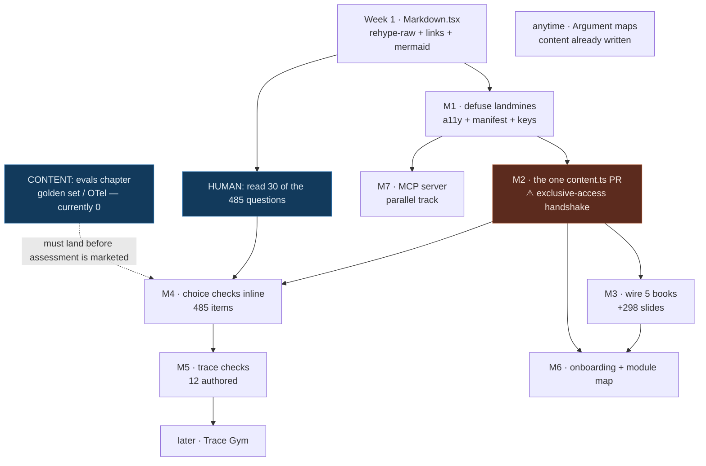

# 13 — Delivery Plan

> Ordered, buildable sequence. Scoped to the **honest minimum** from report 12 §2,
> with the deferred work named so it stays deferred.
>
> The trust gate in this repo is `npm run build` (type-check + static generation of
> every slide) plus `npm run lint`. **There is no test runner.** No step below
> claims test evidence.

---

## 0. Week 1 — the smallest change that makes the product visibly better

**One PR. Tier 1 (bug fix). No new routes, no new surfaces, no coordination.**

Touch exactly one file: `src/components/Markdown.tsx`.

1. Add `rehype-raw` to the plugin chain → **490 existing answers become visible**
   across 55 chapters.
2. Add a link resolver to the component's existing `a()` override → **324 broken
   relative `.md` links** across 47 files start resolving:
   `*/Glossary.md#anchor` → the glossary route; `chapter-NN-*.md` → that chapter's
   slide-0 href.
3. Add mermaid rendering → **33 diagrams** in `content/research papers/` stop
   rendering as syntax-guessed code. (Include it here or those books ship visibly
   broken later.)

**Why this first.** It is a bug fix, not a feature. It de-risks the single largest
assumption in the whole plan — that 490 gradable items already exist — by making
them observable in the browser, before a line of assessment code is written.

**Acceptance:** `npm run build` green; `npm run lint` green; manual verification
that an `## Review` slide now shows its answers, that
`content/context-engineering/…/The Four Moves` links resolve, and that a
`research papers` mermaid block renders as a diagram.

**Gating task for a human, in parallel and before M2:** read **30 of the 485
harvested questions**. The entire v1 inventory rests on their quality and nobody
has checked. If more than ~20% have a giveaway distractor, M3 changes from
"harvest" to "harvest and rewrite", which is a different project and needs to be
known now.

---

## 1. Milestones

### M1 — Defuse the landmines · Tier 0/1 · no coordination

**Goal:** make it safe to wire a second book.

| Work | File |
|---|---|
| De-duplicate the nav manifest (emitted twice: `:357` and `:363`) | `src/lib/content.ts` ⚠ handshake |
| Unbind `Space` from next-slide (the stage is a scroll container at `:352`) | `ReaderChrome.tsx:187` |
| Fix cross-book `ResumePill` (`byHref` is book-scoped) | `ReaderChrome.tsx:130` |
| Add a global `:focus-visible` ring; remove bare `outline-none` | `globals.css`, `SearchPanel.tsx:130`, `ChatPanel.tsx:413` |
| Focus trap + restore on `Modal`; `inert` on collapsed panels | `Modal.tsx`, 3 panels |
| Raise sub-4.5:1 contrast values | `globals.css` and usages |
| `aria-hidden` + static label on scramble-animated headings | `home/fx.ts` |

**User-visible outcome:** keyboard navigation works; screen readers stop reading
scrambled gibberish; reader pages get ~50% smaller.
**Gate:** build + lint green; tab through every interactive element and see a ring.
**Kill criterion:** none — this is debt repayment and it is unconditional.

> The manifest fix touches `content.ts`. If the handshake for M2 is imminent, fold
> it into M2 rather than paying for two handshakes.

### M2 — The one `content.ts` PR · Tier 4 · **exclusive-access handshake** · critical path

**This is the single point of failure for everything downstream. Treat it as such.**

Five changes, one PR, because they all touch `loadBooks()`/`splitIntoSections()`
and the file needs a lane handshake:

1. Parse and strip YAML frontmatter **before** `splitIntoSections()` (otherwise the
   `---` block lands in the intro slide). Expose typed fields on `Chapter`/`Book`.
2. `book.featured` → `getPrimaryBook() = books.find(b => b.featured) ?? books[0]`.
3. Extract `## Review` → `Chapter.questions[]` and **remove it from `slides[]`**.
4. Sub-split any `##` section over a word threshold on its `###` boundaries.
5. Throw at build time on a chapter missing `module` / `difficulty` / `minutes`.

**User-visible outcome:** the 71-slide long tail of 1,961–2,832-word Review slides
disappears; the harness book's 501-words-per-slide average drops to something
readable; 490 questions become structured data.

**Gate:** build green (static generation of all 199 slides is the type check *and*
the parser test); lint green; slide count before/after recorded in the PR body;
`getPrimaryBook()` still returns the architecture book with `featured: true` set.

**Kill criterion:** if item 3 or 4 changes any existing slide URL, stop. The URL
contract is load-bearing for SEO and `llms.txt`, and no assessment feature is worth
a redirect map.

### M3 — Wire the library · content-ops · parallel-safe

Ordered by slides-per-unit-of-work.

| Step | Work | Slides |
|---|---|---|
| 1 | Delete `architecture-and-system-design/old docs/` (19 stale duplicate files, 32,829 words) | −0, prevents corpus pollution |
| 2 | `content/building coding agents and harnesses/` → `content/coding-agents-and-harnesses/`, flatten `explained/` (18 `git mv`, keep `glossary/` alongside so `[glossary](glossary/)` still resolves) | **+123** |
| 3 | Rename the four `Chapter N - Title.md` books to kebab-case folders + `chapter-NN-*.md`, write 4 fresh `index.md` (do **not** repurpose `00 - Overview…` — its H1 would become the book title) | **+175** |
| 4 | Script-backfill frontmatter on 87 files from `modules.json` (`module`, `order`, `difficulty`, `minutes`, `updated`, `status` are all derivable — zero human judgement) | — |
| 5 | LLM-assisted `tags` pass, human-reviewed as one 87-row table | — |

**User-visible outcome:** the site goes from 199 to ~497 slides. This is the single
largest improvement available and it needs no new code.
**Gate:** build green (static generation catches every malformed file and every
missing frontmatter field); `/read/<each-book>/…` loads; sitemap grows.
**Kill criterion:** if a wired book's slides average >500 words after M2's
sub-splitting, stop and fix the split threshold before wiring the rest.

Deferred out of M3 deliberately: `research papers/` promotion (+132 slides) — it
needs an attribution decision first, and the existing index credits an external
curator. Glossary `###`→`##` — it belongs with the card deck, which is deferred.

### M4 — `choice` checks, inline · Tier 4 · frontend lane

| Work | File |
|---|---|
| `checks.ts` — parse `` ```yap-check `` blocks + `Chapter.questions[]` → `Check[]` | `src/lib/checks.ts` (new) |
| `grade.ts` — pure functions, zero imports | `src/lib/grade.ts` (new) |
| `mastery.ts` — attempts store, copying `progress.ts`'s `useSyncExternalStore` + null-server-snapshot pattern verbatim | `src/lib/mastery.ts` (new) |
| The options renderer, all five states (unattempted / correct / wrong / assisted / revealed) | `src/components/checks/` (new) |
| Harvest script: 485 `choice` checks from the parsed `## Review` data | `scripts/harvest-checks.mjs` (new) |
| Render check slides in the reader between prose slides | `read/[book]/[chapter]/[slide]/page.tsx` |
| Dots in the rail per chapter | `Rail.tsx` |

**User-visible outcome:** ~485 questions live, graded instantly, with explanations,
progress persisted. The site becomes an assessment product.

**Gate:** build + lint green. Manual: answer wrong → full explanation, no red, not
blocked; use Hint → attempt marked assisted; reload → state persists; private
window → no crash, no persistence.

**Kill criterion:** if the sampled-30 read from §0 failed, do not ship 485 items.
Ship 60 hand-reviewed ones and treat the rest as a backlog.

### M5 — `trace` checks · Tier 4 · **the differentiator**

| Work | Detail |
|---|---|
| The trace renderer: role gutter, numbered 44px-tall step rows, click target, internal scroll capped ~60vh | shares the check chrome from M4 |
| Two-stage answer: click the step → then pick a taxonomy label | `alsoAccept` supported |
| The 16-label failure taxonomy, authored once, used as answer set + glossary + DAG tags | |
| **12 hand-authored traces**, one human read each | ~1 week of careful work |

**User-visible outcome:** the thing nothing else on the internet has.
**Gate:** build + lint. Each trace read end-to-end by a human before merge.
**Kill criterion:** if 12 traces take more than two weeks to author well, the type
is too expensive; ship 6 and reassess. Do not ship a bad trace — a bad trace
teaches a wrong lesson and is worse than no trace.

### M6 — Onboarding + the module map · Tier 4

| Work | Detail |
|---|---|
| `content/modules.json` — 20 modules, prereqs, `contentRefs` (report 01 §5.3 is drop-in) | |
| `src/lib/modules.ts` — reads the manifest, exposes the DAG. Sibling to `content.ts`, not inside it | |
| `/start`, `/start/[goal]`, `/start/[goal]/[level]` — **21 static pages, one client island** (the Begin button). `noindex` + canonical → `/start` on the 20 children | |
| **Three templates only**: `foundations` (the no-profile default), `debug`, `ship` | report 12 §2 |
| `agent-yap:profile:v1` store | same pattern as `progress.ts` |
| `/modules`, `/modules/[id]` — single column, tier groups, 0–3 dots, plain-text unmet prereqs, never locked | |
| Landing section 2 becomes profile-aware; the 18-card grid becomes a 20-row list | `Home.tsx` |
| One dismissable line on deep-landed slides. Once, ever. No modal. | |
| Seeded procedural marks — pure function of module id | `src/lib/mark.ts` (new) |
| `--module-h` in `@theme`; derive `AmbientBackdrop` palette from it (it is currently orange behind a blue accent) | `globals.css`, `AmbientBackdrop.tsx` |
| Reduce to three photographs, each used once; compress from 14.7 MB | `public/assets/`, `Home.tsx` |

**User-visible outcome:** a personalized entry that costs two taps, and a
curriculum surface that survives 20 modules.
**Gate:** build + lint. Manual: skip onboarding entirely and confirm the site is
fully usable with zero nags; land on a deep slide cold and confirm exactly one new
element appears.
**Kill criterion:** if onboarding needs a third question or any client state before
the final tap, stop and re-scope — it has stopped feeling like nothing.

### M7 — Parallel track, any time after M1 · the MCP server

Independent of everything above. `npx agent-yap-mcp`, three tools over the existing
BM25 index in `src/lib/search.ts`: `search_agent_knowledge`, `get_chapter`,
`get_check`. ~300 lines. Highest ceiling in report 10, zero coupling to the
assessment layer. **Do not let it block M2–M6, and do not let M2–M6 block it.**

---

## 2. Dependency graph



`ARG` (argument maps) has no dependencies at all — the content is already in
`content/multi-agent/`. It is the cheapest credibility win available and can ship
any week.

---

## 3. FEATURE-STATUS.md rows to add

Matching the existing table format exactly.

Under **Content & Modules**:

```
| 34 | Markdown renderer: rehype-raw + link resolver + mermaid | ⬜ | Unlocks 490 authored answers, 324 relative links, 33 mermaid diagrams. Tier 1 fix. |
| 35 | Frontmatter + `featured` + Review→questions[] + `###` sub-split | ⬜ | One coordinated `content.ts` PR (exclusive-access). Critical path for all assessment work. |
| 36 | Book wiring: harness (+123), context-eng, memory, multi-agent, rag (+175) | ⬜ | Supersedes rows 14–18. Content-ops only, no code change after #35. |
| 37 | Module taxonomy manifest (`content/modules.json`, 20 modules + prereq DAG) | ⬜ | `src/lib/modules.ts` reads it; sibling to `content.ts`, not inside it. |
```

Under **Interactivity & Progress** (supersedes row 20):

```
| 38 | Check primitive: `yap-check` block, pure grading, attempts store | ⬜ | Supersedes row 20 (```quiz). `checks.ts` + `grade.ts` + `mastery.ts`. |
| 39 | `choice` checks live (485 harvested) | ⬜ | Depends on #34, #35, #38. |
| 40 | `trace` checks live (12 authored) + 16-label failure taxonomy | ⬜ | The differentiator. Taxonomy doubles as glossary + DAG tags. |
| 41 | Review ladder (spaced review, 6-rung, FSRS-shaped but not FSRS) | ⬜ | Derived from attempts; swappable for FSRS with no migration. |
```

Under **Modes** (supersedes row 25):

```
| 42 | Onboarding `/start` (2 questions, 21 static pages, 3 templates) | ⬜ | Supersedes row 25's placement quiz. Placement deferred. |
| 43 | Module map `/modules` + `/modules/[id]` | ⬜ | Replaces the landing chapter-card grid, which does not survive 8 books. |
```

Under **Discovery & Growth**:

```
| 44 | MCP server over the corpus (`npx agent-yap-mcp`) | ⬜ | Parallel track, ~300 lines over `src/lib/search.ts`. Report 10 idea 1. |
| 45 | Argument maps (multi-agent yes/no, RAG vs long context, framework vs scratch) | ⬜ | Content already authored in `content/multi-agent/`. No dependencies. |
```

Also flip stale rows the audit found: **row 30** (SEO foundation) merged in
`a92f9e0` and should be ✅ after a code audit; `specs/INDEX.md` claims no specs
exist while `specs/features/reader/ide-shell/` does.

---

## 4. Specs required by this repo's own process

Per `specs/WORKFLOW.md`, Tier-4 features need a spec before `/plan`. Order:

| # | Spec path | Covers | Blocks |
|---|---|---|---|
| 1 | `specs/features/content/parser-v2/spec.md` | M2 — all five parser changes, the frontmatter schema, and the invariant update for the discovery rule | M3, M4, M6 |
| 2 | `specs/features/assessment/check-primitive/spec.md` | M4 — the `Check` type, the `yap-check` block grammar, the grading contract, the attempts schema | M5 |
| 3 | `specs/features/assessment/trace-checks/spec.md` | M5 — the trace renderer, the two-stage answer, the taxonomy | — |
| 4 | `specs/features/onboarding/start-flow/spec.md` | M6 — the 21 routes, the profile schema, the three templates, the no-profile default | — |
| 5 | `specs/features/reader/module-map/spec.md` | M6 — `/modules`, the DAG contract, the never-locked rule | — |

Also required:

- **ADR-006 — Vitest for pure logic only.** ADR-005's own revisit trigger names
  "quiz scoring, progress state, placement logic" verbatim, and `src/lib/progress.ts`
  already shipped past it. `grade.ts` is a pure function with a truth table; testing
  it is cheap and the absence of a runner is now a real risk. Scope: pure `src/lib`
  logic only; `npm run build` + lint stays the gate for UI and SSG.
- **Register the orphan invariants.** P-READER-002, P-READER-003, P-CHAT-001 are
  defined in the ide-shell spec but never registered in
  `specs/properties/invariants.md` — a C10 violation that exists today.
- **Resolve P-READER-002 vs CR-2026-010.** The invariant says no progress data is
  ever transmitted; the analytics CR wants completion events. Decide before
  assessment ships.

---

## 5. Parallelisation

Per `AGENTS.md`, the exclusive-access files are `src/lib/content.ts` and
`docs/api-contract.md`. Everything else splits cleanly.

| Lane | Owns | Can run concurrently with |
|---|---|---|
| **Frontend** | `src/app/**` (not `api`), `src/components/**`, `src/lib/{checks,grade,mastery,modules,mark}.ts`, `globals.css` | everything, once M2 has merged |
| **Backend** | `src/app/api/**`, `src/lib/{search,ask}.ts`, `.env.example` | everything. **Note:** `search.ts:124` is O(docs² × terms) — 119k lookups today, ~7.7M at 8 books, ~48M at 20. This is a backend-lane fix that must land before or with M3. |
| **Content** | `content/**`, `scripts/**` | everything after M2. M3 steps 1–3 are pure `git mv` and can proceed while frontend builds M4's renderer. |
| **Shared / gated** | `src/lib/content.ts` | **nothing.** One PR, one handshake, five changes. |

**The parallel schedule that works:** Week 1 fix (frontend) → M1 (frontend) and the
`search.ts` complexity fix (backend) and the 30-question read (human) all at once →
**M2 alone, blocking** → then M3 (content) ‖ M4 (frontend) ‖ M7 (separate track).

---

## 6. Reversibility

| Milestone | Rollback | Data implication |
|---|---|---|
| Week 1 | Revert one file. | None. |
| M1 | Revert per-fix. | None. |
| M2 | Revert the PR; frontmatter in content files becomes inert text in the intro slide — **so revert content and code together**. | None (no user data). |
| M3 | `git mv` back. URLs for newly-wired books disappear — acceptable, they were never indexed. | Any `progress.read` entries for those books orphan harmlessly (keyed by bookSlug, and unknown keys are ignored). |
| M4 | Remove the renderer; checks fall back to being invisible, exactly as today. | `agent-yap:attempts:v1` orphans. Harmless — the defensive-parse pattern resets on version mismatch. |
| M5 | Remove the trace renderer; trace checks are skipped by `checks.ts`. | None. |
| M6 | Remove `/start` and `/modules`; the landing page reverts to the chapter list. | `agent-yap:profile:v1` orphans → default is `foundations`/`l2`, which is a working product. |

**localStorage migration rule, set now:** every store carries `v: 1` and every
reader does a defensive parse that **resets to zero-state on any version mismatch
or corruption**. That is already the shipped pattern in
[src/lib/progress.ts:36](src/lib/progress.ts:36). Never write a migration; bump the
version and accept the reset. Losing localStorage progress is a minor annoyance;
a buggy migration that corrupts it is a bug report you cannot reproduce.

---

## 7. What is explicitly not in this plan

Named so nobody quietly adds them: `/practice` index · `/path` · `/review` as
routes · the `budget` widget · `order`/`predict`/`spot`/`cloze` types · the
`card` deck · the `/check` placement diagnostic · the `interview` and `current`
templates · `research papers/` promotion · certificates · streaks · accounts ·
LLM-judged free text · a code sandbox.

Each has a home in reports 07–10 and each waits for evidence. The one content item
that does **not** wait: **the evals chapter** (`golden set` 0, `OpenTelemetry` 0).
A product whose pitch is "we will evaluate you" cannot launch with zero content on
how to evaluate anything.
