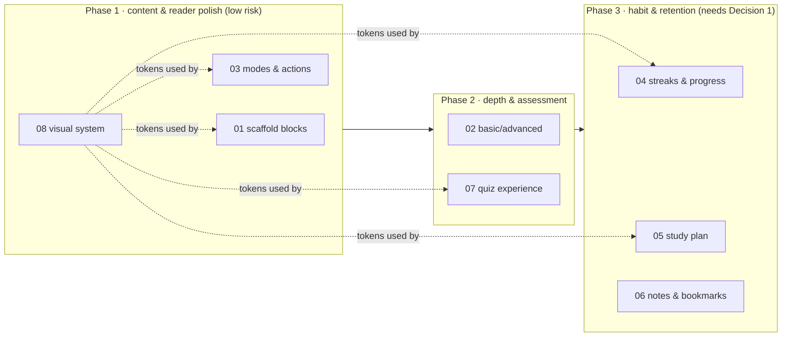

# Agent YAP — TUF-inspired feature specs

> **What this folder is.** A design-first breakdown of the TUF+-inspired features we
> decided to build, sliced into **right-sized specs** — each one scoped so a single
> coding agent (or one Claude-design pass) can take it end to end. The flow is
> **spec → design → your review → code**, one spec at a time.
>
> Source research: [docs/research/tuf-plus-inspiration.md](../research/tuf-plus-inspiration.md).
> This folder is the *decisions + build plan* that came out of that research.

---

## How to read this folder

1. Start here (decisions, answers, phasing, and the two calls you need to make).
2. Each `NN-*.md` is one buildable slice. Hand them to Claude design **one at a time**,
   in the order in the table, review the design, then we code.
3. [`99-deferred-later-iterations.md`](99-deferred-later-iterations.md) holds everything
   we consciously pushed to a later iteration (too big for one pass, or needs infra we
   don't have yet). Nothing there is forgotten — it's parked with the reason.

**Spec file format** (kept light on purpose): `Intent` · `Prior art / where it plugs in`
· `Requirements` (stable IDs `R-1`, `R-2`…) · `Design notes` (what Claude-design decides)
· `Acceptance` · `Out of scope` · `Blast radius` · `Open questions`. This mirrors the
repo's PRD/spec conventions ([docs/pm/prd/README.md](../pm/prd/README.md),
[specs/features/](../../specs/features/)) but stays scannable.

---

## Two decisions I need from you before coding (not before designing)

These don't block design work — but they must be resolved before the code lands, because
they reverse things your own redesign-2026 docs explicitly decided.

### Decision 1 — Gamification reversal (streaks / emoji calendar / leaderboard)
Your redesign-2026 research **permanently refused** streaks, notifications, certificates,
and global-percentile pressure (`docs/redesign-2026/research/07-assessment-system.md` §1.10,
`00-MASTER-PLAN.md` §4, `09-ia-and-flows.md` §8). Your **growth** track then revived a
*softened, local-only* streak (`docs/growth/03-gamification-design.md`, CR-2026-013) — but
noted it needs a `plan.md` non-goals amendment first.

You're now asking for the **full** version (streaks + emoji calendar + later leaderboard).
That's a legitimate product call — but it's a **reversal**, so it should be recorded, not
slipped in. **Prerequisite for [04-streaks-and-progress](04-streaks-and-progress.md):**
land a one-line `plan.md` non-goals amendment + a short ADR citing CR-2026-013. Spec 04
is written to the *local-only, opt-in, non-punishing* framing so it stays true to the
"no guilt" principle even while adding the streak.

### Decision 2 — Reminders/notifications need a backend + accounts (so they're deferred)
Your bookmark/note **reminder notifications** (A8) can't be built now: the whole app is
**localStorage-only, no accounts** ([src/lib/progress.ts](../../src/lib/progress.ts),
`plan.md` Phase 2), and redesign-2026 **excludes notifications** (`09-ia-and-flows.md` §8).
Reminders need (a) accounts/identity, (b) a stored notification schedule server-side, and
(c) a delivery channel (email/web-push). That's its own milestone → parked in
[99-deferred](99-deferred-later-iterations.md#reminders--notifications). We **do** build the
notes + bookmark *capture* now ([06-notes-and-bookmarks](06-notes-and-bookmarks.md)), so the
data exists the day we turn reminders on.

---

## Answers to the questions you asked

**Q: Won't mixing TUF's design into ours make a "hotch-potch" and wreck our current design?**
No — and your instinct to keep our own theme is right. Two reasons:
- **We are NOT grafting TUF's look.** TUF is warm/orange with gradient category cards.
  Your redesign-2026 identity is deliberately the *opposite*: a single **cool** accent
  (OKLCH hue on a 184°–324° teal→indigo→violet arc, centered on today's `#0071e3`),
  **no gradients**, accent on **≤2% of pixels**, surface hierarchy from a 4-step neutral
  ladder, per-module identity from **seeded procedural marks** (no stock icons/images)
  (`docs/redesign-2026/research/06-visual-identity.md`). We take TUF's *structure and
  pedagogy*, rendered entirely in our own system.
- **Our styling is fully tokenized**, so evolving the look is a *retokenization*, not a
  mashup. Everything is built on semantic tokens in
  [src/app/globals.css](../../src/app/globals.css) (`bg-canvas`, `text-ink`, `bg-blue`,
  `border-hairline`, `--radius-card`…) and the dark theme just re-points the same tokens.
  Change a handful of token *values* in one place and every component updates coherently.
  The only way you get a hotch-potch is by introducing **one-off hardcoded colors** that
  bypass tokens — so the rule (see [08-visual-system](08-visual-system.md)) is: **no new
  raw colors; everything through tokens.** That's how we evolve safely.

**Q: Focus Mode vs a totally different "Free mode" look — one or two things?**
**One toggle, not a reskin.** Building a second visual identity doubles our design/QA
surface for little gain. We ship **two reading modes as one switch**:
*Organised* (default — rail, progress, streak, plan visible) and *Free* (a Focus-Mode
that hides all chrome and gamification, leaving only content + minimal nav — exactly
TUF's Focus Mode). Same tokens, same components, just visibility. Details in
[03-reader-modes-and-actions](03-reader-modes-and-actions.md).

**Q: The streak-decay emoji range — can you do better than my ladder?**
Yes — here's a tuned, gentle→intense arc (playful, not cruel; opt-in). Full ladder,
accessibility notes, and a "dead streak" alternative live in
[04-streaks-and-progress](04-streaks-and-progress.md#emoji-ladder). Short version:

| State | Emoji | Reading |
|---|---|---|
| On streak (studied today) | 🔥 | alive |
| Missed 1 day | 🙂 | "all good" |
| 2 | 😕 | mild |
| 3 | 😟 | worried |
| 4 | 😣 | strained |
| 5 | 😢 | sad |
| 6 | 😭 | breakdown |
| 7 | 😤 | frustrated |
| 8 | 😠 | angry |
| 9 | 😡 | furious |
| 10+ | 🤬 | capped rage |
| lapsed (≥14) | 🪦 | *optional* "dead streak" — softer + funnier than eternal rage |

**Q: How do Basic/Advanced tracks get authored?**
Via a dedicated **cowork authoring skill** you review and run manually (not auto-gen).
The advanced layer references real OSS (Codex, Claude Code, OpenClaw, Hermes, etc.) to
explain *how a feature is actually built*. Spec
[02-basic-advanced-depth](02-basic-advanced-depth.md) covers the content format + the
frontend toggle + how we present those code snippets in an "intriguing" way; the skill
itself is one of its deliverables. Note: difficulty *tabs* were rejected for `/practice`
in redesign-2026 — this is different (a depth toggle on **reading** content), and the
spec calls that out.

---

## The build-now specs (in suggested order)

| # | Spec | One-liner | Plugs into | Notes / flags |
|---|------|-----------|-----------|---------------|
| 01 | [Reading scaffold blocks](01-reading-scaffold-blocks.md) | `Common Doubts`, `FAQs`, `Fun Facts`, progressive `reveal` callouts authored in markdown | `Markdown.tsx`, parser | Extends the planned callout/typography pass |
| 02 | [Basic / Advanced depth](02-basic-advanced-depth.md) | Two-level content depth; advanced = OSS-code explainers, shown only where authored; + a cowork authoring skill | `content.ts`, `Markdown.tsx`, reader | New; coordinate with parser-v2 (exclusive-access) |
| 03 | [Reader modes & unit actions](03-reader-modes-and-actions.md) | Organised vs **Free/Focus** mode, **Study view**, like/dislike, report-a-bug | `ReaderChrome.tsx` | Prev/next & mark-complete already exist |
| 04 | [Streaks & progress dashboard](04-streaks-and-progress.md) | Local streak, **emoji streak calendar**, progress rings/donut | `progress.ts` (new sibling) | ⚠️ **Decision 1** — reverses a non-goal |
| 05 | [Study plan (Planly)](05-study-plan.md) | Schedule chapters across dates, **calendar** (done/missed/upcoming), pace steppers, **Pause** | roadmap/modules | Calendar layer is new |
| 06 | [Notes hub & bookmarks](06-notes-and-bookmarks.md) | Per-slide notes + bookmark toggle + a consolidated hub | `ReaderChrome.tsx`, storage | Reminders → deferred (**Decision 2**) |
| 07 | [Chapter quiz experience](07-quiz-experience.md) | Full exam-style UX (question grid, save & next, results, optional timer) over the spec'd engine | assessment engine | Engine already spec'd — this is the UX shell |
| 08 | [Visual system & components](08-visual-system.md) | Token evolution rules + the component inventory needed to build 01–07 | `globals.css`, `components/` | Answers the hotch-potch question as a build task |

**Deferred:** [99-deferred-later-iterations.md](99-deferred-later-iterations.md) —
coding questions + sandboxing, "Now your turn" MCQ *retrofit* into existing chapters,
scaled advanced OSS-explainer authoring, command-palette *overhaul*, reminders/
notifications, leaderboard/social, draggable panels, right-pane interactive, worked
examples, company tags.

---

## Suggested phasing

Rationale: 01/03/08 are self-contained reader/design wins with no data-model or infra
risk — ship confidence first. 02 and 07 touch the exclusive-access content/assessment
core, so they go through the parser-v2 / check-primitive coordination. 04/05/06 are the
habit layer and depend on Decision 1 + a shared local "study state" store.

## Guardrails every spec inherits
- **Stack-current (C7):** verify Next 16 / React 19 / Tailwind v4 APIs against
  `node_modules/next/dist/docs/` or `find-docs` before coding.
- **Lane discipline (C2):** `src/lib/content.ts` and `docs/api-contract.md` are
  exclusive-access; backend routes are Codex's lane.
- **Trust gate:** `npm run build` + `npm run lint` green (no test runner yet).
- **No-accounts today:** all new state is localStorage unless a spec says otherwise.
- **Design workflow:** each UI spec runs the `AGENTS.md` frontend workflow (shadcn →
  skills → Chrome check → a11y → impeccable).
