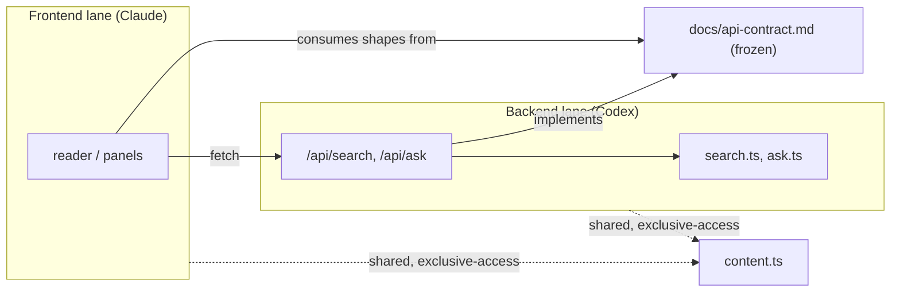

# Concept: Frontend / backend lanes via a frozen contract

## In Our System
The codebase is split into two ownership lanes so multiple AI agents can work in
parallel without collisions:
- **Frontend (Claude):** `src/app` (except `api`), `src/components`, reader UX
  (module/reader, module/landing, module/search-ask-panels, module/display,
  module/markdown-render).
- **Backend (Codex):** `src/app/api/**`, `src/lib/search.ts`, `src/lib/ask.ts`,
  `.env.example` (module/search, module/ask).
- **Shared / exclusive-access:** `src/lib/content.ts` (module/content) and
  `docs/api-contract.md`.

`docs/api-contract.md` is the frozen interface between the lanes. Governed by
[ADR-002](../../specs/decisions/ADR-002-frontend-backend-lanes.md) (constitution
rules C2/C4) and documented in `AGENTS.md`.

## Why This Constraint Exists
Without disjoint ownership, two agents editing overlapping files produce merge
collisions and contradictory changes. Making the contract the single sync point
turns any cross-lane change into a deliberate, coordinated act instead of an
accidental drift where frontend and backend disagree on payload shapes.

## How It Works

## Where Applied
- module/search-ask-panels consume the contract; module/search + module/ask
  implement it.
- module/content is the shared dependency both lanes read.

## Rules / Current Limitations
- Do not edit across the lane boundary (C2).
- Backend implements `docs/api-contract.md` precisely; frontend consumes only
  what it promises (C4).
- Contract changes are high blast radius → run RIGOR.
- `src/lib/content.ts` sits in frontend territory but is shared because backend
  depends on it — a known coupling (OVERVIEW lists "shared ownership" as a
  possible future mitigation).
