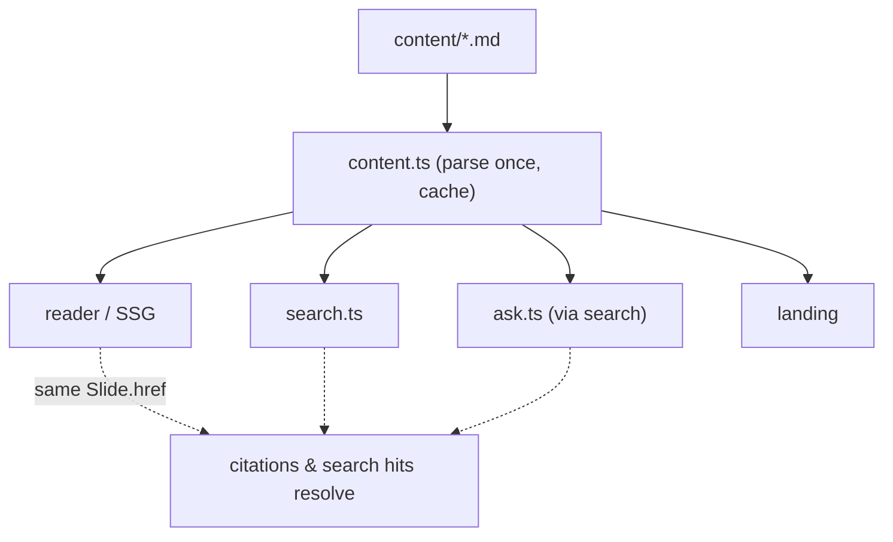

# Concept: Single source of truth for content

## In Our System
`src/lib/content.ts` is the one and only place that reads `content/` and defines
the `Book → Chapter → Slide` model. The reader (SSG), search, ask, and landing
all import their data from it; nothing else re-parses markdown or touches the
`content/` layout. Governed by
[ADR-001](../../specs/decisions/ADR-001-markdown-first-content-pipeline.md)
(reinforced by constitution rule C3).

## Why This Constraint Exists
If a component or an API route re-parsed markdown independently, each would grow
its own subtly different notion of "a slide" — different boundaries, titles, or
`href`s. Search would rank sections the reader can't open; citations would point
to URLs that 404. Funneling everything through one parser makes divergence
structurally impossible: there is exactly one definition to be right or wrong.

## How It Works

## Where Applied
- module/content — the single parser and query surface.
- module/search / module/ask — retrieve from `getAllSlides()`.
- module/reader — SSG + nav manifest from the same objects.
- module/landing — `getPrimaryBook()`.

## Rules / Current Limitations
- Never re-parse markdown or read `content/` outside module/content (C3).
- `content.ts` is exclusive-access across the frontend/backend lanes
  (concept/frontend-backend-lanes) because backend depends on it.
- The parser caches for the process lifetime; new content requires a rebuild
  (dev needs a restart) — a documented limitation, not a bug (OVERVIEW).
- Book eligibility is enforced by invariant/book-discovery.
