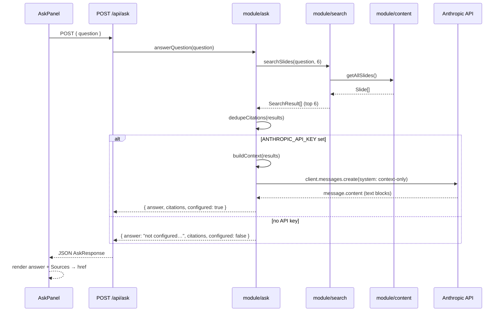

# Flow: Ask the docs (retrieval-augmented answer)

## Overview
A grounded Q&A assistant over the knowledge base. The reader asks a natural-
language question; the system retrieves the most relevant slides (reusing the
same BM25 search), feeds their markdown to Claude with a system prompt that
forbids answering outside the provided context, and returns a synthesized
answer plus citations that link back to the source slides. When no API key is
configured it degrades gracefully to citations-only — the panel stays useful
(see OVERVIEW "Graceful degradation").

## Entry Point
`POST /api/ask` with `{ question: string }` — `src/app/api/ask/route.ts`
(`runtime = "nodejs"`). Called by `AskPanel`.

## Steps
1. `AskPanel` POSTs the question as JSON; the route validates the body and
   rejects empty/invalid input with a 400 — owner: module/search-ask-panels → module/ask — sync.
2. `answerQuestion(question)` retrieves via `searchSlides(question, 6)`
   (`RETRIEVAL_LIMIT`) — owner: module/ask → module/search → module/content — sync.
3. `dedupeCitations(results)` builds the citation list keyed by `href` — owner: module/ask — sync.
4. Branch on `process.env.ANTHROPIC_API_KEY`:
   - **Set:** `buildContext(results)` assembles numbered sources (chapter,
     section, URL, and the slide **markdown** — not plain text — so code blocks
     survive); `client.messages.create` runs with model
     `ANTHROPIC_MODEL ?? "claude-sonnet-4-6"`, `max_tokens: 800`,
     `temperature: 0.2`, and the context-only system prompt — owner: module/ask — sync (awaited external call).
   - **Missing:** returns a "not configured" message with the citations and
     `configured: false` — owner: module/ask — sync, no external call.
5. `textFromMessage` extracts text blocks; the route returns the `AskResponse`
   (`{ answer, citations, configured }`) — owner: module/ask — sync.

## End Condition
`AskPanel` renders the markdown answer and a "Sources" list; each citation links
to a slide (entering flow/slide-rendering). When `configured: false`, a banner
explains the assistant is not configured and only citations are shown.

## Failure Modes
| Failure | Handling |
|---|---|
| Non-JSON body | Route returns 400 `{ error: "Request body must be valid JSON." }` |
| Missing/blank `question` | Route returns 400 `{ error: "Question is required." }` |
| No `ANTHROPIC_API_KEY` | Graceful fallback: citations-only, `configured: false` |
| Empty retrieval | Context becomes "No relevant slides were retrieved."; model told to say it cannot answer |
| Anthropic call throws | Propagates as non-OK; `AskPanel` shows "The assistant isn't available yet." |

## Transaction Boundaries
Retrieval is synchronous and in-process; generation is a single awaited external
call to the Anthropic API (the only network dependency in the app). No caching,
no rate limiting, no persistence — each request is independent. Answer grounding
is enforced by prompt only (see invariant/grounded-answers).
