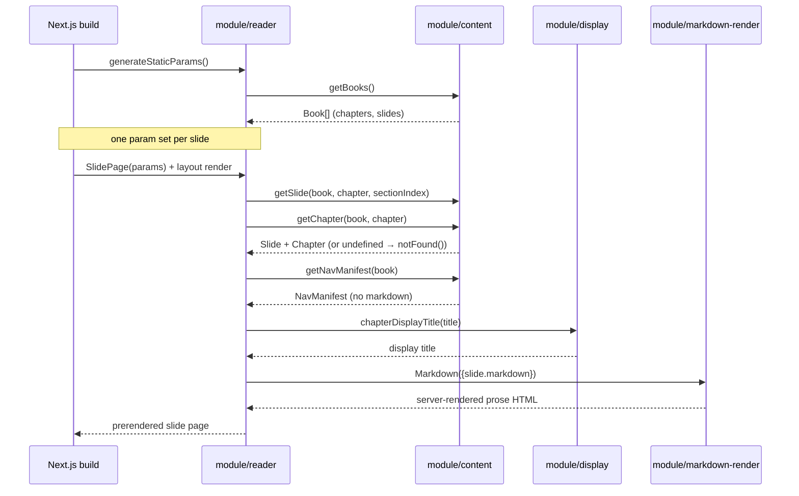

# Flow: Slide rendering (request → prerendered slide page)

## Overview
The core read path. A reader opens
`/read/[book]/[chapter]/[slide]` and gets a single "slide" — the intro (text
before the first `##`) or one `##` section of a chapter. Every such page is
prerendered at build time (SSG), so at runtime the browser is served static
HTML with no filesystem read and no markdown re-parse. This is the value the
product exists to deliver: paced, one-idea-per-screen reading of a long
markdown knowledge base (see ADR-003).

## Entry Point
- **Build time:** `generateStaticParams()` in
  `src/app/read/[book]/[chapter]/[slide]/page.tsx` enumerates every slide route.
- **Render:** the default `SlidePage({ params })` server component in the same
  file; the book `layout.tsx` wraps it with `ReaderChrome`.

## Steps
1. `generateStaticParams()` walks `getBooks()` → every book → chapter → slide
   and emits `{ book, chapter: chapter.slug, slide: String(sectionIndex) }` — owner: module/reader + module/content — sync.
2. Next.js prerenders one HTML page per emitted param. A broken slug therefore
   fails `npm run build`, which is the correctness gate (ADR-005) — owner: module/reader — sync.
3. On render, `SlidePage` resolves `getSlide(book, chapter, sectionIndex)` and
   `getChapter(book, chapter)`; a miss or non-integer index → `notFound()` — owner: module/content — sync.
4. The book `layout.tsx` calls `getNavManifest(book)` and passes the lightweight
   manifest (no markdown bodies) to `ReaderChrome` for nav/TOC/progress — owner: module/content + module/reader — sync.
5. `chapterDisplayTitle(...)` strips any embedded "Chapter N:" prefix from the
   heading for display — owner: module/display — sync.
6. The slide body is handed to `<Markdown>{slide.markdown}</Markdown>`, a server
   component (react-markdown + GFM + rehype-highlight) — owner: module/markdown-render — sync.

## End Condition
A static HTML page exists (or is streamed) for the slide, with kicker
(`Chapter NN · title · index/count`), heading, and rendered markdown body.
Prev/next and TOC are wired client-side by `ReaderChrome` from the manifest.

## Failure Modes
| Failure | Handling |
|---|---|
| Slide / chapter not found, or `slide` not an integer | `notFound()` → 404 page |
| Unknown `book` in layout | `getBook` miss → `notFound()` |
| Broken slug emitted by params | Surfaces as a build failure (`npm run build`) |
| Empty content root at first load | `content.ts` does not cache the miss; recovers next request (see module/content) |

## Transaction Boundaries
Fully synchronous and read-only. All heavy work (parse + render) happens once at
build time and is baked into static HTML; there is no runtime write, no external
call, and no per-request filesystem read for a slide view.
