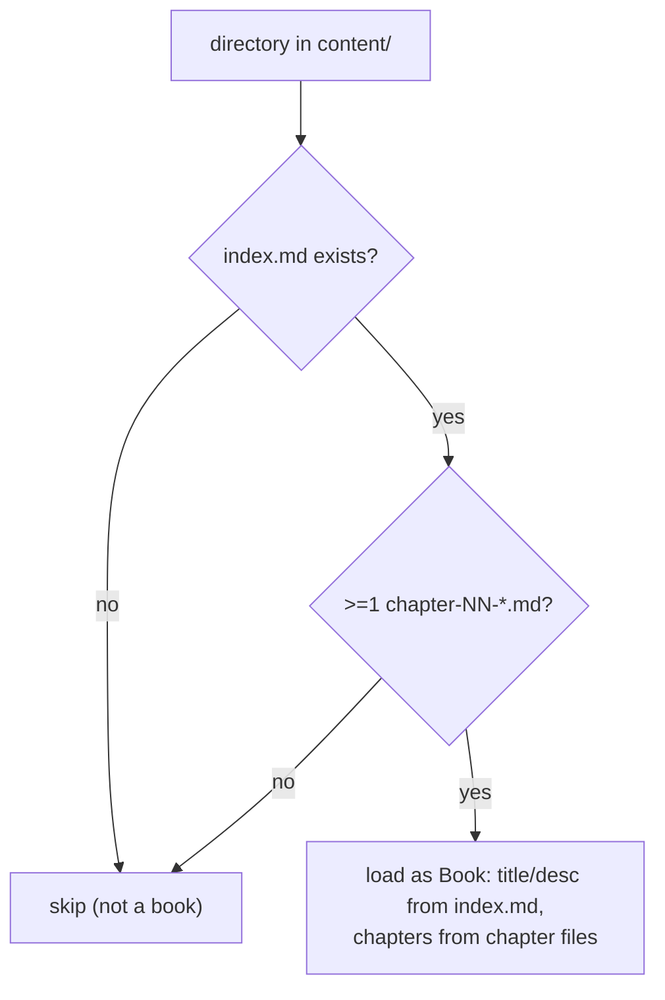

# Invariant: Book discovery requires index.md + chapter-NN-*.md

## Rule
`P-CONTENT-001` — A directory under `content/` becomes a reader **book** if and
only if it contains both an `index.md` **and** at least one file matching
`chapter-\d+*.md`; any other directory is silently ignored by the parser.
(New P-ID — to be registered in
[`specs/properties/invariants.md`](../../specs/properties/invariants.md) when
`content.ts` is next spec'd.)

## Why It Exists
The `content/` tree holds more than reader books: research `sources/` folders,
draft modules using incompatible naming (`Chapter N - Title.md`, nested
`explained/`), and un-structured overviews (OVERVIEW content inventory). Without
a strict eligibility rule, half-finished or non-book folders would render as
broken books, emit 404-ing slide routes, and fail the build. The two-part rule
is the gate that keeps only real, well-formed books live.

## How It Is Enforced

Mechanism: `loadBooks()` in `src/lib/content.ts` — `if (!fs.existsSync(indexPath)) continue;`
then `chapterFiles = readdirSync(dir).filter(/^chapter-\d+.*\.md$/)` and
`if (chapterFiles.length === 0) continue;`. Chapter number and slug are derived
from the filename (`chapter-(\d+)` → number; strip `chapter-`/`.md` → slug).

## What Can Go Wrong
- A folder with `index.md` but no `chapter-NN-*.md` (e.g. a papers index)
  silently produces no book — intended, but can surprise authors ("why isn't my
  content showing?").
- Misnamed chapter files (`Chapter 1 - X.md`) are ignored; content looks live in
  git but never renders. Fixing means renaming to the convention (a documented
  migration; OVERVIEW roadmap).

## Applies To
module/content (loader + slug/number derivation). Verified by: the type system +
`npm run build` (broken discovery surfaces as missing routes) — this repo has no
test runner (ADR-005). Governs the corpus that concept/single-source-of-truth
distributes to every consumer.
