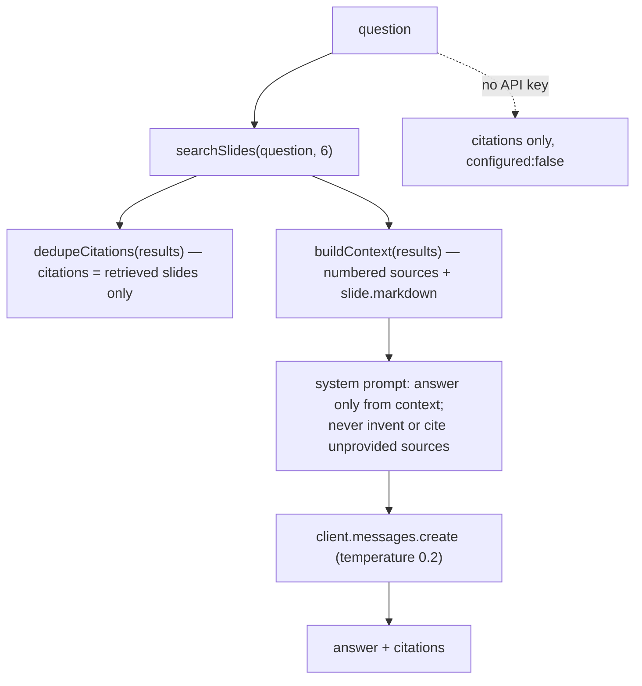

# Invariant: Ask answers are grounded only in retrieved slides

## Rule
`P-ASK-001` — An "Ask the docs" answer must be derived only from the slides
retrieved for the question, and its citations must reference only those
retrieved slides; the assistant must not invent facts or cite sources that were
not provided as context. (New P-ID — to be registered in
[`specs/properties/invariants.md`](../../specs/properties/invariants.md) when
`ask.ts` is next spec'd.)

## Why It Exists
The product's promise (stated in `AskPanel`: "grounded only in this knowledge
base — answers cite the sections they came from") depends on this. If the model
answered from its own parametric knowledge or fabricated citations, the feature
would mislead readers, cite non-existent slides, and undermine trust in a site
whose whole point is teaching correct agent design. Grounding is what makes the
citations trustworthy.

## How It Is Enforced

Mechanisms in `src/lib/ask.ts`: (1) citations are built from the retrieval
results before generation, so they can only reference retrieved slides;
(2) the system prompt constrains the model to the `<context>` block;
(3) low `temperature` (0.2) reduces drift.

## What Can Go Wrong
- Enforcement is **prompt-only** — there is no programmatic check that the
  answer text actually stayed within the context. A model could still stray;
  this is a known limitation (module/ask). TBD: post-hoc grounding verification.
- If retrieval returns nothing, context is "No relevant slides were retrieved."
  and the model is instructed to say it cannot answer — but citations will be
  empty.
- Prompt-injection inside slide markdown is a theoretical risk (untrusted-ish
  content in context); not currently mitigated beyond the system prompt.

## Applies To
module/ask and flow/ask-the-docs. Verified by: manual reproduction / prompt
review — this repo has no test runner (ADR-005).
