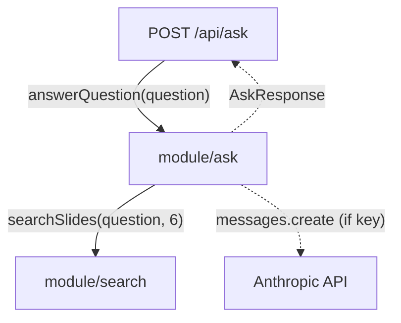

# Module: Ask / RAG (`src/lib/ask.ts`)

## Responsibility
Owns the "Ask the docs" retrieval-augmented generation glue: given a question it
retrieves the top slides (via module/search), builds a grounded context,
optionally calls the Anthropic API to synthesize an answer, and returns an
`AskResponse` (`answer`, `citations`, `configured`). It also owns the
no-API-key fallback and citation de-duplication.

It does **not** own: retrieval/ranking (delegates to module/search), the corpus
(module/content, reached transitively), HTTP handling (the route), or UI
(module/search-ask-panels).

## Why It Exists as a Separate Module
To isolate the one external-service dependency (Anthropic) and the RAG assembly
from both the corpus layer and the HTTP layer. This keeps the model call, the
system prompt, and the grounding rules in a single auditable place, and lets the
route handler stay a thin validator.

## Key Boundaries
- **`AskResponse`** — the contract returned to the client: `answer` (markdown),
  `citations[]`, and `configured` (whether an API key was present). Shape is
  fixed by `docs/api-contract.md`.
- **Retrieval** — `RETRIEVAL_LIMIT = 6` slides via `searchSlides(question, 6)`.
- **Context** — `buildContext` emits numbered sources with chapter, section,
  URL, and the slide **markdown** (not plain text) so code blocks and structure
  reach the model intact.
- **Model** — `ANTHROPIC_MODEL ?? "claude-sonnet-4-6"` (`DEFAULT_MODEL`);
  `max_tokens: 800`, `temperature: 0.2`.
- **Grounding** — a system prompt instructs the model to answer *only* from the
  provided context and never invent facts or cite unprovided sources (see
  invariant/grounded-answers).
- **Fallback** — when `ANTHROPIC_API_KEY` is absent, returns a "not configured"
  message with citations and `configured: false`; no external call is made.

## Module Relationships

## How It Coordinates Other Modules
`answerQuestion` orchestrates a two-stage pipeline: retrieve (module/search) →
generate (Anthropic). Citations are derived from the retrieved results before
generation, so they are returned even on the fallback path. The only network
call is the awaited `client.messages.create`.

## Design Decisions
- **Retrieve-then-generate with lexical retrieval** — reuses module/search
  rather than adding embeddings; the app demonstrates the RAG pattern its own
  content teaches (OVERVIEW).
- **Send markdown, not plain text, as context** — preserves code fences and
  structure for higher-quality grounded answers (OVERVIEW deep-dive §10).
- **Graceful degradation without a key** — the panel stays useful (citations
  only) instead of erroring, so the feature is demoable without secrets.
- **Grounding is prompt-only** — there is no post-hoc verification that the
  answer used only cited slides; enforcement is the system prompt +
  `temperature: 0.2`. This is a known limitation (see invariant/grounded-answers).
- **No rate limiting / cost controls** — flagged as a production risk in
  OVERVIEW; not yet implemented. TBD before public deploy.
- **Lane:** backend-owned (Codex) per
  [ADR-002](../../specs/decisions/ADR-002-frontend-backend-lanes.md) (see
  concept/frontend-backend-lanes).

For Claude/Anthropic SDK specifics (model ids, params), consult current SDK docs
rather than restating them here.
