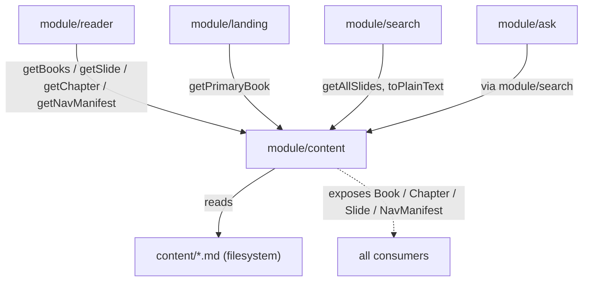

# Module: Content (`src/lib/content.ts`)

## Responsibility
Owns the definition and loading of the knowledge base: it reads markdown from
`content/<book>/`, parses it into the `Book → Chapter → Slide` model, and
exposes typed query functions (`getBooks`, `getBook`, `getPrimaryBook`,
`getChapter`, `getSlide`, `getAdjacent`, `getAllSlides`, `getNavManifest`). It
is the **single source of truth** for "what is a book / chapter / slide" (ADR-001).

It does **not** own: rendering markdown to HTML (module/markdown-render),
ranking or retrieval (module/search, module/ask), routing or UI (module/reader,
module/landing), or display-title formatting (module/display). It exposes data;
it makes no product decisions about how that data is shown or scored.

## Why It Exists as a Separate Module
So the "slide" concept is defined in exactly one place. Reader SSG, search
indexing, and RAG retrieval all consume the same parsed objects, so they can
never disagree on chapter/slide boundaries or `href`s. Consolidating parsing
here is the concrete mechanism behind concept/single-source-of-truth and
prevents the recurring failure mode of ad-hoc markdown re-parsing in a component
or an API route (ADR-001, "Parse markdown where needed" rejected).

## Key Boundaries
- **`Slide`** — the atomic unit: `id`, book/chapter identity, `sectionIndex`
  (0 = intro; 1..n = `##` sections), `title`, `markdown` (heading line removed),
  `text` (plain text via `toPlainText`), `href`, and `globalIndex` (book-wide
  flat ordering that powers cross-chapter prev/next).
- **`Chapter`** / **`Book`** — chapters sorted by number; `Book.slides` is the
  flattened reading-order list across all chapters.
- **Book discovery** — a directory is a book only if it has `index.md` **and**
  at least one `chapter-\d+*.md` file; everything else on disk is ignored (see
  invariant/book-discovery).
- **Slide splitting** — `splitIntoSections` treats `#` as the chapter title
  (line dropped), `##` as slide boundaries, and `###`+ as in-slide content
  (ADR-003). An empty leading intro is dropped.
- **In-memory cache** — parsed books are cached on `globalThis`
  (`__agentYapBooks`) for the process lifetime; a miss (empty content root) is
  deliberately **not** cached so a wrong Turbopack cwd on first hit can recover
  on the next request.

## Module Relationships

## How It Coordinates Other Modules
It does not orchestrate; it is a passive provider. Consumers pull data:
`generateStaticParams` and slide pages call `getBooks`/`getSlide`/`getChapter`;
the reader layout calls `getNavManifest`; `search.ts` calls `getAllSlides` and
`toPlainText`; `ask.ts` reaches content transitively through `search.ts`.

## Design Decisions
- **Markdown-on-disk, one parser, no CMS/database** — rationale in
  [ADR-001](../../specs/decisions/ADR-001-markdown-first-content-pipeline.md).
  Git is the CMS; builds are reproducible.
- **`##` = slide boundary, prerendered** — rationale in
  [ADR-003](../../specs/decisions/ADR-003-slide-reader-model.md): boundaries
  track authored structure, not length.
- **`globalIndex` flat ordering** — enables O(1) prev/next across chapter
  boundaries without re-parsing (`getAdjacent`).
- **Don't-cache-the-miss** — a defensive choice after a real Turbopack bug where
  a wrong `process.cwd()` on the first module evaluation cached an empty book
  list and 404'd every slide while `/` still worked (see the `resolveContentRoot`
  and `loadBooks` comments).
- **Lane note:** although this file sits in the frontend's conceptual territory,
  it is declared **shared / exclusive-access** in
  [ADR-002](../../specs/decisions/ADR-002-frontend-backend-lanes.md) because the
  backend (search/ask) depends on it — coordinate before editing (see
  concept/frontend-backend-lanes).
