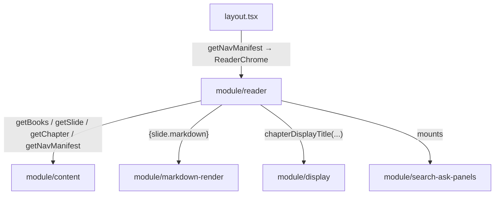

# Module: Reader (`src/app/read/**`, `src/components/reader/**`)

## Responsibility
Owns the slide-reading experience: the SSG slide route
(`src/app/read/[book]/[chapter]/[slide]/page.tsx`), the book layout that mounts
the reader shell (`src/app/read/[book]/layout.tsx`), the per-slide transition
(`template.tsx`), the redirects (`src/app/read/page.tsx`,
`src/app/read/[book]/page.tsx`), and the client chrome `ReaderChrome`
(header, progress bar, prev/next, keyboard, swipe, TOC drawer) plus the
`nav-direction` helper.

It does **not** own: content parsing (module/content), markdown-to-HTML
(module/markdown-render), the search/ask modal internals (module/search-ask-panels),
or the landing page (module/landing).

## Why It Exists as a Separate Module
It is the product's primary surface and the reason for the SSG model (ADR-003).
Separating the reader shell (client, interactive) from the slide content (server
component, static) keeps prose rendering JS-free while still delivering
keyboard/swipe navigation and a TOC — the server/client split is a deliberate
boundary (OVERVIEW "Server/client split").

## Key Boundaries
- **Route params** — `{ book, chapter, slide }`; `slide` is the integer
  `sectionIndex`. `generateStaticParams` enumerates all of them for SSG.
- **`generateStaticParams`** — book-wide fan-out over `getBooks()`; a broken
  slug fails the build (the correctness gate, ADR-005).
- **NavManifest boundary** — the layout passes a `NavManifest` (no markdown
  bodies) to `ReaderChrome`; the client navigates by `manifest.slides[index ± 1]`,
  crossing chapter boundaries via `globalIndex`.
- **Directional animation** — `setNavDirection(±1)` is set before
  `router.push` so `template.tsx` (which remounts per navigation) animates in the
  travel direction.
- **Intro vs. section layout** — `sectionIndex === 0` renders the chapter-intro
  layout (kicker + chapter title); otherwise a section layout (H1 = section
  title). `notFound()` on a missing slide/chapter or non-integer index.

## Module Relationships

## How It Coordinates Other Modules
The book `layout.tsx` fetches the manifest and wraps children in `ReaderChrome`.
`ReaderChrome` mounts `SearchPanel` and `AskPanel` (module/search-ask-panels) and
handles global keys (`/` search, `T` TOC, arrows/space/swipe for nav). Slide
pages pull one slide from module/content and hand its markdown to
module/markdown-render; titles pass through module/display.

## Design Decisions
- **Paged SSG reader, `##` = slide** —
  [ADR-003](../../specs/decisions/ADR-003-slide-reader-model.md); infinite scroll
  and length-based chunking were rejected.
- **Server slide + client shell** — prose ships zero JS (module/markdown-render
  is a server component); only the navigation chrome hydrates, driven by the
  lightweight manifest (concept/single-source-of-truth keeps the manifest in
  sync with rendered slides).
- **`template.tsx` for transitions** — relies on Next.js template remount-on-nav
  semantics rather than manual route-change listeners.
- **Lane:** frontend-owned (Claude) per
  [ADR-002](../../specs/decisions/ADR-002-frontend-backend-lanes.md).
- Long `##` sections with heavy `###` content can overflow one screen — a known
  authoring tradeoff of the `##`-only split (OVERVIEW usability notes).
