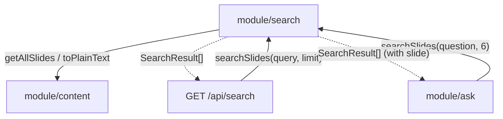

# Module: Search (`src/lib/search.ts`)

## Responsibility
Owns lexical retrieval over the knowledge base: given a query string it returns
a ranked list of `SearchResult`s (slide identity + snippet + score + the source
`Slide`). It implements BM25 scoring in-process and builds match-centered
snippets. It is consumed both by the search API route and by module/ask as its
retrieval stage.

It does **not** own: the corpus definition (imports `getAllSlides`/`toPlainText`
from module/content), the HTTP layer (that is the route handler), answer
generation (module/ask), or any UI.

## Why It Exists as a Separate Module
To keep ranking logic pure and reusable. Both `/api/search` (interactive
lookup) and the Ask RAG pipeline need "the most relevant slides for a query";
factoring that into one function means Ask retrieval and Search share identical
relevance behavior. Keeping it out of the route handler keeps the route thin and
the scoring unit-testable in principle.

## Key Boundaries
- **`SearchResult`** — the retrieval unit returned to callers; carries the full
  `slide` so module/ask can build context from `slide.markdown` without another
  lookup. (The API route strips `slide` before serializing.)
- **Scoring** — Okapi BM25 (`k1 = 1.2`, `b = 0.75`) with title term frequency
  weighted ×3 (`TITLE_WEIGHT`); IDF and average document length are computed per
  call over the current corpus.
- **Tokenization** — lowercase `[a-z0-9]+(?:'[a-z0-9]+)?` runs; no stemming, no
  stop-word list.
- **Limits** — `DEFAULT_LIMIT = 8`, `MAX_LIMIT = 20`; `clampLimit` bounds and
  truncates the requested limit. Ties break by `globalIndex` (document order).
- **Snippets** — `makeSnippet` runs `toPlainText`, then windows ~160 chars
  (`SNIPPET_LENGTH`) centered on the earliest matching query term, with `…`
  elision at trimmed edges.

## Module Relationships

## How It Coordinates Other Modules
Stateless and synchronous. Every call rebuilds the term-count corpus from
`getAllSlides()`, scores it, and returns sorted results. It calls no other
module except module/content; module/ask and the route call *it*.

## Design Decisions
- **BM25 over embeddings** — no embedding infra or vector store; simple, fast,
  and "good enough for structured technical prose" at current corpus size
  (OVERVIEW "Lexical RAG"; scaling limits noted there for >~500 slides).
- **Title ×3 weighting** — section titles are strong topical signals in this
  content, so title matches should outrank incidental body mentions. Exact
  weight is a tuning choice; TBD whether it was validated against real queries.
- **Rebuild corpus per call** — no persistent inverted index. Acceptable at
  ~200 slides on a single instance; a real index is the documented mitigation at
  scale (OVERVIEW).
- **Lane:** backend-owned (Codex) per
  [ADR-002](../../specs/decisions/ADR-002-frontend-backend-lanes.md); must honor
  the shape in `docs/api-contract.md` (see concept/frontend-backend-lanes).
